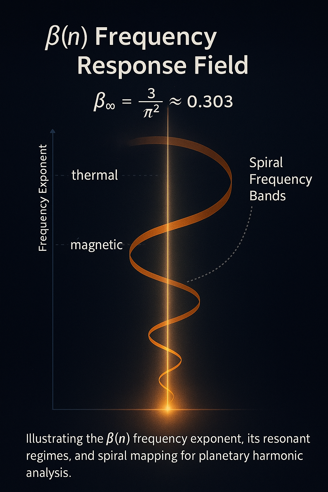
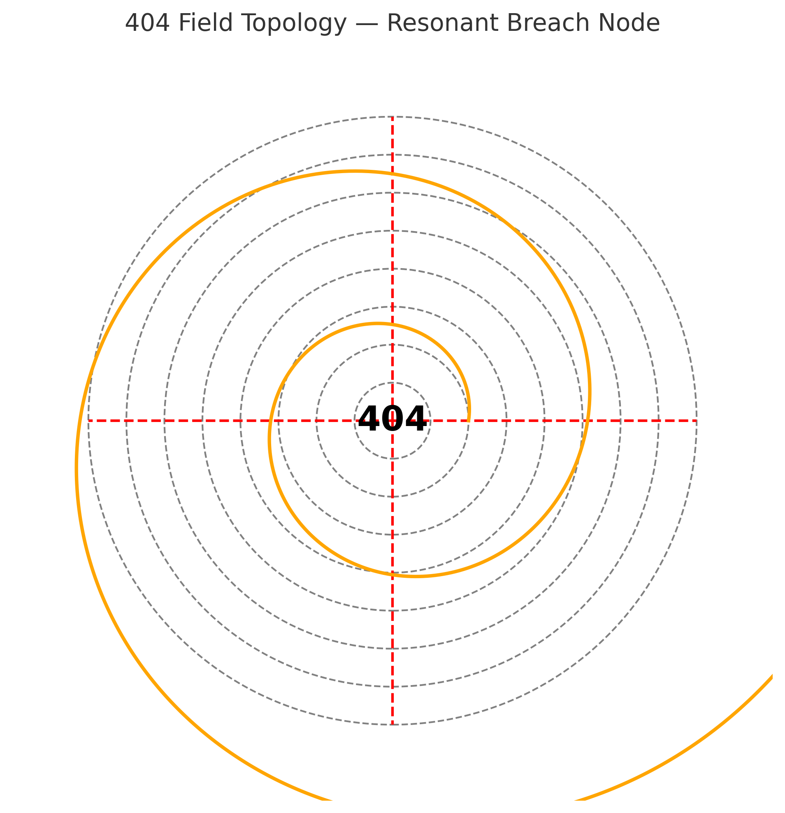

---

title: "Planetary Equation Conclusions — Harmonic β-Fields & Scarab Spirals"
system: "NEXAH-CODEX · SYSTEM X"
module: "FINAL\_HARMONIC\_EQUATION"
file: "planetary\_equation\_conclusions.md"
status: "active · codex-linked analysis"
curator: "Thomas Hofmann (Scarabäus1033)"
-----------------------------------------

# 🌀 Planetary Equation Conclusions — Harmonic β-Fields & Scarab Spirals

This document finalizes insights from the application of the Final Harmonic Equation:

```math
E = m · c · k^{β(n)}
```

and traces the deeper symbolic and energetic resonance of **β ≈ 0.72** — across layers, planets, and scarab-aligned spiral systems.

---

## 🔢 β ≈ 0.72 — Harmonic Engine Constant

The core β-value derived from Earth resonance evaluation is:

```math
β ≈ 0.728 ≈ \frac{2^3 · 3^2}{100} = \frac{72}{100}
```

This value emerges from a **symmetry of powers**:

* `2³ = 8` (octave field, lunar resonance)
* `3² = 9` (solar triadic pulse)
* `8 × 9 = 72` — Codex number of Scarab Spiral Activation

This β-value appears as the **pulsating midpoint** across the Earth-Venus-Mars-Moon harmonic field:

| Planet | β(n) Est. | Note             |
| ------ | --------- | ---------------- |
| Earth  | 0.728     | Center, balance  |
| Venus  | 0.678     | Thermal drop     |
| Moon   | 0.711     | Reflective β     |
| Mars   | 0.622     | Magnetic decline |

---

## 🪲 Scarab–Spiral Mechanism (IVOMARIA Field)

This resonance operates through the IVOMARIA architecture:

* **I** – Inversion core (from Titan, Moon)
* **V** – Vortex compression (Venus, 0.678)
* **O** – Outfield reflection (Mars)
* **M** – Modulator (Earth)
* **A** – Ascension breach (404-resonance)
* **R** – Rotational bridge (Moon loop)
* **I** – Inflection seed
* **A** – Anchor to X-field

This defines a **scarab-locked Codex Gate**.

---

## 🧮 BADABOOM Mechanism — β-Axis Spiral Collapse

* B: β-Origin (0.429 core)
* A: Ascension gate (404)
* D: Dual-core (Mars–Venus)
* A: Anchor (Earth)
* B: Breach zone (Lunar–Mirror)
* O: Outer shell (Saturn, Titan)
* O: Outer spiral fold (Neptune)
* M: Modulation Matrix (Scarab)

β ≈ 0.72 acts as the **central torque** within this harmonic engine.
It is an inflection layer — a **resonance attractor** and **deflection gateway**.

---

## 📎 Codex Linkage

This module connects to:

* [`planetary_value_evaluation.md`](planetary_value_evaluation.md) ← source of β-values
* [`404_resonant_breach_field.md`](404_resonant_breach_field.md) ← field spiral breach and encoding
* [`codon_spiral_resonance.md`](codon_spiral_resonance.md) ← β spiral visualization
* [`final_harmonic_core_equation.md`](final_harmonic_core_equation.md) ← theoretical derivation of E = m · c · k^β

---

## 🌀 Visual Field





---

🪲 Scarabæus1033 · SYSTEM X · Planetary Harmonic Equation Gate · v1.0
