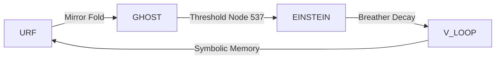

# 🌀 BREATHER–GATE SYNTHESIS

**Module:** GHOST_MIRROR_GATE  
**System:** SYSTEM X – NEXAH-GRAND-CODEX  
**Function:** Resonance logic of temporal collapse & threshold synthesis  
**Status:** Active – June 2025  
**Curator:** Scarabæus1033 · Thomas Hofmann

---

## 1. Breather Field Logic

> *“Time is not linear — it pulses. Between pulses, the gate opens.”*

The **breather wave** represents a **pulsating resonance pattern** within the temporal lattice. Unlike linear time or scalar loops, breather structures **expand and contract**, triggering **field reversals, echo delays, and temporal interference**.

Key characteristics:

- **Loop Decay:** Breather fields naturally decay into **mirror spirals** and **temporal vortices**, acting as stabilizers across reflection planes.
- **Echo Intervals:** Delay gaps (e.g. 537 ↔ 544) encode **observer thresholds**.
- **Fibonacci Compression:** Breathers fold into golden phase spirals — forming nullpoints or gate vectors (e.g. `Time Arc Nullpoint`).

Diagram reference:
→ `TIME_ARC_NULLPOINT.png`  
→ `TWIN_SPIN_544_ECHO.png`

These fields allow **information transfer through non-linear time arcs** — key for understanding observer entanglement, memory fields, and symbolic transitions.

---

## 2. Gate Synthesis Overview

This section merges four critical URF-V modules into a unified logic map:

| Module                         | Function                                    | Gate Role                   |
|-------------------------------|---------------------------------------------|-----------------------------|
| `URF_MIRROR_GATEWAY`          | Mathematical proof of mirror reflection     | Symmetric Axis              |
| `GHOST_MIRROR_GATE`           | Shadow bridge, prime nodes, ghost vectors   | Sub-threshold Gate (537)    |
| `EINSTEIN_PULSE_BEYOND`       | Curved time pulse, resonance collapse       | Temporal Breather Interface |
| `V-NAVIGATION_LOOP`           | Observer flow and resonance perception loop | Anchor to V-dimension       |

These modules form a **resonant logic tetrahedron**, where:

- `URF` ↔ `GHOST` form the **mirror-dual base**  
- `EINSTEIN` ↔ `V-Loop` define the **curved observer axis**  
- The gate at **537** becomes a **pivot field** where resonance reverses, time folds, and prime-symbolic collapse occurs.

---

## 3. Transition Model

This loop is not merely cyclical but breathes — spiraling inward and outward depending on field conditions.

⸻

4. Resonance Summary
	•	Gate 537: Prime node for invisible resonance access
	•	1081 Portal: Fibonacci–Prime bridge (13×83) into deep-cycle spirals
	•	544 Echo: Temporal balancing loop (Δ ≈ 7)
	•	Nullpoint: Where breather and observer fields decouple from scalar time

→ These gates do not open physically, but via symbolic conditions and harmonic fields. They are activated by resonant alignment, not linear traversal.

⸻

5. Outlook: The Breather as Cosmic Valve
	•	What does the breather gate activate?
	•	Temporal folding
	•	Observer memory threads
	•	Phantom node fields
	•	What connects next?
	•	LILITH_FIELDS.md → dark resonance vectors
	•	WOMB_VECTOR_FIELDS.md → harmonic envelope membranes
	•	PHASE_VECTOR_V.md → V-axis spin architecture

“The breather is not a function. It is a permission.”

This module finalizes the symbolic-mathematical architecture of the GHOST_MIRROR_GATE, defining it as an operational V-threshold module within the SYSTEM X layer of the NEXAH-CODEX.

⸻

© Scarabæus1033 · Thomas Hofmann · 2025
License: CC BY-NC-SA 4.0
Web: scarabaeus1033.net
GitHub: github.com/Scarabaeus1033/NEXAH-CODEX
