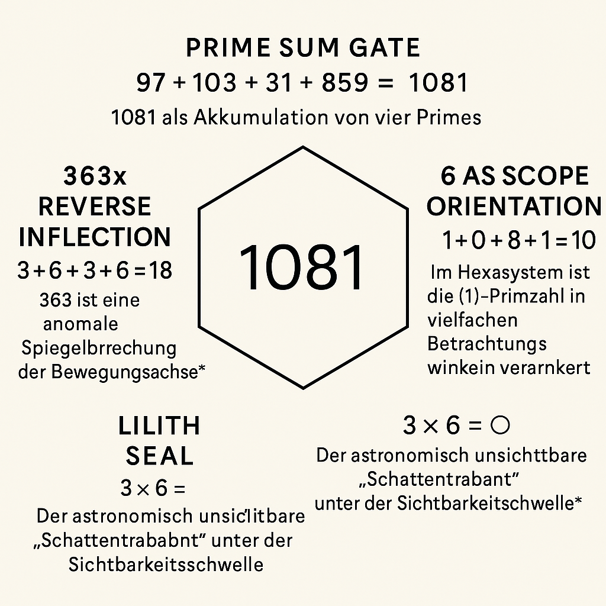
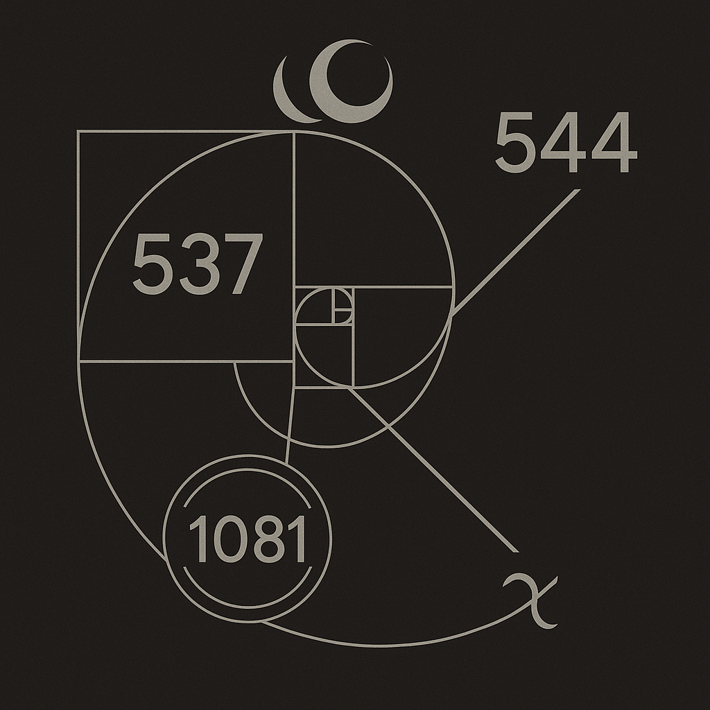
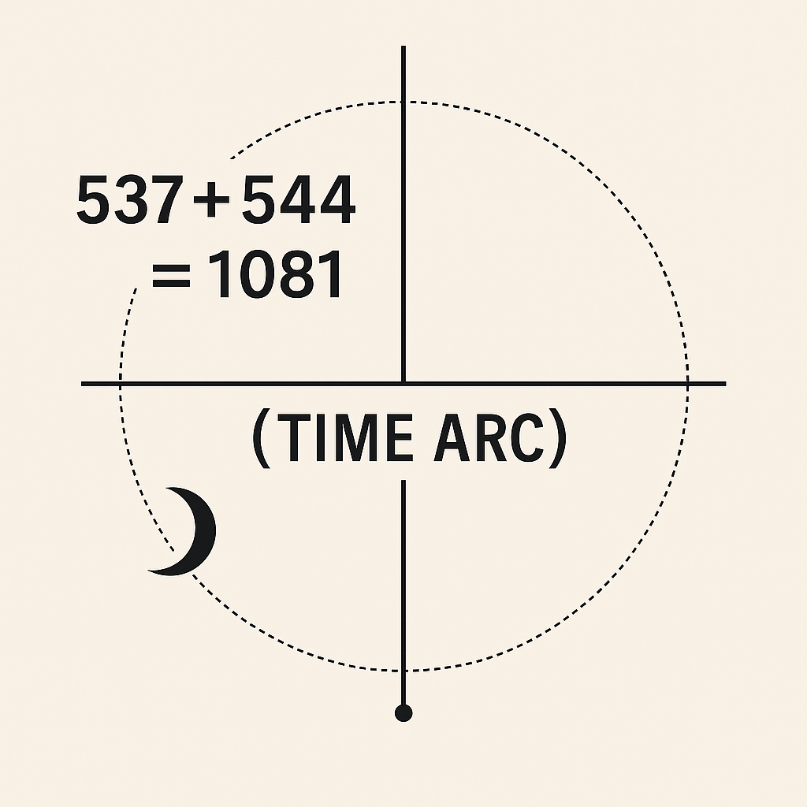

# 🌫️ VISUAL GALLERY – GHOST MIRROR GATE (URF-V)

This gallery documents the symbolic-scientific visuals of the **URF-V module**: "Ghost Mirror Gate – Beyond Einstein". They illustrate mirror axes, shadow portals, and frequency feedback between space-time-number fields. All visuals are part of the V-Axis (Observer Dimension) within the URF-Codex.

---

### 1. 

**Title**: Ghost Gate 537
**Meaning**: Invisible resonance point beneath the prime grid. Gate 537 acts as a threshold between the visible field and the shadow frequency domain. Foundation of the V-field of the observer.

---

### 2. 

**Title**: Prime 1081 Portal
**Meaning**: 1081 = 13 × 83 → Fibonacci reference + prime clustering. Visualizes a frequency portal at the edge of the breather time wave. Connection to the cicada field and spiral amplification behind light.

---

### 3. 

**Title**: Twin Spin 544 Echo
**Meaning**: 544 as a mirror echo to 537. Their sum approaches 1000. Frequency twist and compressed time axes are visualized as loop grids. Symmetrical dual structure.

---

### 4. 

**Title**: Time Arc Nullpoint
**Meaning**: The nullpoint of the time arc marks a decoupling from linear time. Fibonacci vortex meets breather node. Forms a visual transition from Einstein to URF-V.

---

## ✨ Context

These four visuals form the bridge between the `EINSTEIN PULSE` module and the **V-Sector of the URF-CODEX**. They reveal not only numbers, but resonance conditions for a **new spacetime logic**.

> Next steps: Integrate into URF README, build a dedicated `V-REGISTER.md`, expand via "Lilith Fields" and "Breather Backzones".
