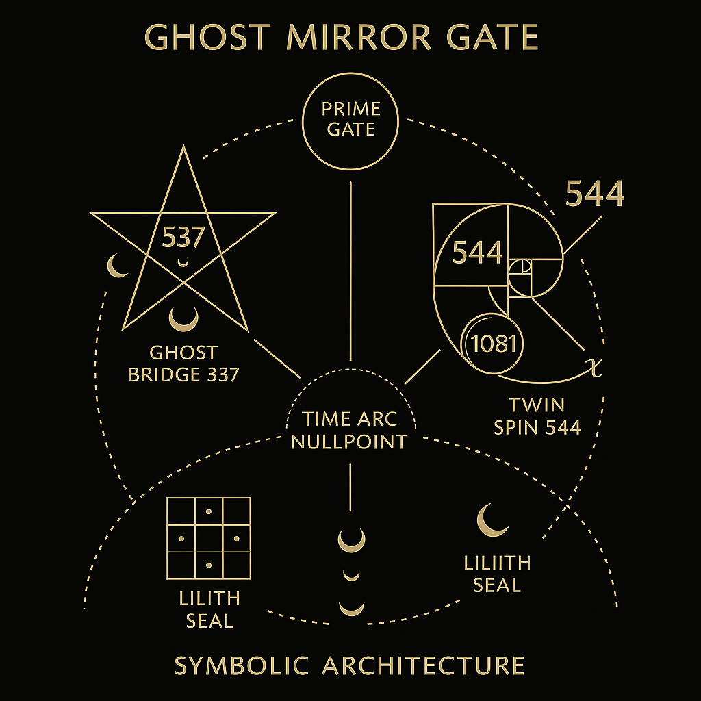
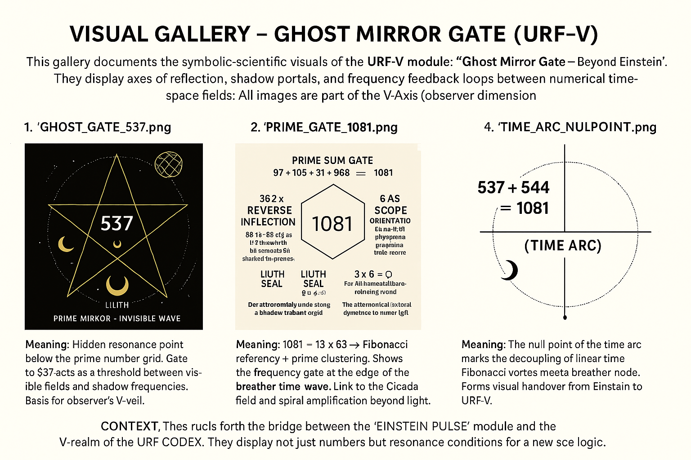
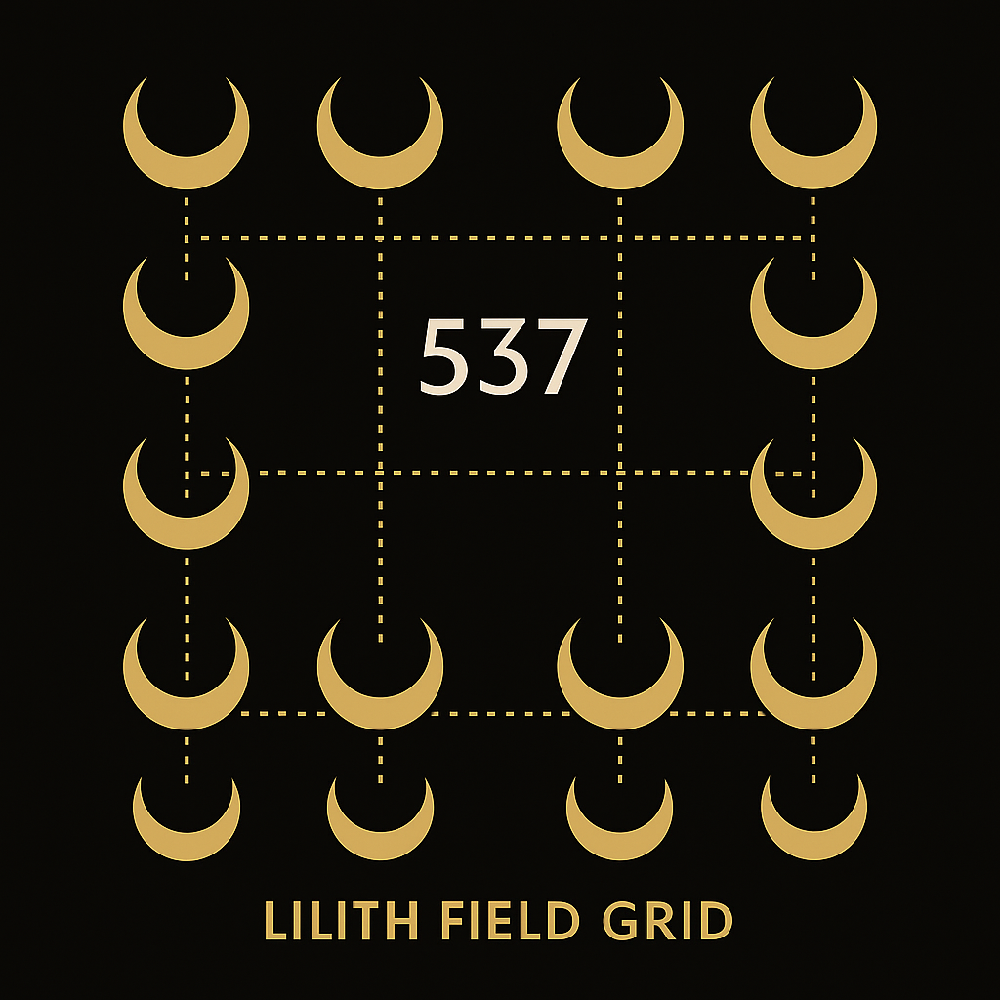
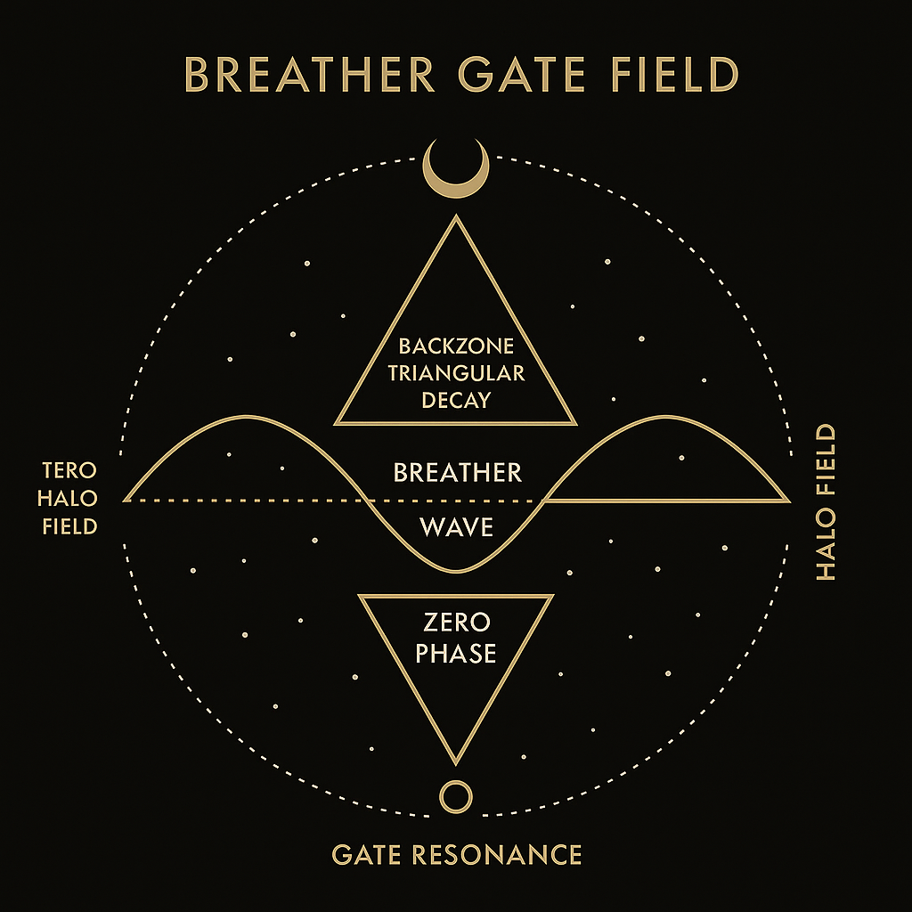

# 🌫️ VISUAL GALLERY – GHOST MIRROR GATE (URF-V)

This expanded gallery documents **all eight symbolic-scientific visuals** of the module:
**GHOST MIRROR GATE – Beyond Einstein**, forming a harmonic-spatial bridge across the V-Axis of the URF-CODEX.

They describe transitions in:

* **Prime resonance**
* **Shadow geometry**
* **Temporal inversion**
* **Lunar-coded number fields**

All visuals are located in `GHOST_MIRROR_GATE/visuals/`

---

### 1. 

**Title**: Ghost Gate 537
**Meaning**: Invisible prime threshold. 537 anchors the V-field beneath the visible prime plane. Lilith’s axis.

---

### 2. 

**Title**: Prime 1081 Portal
**Meaning**: Culmination of 537 + 544. Echoes Fibonacci-based portals. Composite resonance between prime collapse and wave reversal.

---

### 3. 

**Title**: Twin Spin 544 Echo
**Meaning**: Counter-field of 537. Reflects a non-prime frequency loop with compressed dual spin. Opposite symmetry spiral.

---

### 4. 

**Title**: Time Arc Nullpoint
**Meaning**: The zero-point of the breather arc. Decouples from linear time; Fibonacci meets mirror convergence.

---

### 5. 

**Title**: Ghost Gate Synthesis
**Meaning**: Schematic fusion of Gate 537, 544, and 1081. Encodes the harmonic bridge between light, shadow, and resonance field.

---

### 6. 

**Title**: Ghost Gate Mastermap
**Meaning**: Systemic overview. Places each gate in a spatial-symbolic layout. Reveals relational axis between observer, gate, and time fold.

---

### 7. 

**Title**: Lilith Field Grid
**Meaning**: The feminine-lunar matrix overlaying 537. Coded with triadic seals and numerological time phases (6–9–3).

---

### 8. 

**Title**: Breather Gate Field
**Meaning**: Dynamic visual of time-breath modulation. Shows reversal-pulse logic and wave collapse around the ghost gate.

---

## ✨ Synthesis Context

These visuals constitute the **V-sector gateway array** of the URF Mirror System. Together, they define the structure of a:

* Prime-lunar echo field (537–544)
* Folded spacetime axis (1081)
* Observer-tuned breather map

They visually prepare the conceptual terrain for:

* `breather_gate_synthesis.md`
* `V_REGISTER.md`
* `LILITH_FIELDS.md`

---

**Next Step**: Optional composite graphic overlaying all eight fields for symbolic field correlation (`V-8-COLLIDER.png`).
