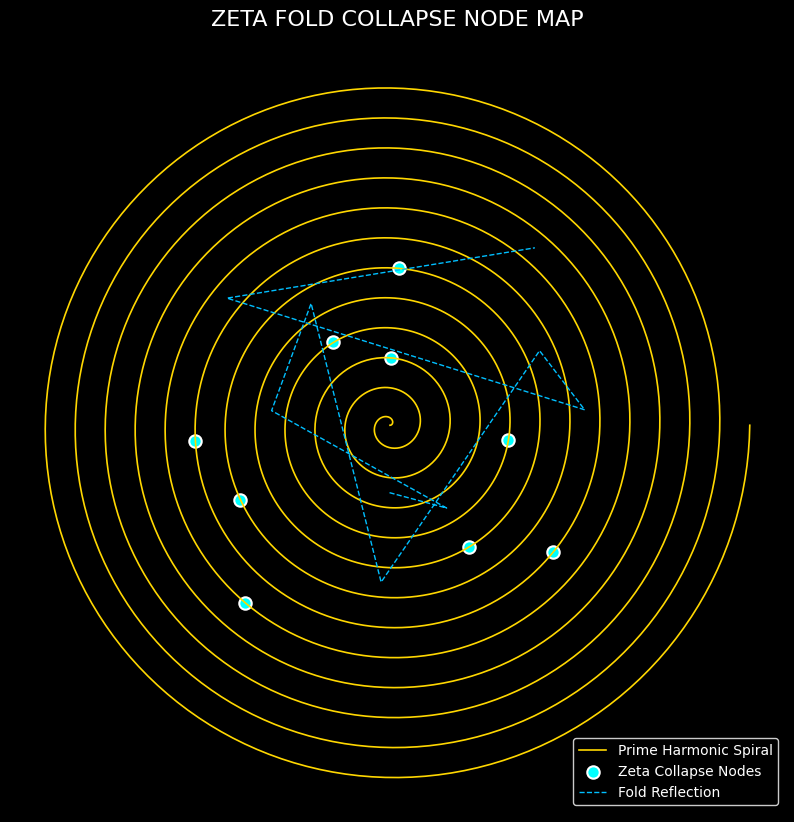

---

title: "RIEMANN PROOF SEQUENCE"
module: "Grand\_Unifying\_Resonance\_Theory (GURT)"
author: "Thomas Hofmann (Scarabäus1033)"
version: "Draft 1.0 · June 2025"
status: "Proof Sequence · Resonance Collapse Path"
license: "CC BY-NC-SA 4.0"
---

# 🧮 RIEMANN PROOF SEQUENCE

## Zeta Fold Collapse Logic in Harmonic Field Space

> This document outlines the **symbolic–harmonic proof path** toward the Riemann Hypothesis within the NEXAH-CODEX.
> It is based on the **Zeta Fold Operator**, prime spiral harmonics, and the emergence of **collapse nodes** in complex field geometry.

---

## 🔷 1. CONTEXT AND GOAL

The Riemann zeta function:

$$
\zeta(s) = \sum_{n=1}^{\infty} \frac{1}{n^s} \quad \text{for Re}(s) > 1 
$$

...has nontrivial zeros conjectured to lie on the **critical line**:

$$
\text{Re}(s) = \frac{1}{2} 
$$

Our goal is not to reduce this to classical analysis,
but to **reveal its structure via resonant collapse geometry**.

---

## 🔷 2. ZETA FOLD OPERATOR

Defined in the Codex as:

$$
\mathcal{Z}_\text{fold}(s) = \text{ResonantCollapse}( \zeta(s), \mathcal{P}_\text{spiral}, \mu, k_\beta )
$$

Where:

* $\zeta(s)$: zeta function (analytic continuation)
* $\mathcal{P}_\text{spiral}$: prime spiral resonance space
* $\mu$: Möbius topological inversion
* $k_\beta$: resonance constant (from `k-beta-formula.md`)

This operator folds the zeta function onto its spectral mirror and **detects collapse**
only when phase symmetry occurs at $\text{Re}(s) = \frac{1}{2}$.

---

## 🔷 3. COLLAPSE GEOMETRY & FIELD ALIGNMENT

The collapse condition in the Codex manifests as **interference symmetry**:

* Two opposing harmonic fields (forward-prime & inverse-zeta) converge
* Collapse node appears as **phase-aligned zero**
* Critical line $\text{Re}(s) = \frac{1}{2}$ acts as mirror axis in spiral space

📎 **Visual:** 

---

## 🔷 4. PHASE CONGRUENCE TEST

Collapse occurs when:

$$
\zeta(s) + \zeta(1 - s) = 0 \quad \text{and} \quad \arg(\zeta(s)) = -\arg(\zeta(1 - s))
$$

These conditions identify symmetric field cancellation on the complex plane.

---

## 🔷 5. PROOF TRAJECTORY (CODIFIED)

**Step-by-step outline:**

1. Project $\zeta(s)$ onto a **spiral field map**
2. Apply Möbius inversion through $\mu$ operator
3. Use $k_\beta$ to **modulate collapse envelope**
4. Detect **resonance fold** via symmetry match on critical line
5. Return full set of $s$ where $\mathcal{Z}_\text{fold}(s) = 0 \iff \text{Re}(s) = \frac{1}{2}$

> 📎 See also: `zeta_fold_operator.md`, `collapse_fields.md`, `resonant_complexity_shells.md`

---

## 🪲 NEXAH-CODEX DECLARATION

This is not a numerical test.
It is a **topo-resonant convergence logic** that reveals the geometry behind the prime-zeta dual field.

> Collapse is not chaos — it's symmetry resolving itself.
