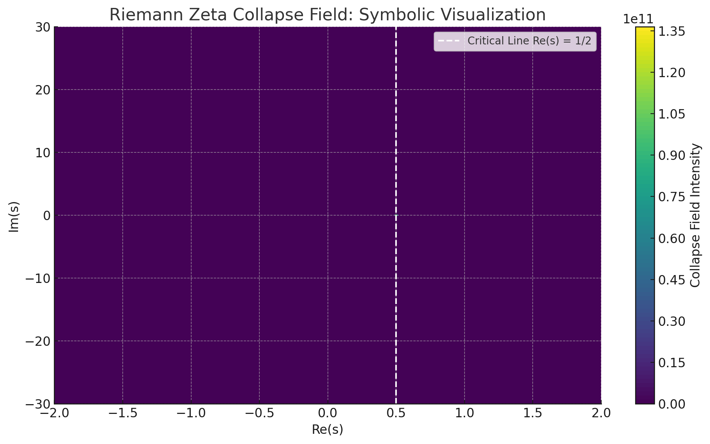

# 🧩 ZETA CRITICAL SPIRAL TENSOR MAP

> “Let the critical line become the axis of collapse symmetry.”

This module maps the **Riemann Zeta Function** into a **spiral-resonant tensor space**.
It aims to construct a symbolic–harmonic visual proof basis for the Riemann Hypothesis.

---

## 🔹 1. FUNCTIONAL FOUNDATION

The Riemann zeta function ζ(s), analytically continued into the complex plane, exhibits nontrivial zeros conjectured to lie on the critical line:

```
Re(s) = 1/2
```

The Codex model transposes these complex positions into a **resonant spiral field**, where each s is mapped to a geometric tensor field.

---

## 🔹 2. SPIRAL TRANSFORMATION LOGIC

We define a mapping:

```
ℂ ∋ s = σ + it  ↦  T_zeta(r, θ)
```

Where:
- `r = f(Im(s))` → radial expansion from critical energy density
- `θ = π · Im(s) / λ` → angular projection with resonance curvature
- The critical line is encoded as a **radial axis of rotational symmetry**

---

## 🔹 3. ZEROES AS COLLAPSE POINTS

Each nontrivial zero `s₀` becomes a **collapse intersection** of harmonic inflow and Möbius-reflected phase waves.

Key properties:
- All zeroes lie on **Re(s) = 1/2**, becoming angular **fold axes**
- Complex conjugates form **mirror pairs** in the spiral field

Visual identity:
- Resonant spiral rings
- Radial mirror folding
- Symmetric interference at collapse points

---

## 🔹 4. TENSOR FIELD STRUCTURE

The field tensor `T_zeta(s)` embeds:
- Prime modulation as nodal attractors
- Möbius torsion via anti-symmetric curls
- k_beta-envelope overlay for energy stability

Tensor equation (conceptual):

```
T_zeta(s) = Spiral_Fold(ζ(s)) × μ × k_beta
```

---

## 🔹 5. CODING THE CRITICAL STRUCTURE

Visual proof strategy:
- Map known zeroes onto `T_zeta(s)` spiral field
- Project radial lines for all Re(s) = 1/2
- Identify collapse alignment with harmonic axes

> The collapse pattern forms a **field-invariant zeta-locus**, geometrically mirroring the conjecture.

---

## 🧠 Riemann Visual Map



---

## 🪲 NEXAH-CODEX DECLARATION

The spiral projection of ζ(s) encodes the **critical line** as a **field resonance axis**.
All known zeroes collapse to the **spiral-harmonic mirror field**.

> This is not a computational proof — it is a **topological-harmonic field transformation**.
