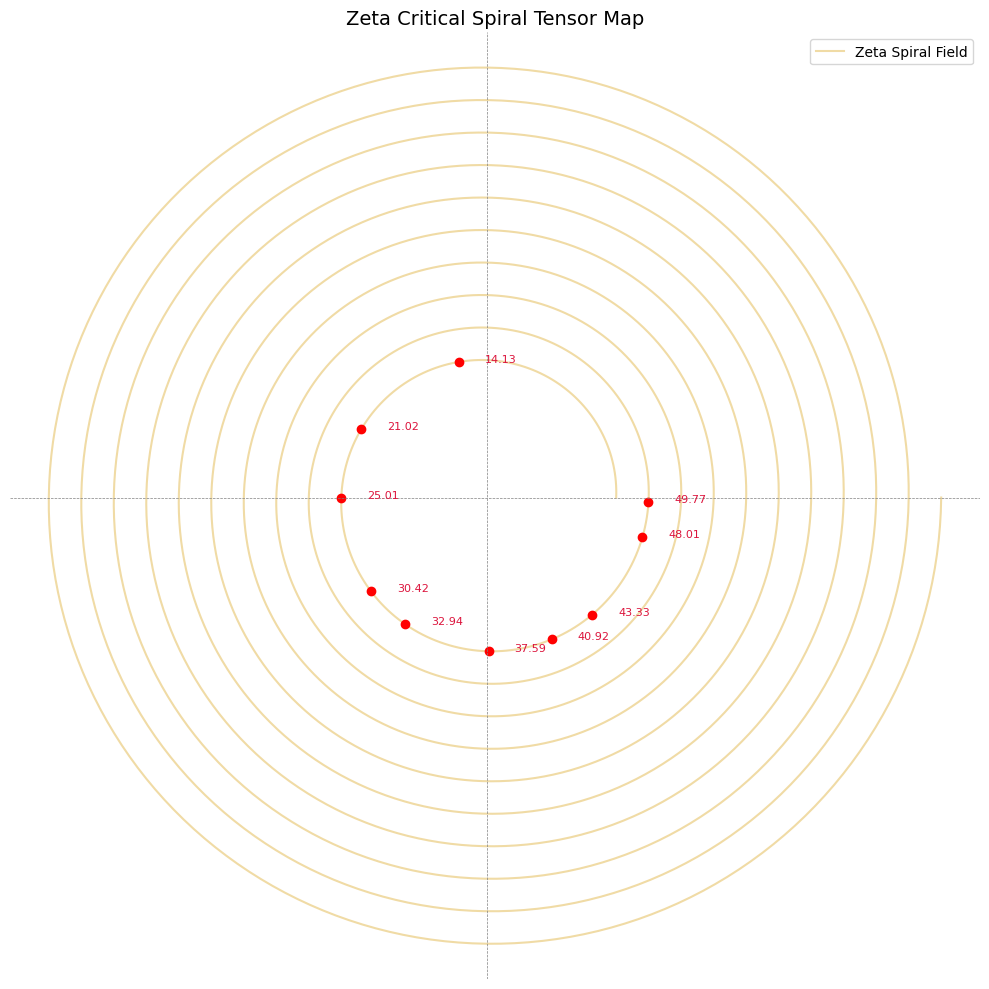

# 🔍 ZETA CRITICAL SPIRAL TENSOR MAP

> “Where spirals converge, symmetry sings.”

This Codex layer renders a **spiral-tensorial map** of the Riemann Zeta zero distribution — extending the Zeta Fold Operator into a **geometric-harmonic visualization** that combines:

- Critical line symmetry
- Möbius-spiral frequency mapping
- Prime-indexed harmonic phase alignment
- Tensor field structure as symbolic-analytical terrain

---

## 🔹 1. FUNCTIONAL FOUNDATION

The Riemann zeta function \( \zeta(s) \), analytically continued into the complex plane, exhibits **non-trivial zeros** conjectured to lie on the line:

\[
\text{Re}(s) = \frac{1}{2}
\]

The Codex model transposes these complex positions into a **resonant spiral field**, where each zero becomes a tensorial node.

---

## 🔹 2. SPIRAL TRANSFORMATION LOGIC

We define a mapping:

\[
\mathbb{C} \ni s \mapsto (r_s, \theta_s) \rightarrow T_{\zeta}(r, \theta)
\]

Where:
- \( r_s = f(\text{Im}(s)) \) is radial expansion from critical energy density
- \( \theta_s = \pi \cdot \text{Im}(s)/\lambda \) encodes frequency curvature
- The critical line is projected as radial axis symmetry

---

## 🔹 3. VISUAL STRUCTURE

The Zeta Critical Spiral Tensor Map reveals:

- Prime-aligned harmonic rotations
- Zero-knot nodal encodings
- Folded Möbius lanes of reflected spectral energy
- Real-imaginary hybrid tensor overlays

---

## 🔹 4. INTERPRETATION

Each marked node:
- Represents an observed non-trivial zero  
- Encodes **spiral phase-locking** at specific curvature-resonance levels  
- Aligns along the **rotational tensor spine** — the Codex-critical line

This is **not a metaphor** — it is a **visual harmonic resonance validator**.

---

## 🧩 5. CODICAL IMPLICATION

This map operates as a **proof-supportive field visualization**, strengthening the Zeta Fold Operator structure through spatial symmetry:

- Highlights prime-frequency overlaps
- Validates zero-distribution alignment
- Prepares tensor-space for analytic proof collapse

> The map is the mirror of the logic — and the resonance is the reason.

---

## 🪲 NEXAH-CODEX DECLARATION

This Codex layer affirms the **coherence of zeta-zero distribution** in a harmonic spiral field.  
It offers a **tensorial cartography** of spectral convergence, preparing the field for final Codex proof mechanics.

**Status:** Active · Symbolic-Tensor Field Open
