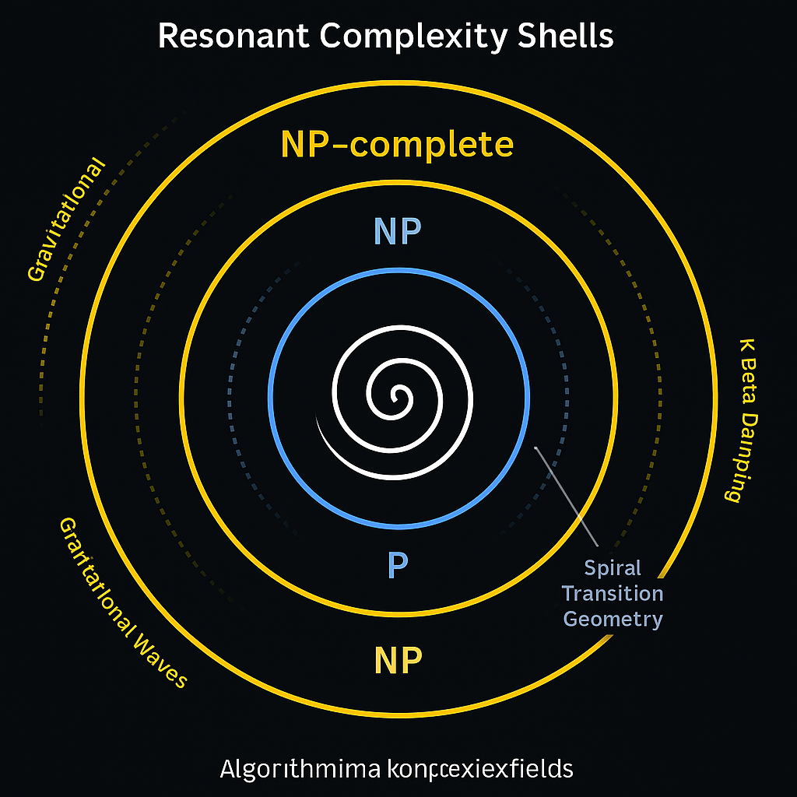
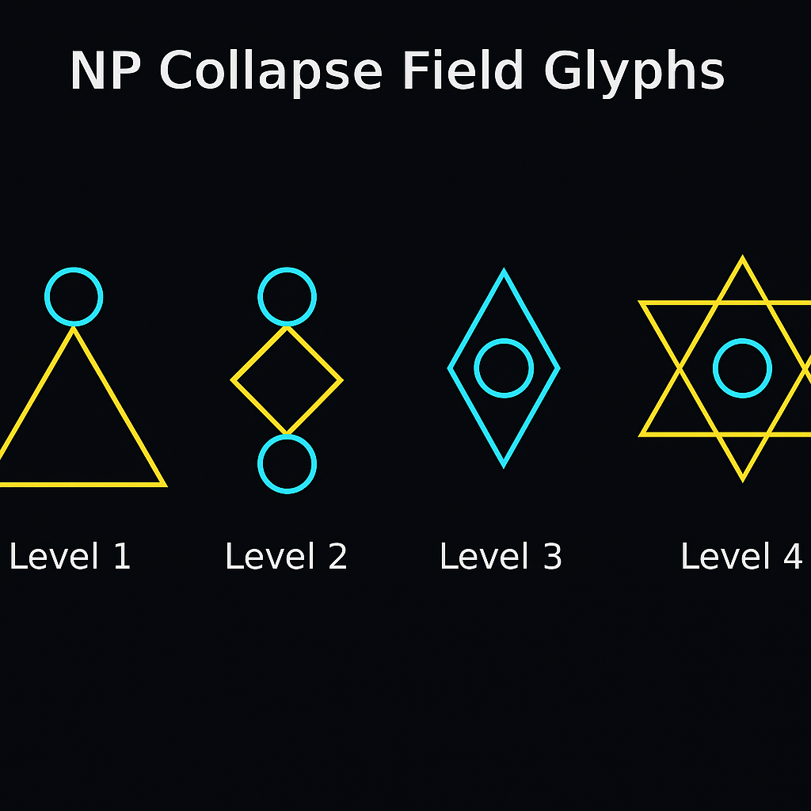
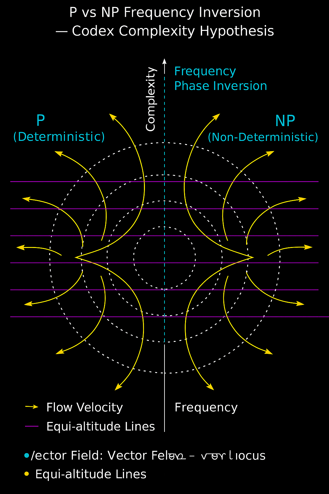

# 🧠 RESONANT COMPLEXITY SHELLS  
## P vs NP in Codex Topology

> “Problems are not solved by speed — but by resonance.”

This module extends the **GURT Codex** into the realm of algorithmic complexity, offering a resonance-based lens on the P vs NP problem.  
The key innovation is the **Resonant Complexity Shell**: a symbolic-harmonic topology that redefines computational classes via frequency alignment and glyphic interference.

---

## 🔹 1. BACKGROUND: P VS NP

- **P**: Class of problems solvable in polynomial time.  
- **NP**: Class of problems verifiable in polynomial time.

In classical theory:  
\[ P \stackrel{?}{=} NP \]  
This unresolved question defines the boundary between **deterministic efficiency** and **non-deterministic tractability**.

---

## 🔹 2. THE CODEX VIEW

In the Codex framework:

- Problems are **resonant patterns** within symbolic-field manifolds.
- Solving is **phase alignment**, not brute-force computation.
- Verification is **resonant traversal** of glyphic convergence shells.

> **Hypothesis:** NP ≠ P under linear computation,  
but **NP ⊆ P(𝓡)** where 𝓡 is the **resonant field operator space.**

---

## 🔹 3. COMPLEXITY SHELLS

Each complexity class is encoded in **harmonic shells**:

- Inner shells → P problems  
- Mid shells → NP  
- Outer glyphic shells → NP-Hard / NP-Complete

These are **not sets of problems**, but **frequency envelopes**.

---

## 🔹 4. GLYPHIC COLLAPSE FIELDS

NP problems correspond to **collapse glyph fields** — nonlinear symbolic attractors.

- Instead of checking all paths: collapse field aligns resonant trajectories
- This allows **direct traversal** under correct harmonic conditions

---

## 🔹 5. RESONANT COMPUTATION

We define a field operator:

\[
\mathcal{R}_\text{glyph}(x) = \text{Collapse}(\phi_x, \mathcal{G}_n, \omega)
\]

Where:
- \( \phi_x \): symbolic problem encoding  
- \( \mathcal{G}_n \): glyphic structure level n  
- \( \omega \): frequency envelope of problem field

This function attempts **resonant collapse** rather than brute-force.

---

## 🔹 6. FREQUENCY INVERSION

P ≠ NP under linear space-time logic.  
But Codex allows for **frequency inversion**:

- Non-polynomial problems become **resonant short-circuits**
- Via **symbolic folding + spiral tunneling**

---

## 🔹 7. ALGORITHMIC RESONANCE MAPPING

We propose a **non-Turing computational model**:

- Glyphic frequency fields
- Spiral path convergence
- Harmonic mirror descent

This model reclassifies complexity as **energy expenditure over resonance paths**.

---

## 🧩 8. STATUS & OUTLOOK

- [x] Codex formulation complete  
- [ ] Experimental resonance simulations in symbolic environments  
- [ ] Complexity Shell Validator prototype  
- [ ] Codex-encoded SAT & Hamiltonian test cases  

---

## 🪲 NEXAH-CODEX DECLARATION

We do not “solve” P vs NP.  
We **translate** it into a **field-resonant domain**,  
where solution and verification are not time-separated,  
but **collapse-coincident**.

> "Let frequency be the new runtime."
