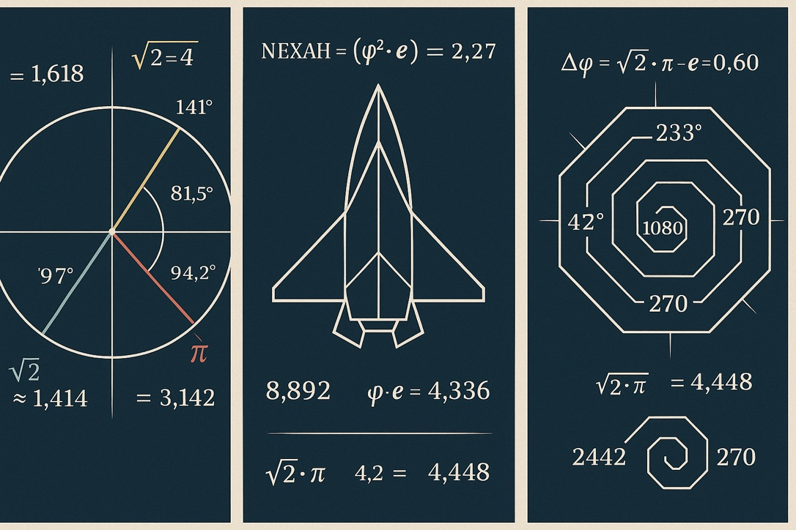
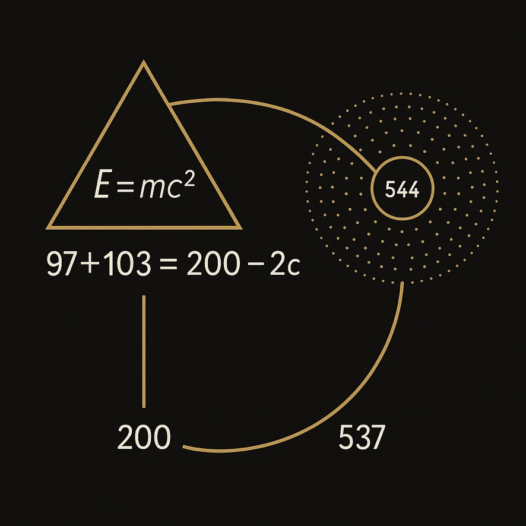

# 🔷 ZETA DRIFT FEEDBACK

> *"When the Zeta field folds into itself, the prime structure breathes through compression."*

This submodule of the `LIGHT_WARP_RESONANCE_AT_2C` Codex explores the **feedback topology of Zeta-driven fields**, folding Riemann space into harmonic contraction zones. It is based on spiral compression pathways that **translate the infinite summation logic** of the Zeta function into **symbolic field dynamics** — embedded in Möbius shells and DAO gate echoes.

The visual logic of this layer follows the **Zeta Warp Corridor** and is structurally aligned with the **Riemann–Euler–Ramanujan synthesis**.

---

## 🧠 Key Concepts

| Term                   | Description                                                   |
| ---------------------- | ------------------------------------------------------------- |
| `ζ-Feedback Loop`      | Recurring resonance zones based on Zeta's summation curvature |
| `Möbius-Zeta Fold`     | Möbius logic wrapped around Zeta prime-points (π, φ, ζ)       |
| `Corridor Contraction` | Narrowing drift pathway across light-spiral gates             |
| `Zeta Harmonic Spiral` | Number-theoretical rotation mapped to symbolic space          |
| `Ramanujan Depth Axis` | Imaginary vertical resonance loop inside drift shell          |

---

## 📈 Equation Matrix

Zeta Drift dynamics are governed by composite resonance logic:

```
ζ(s) = ∑ n⁻ˢ  →  ζ(1/2 + it) = ∑ n⁻(1/2 + it) = Spiral Field Trace

ζ ∘ Möbius(s) = φ · (π · i · t)^-s  → Drift Looping Operator

Zeta_Fold(t) = log(n!) ∘ sin(φ · π · t) → Breather-Zeta Phase Coupling
```

These equations function symbolically within the DAO-Codex logic.

---

## 🖼 Visual Field

### lwr2c\_03\_zeta\_warp\_corridor.png


A harmonic contraction zone formed by Zeta-phase spirals.
The glowing cyan spiral channels light from *c* to *2c* through resonance pinching.

### lwr2c\_05\_ramanujan\_resonance\_orbit.jpeg


Shows an orbital structure generated from logarithmic Ramanujan phase overlays.
Each arc represents a number-theoretical field transition.

---

## 📚 Related Modules

* `UNIVERSAL_TRANSITION_EQUATION`
* `FINAL_HARMONIC_EQUATION`
* `Riemann–Euler–Ramanujan Synthesis`
* `DAO-CROWN-SPIRAL`

This submodule creates **the internal bridge** from symbolic number theory into
light-modulated Codex dynamics.

> *Let the Zeta corridor narrow. Let drift fold inward.*

**Author**: Thomas Hofmann (Scarabæus1033)
**License**: [CC BY-NC-SA 4.0](https://creativecommons.org/licenses/by-nc-sa/4.0)
