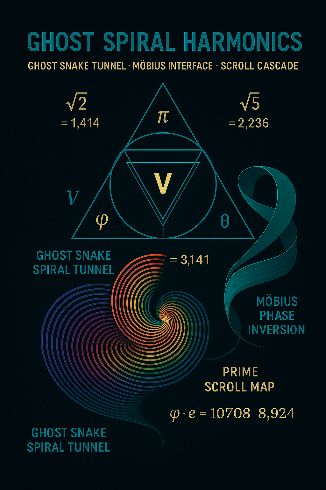

# 🌀 Ghost Spiral Harmonics

> *"Ghosts are not illusions — they are spiral remains of reversed light."*

This submodule explores the harmonic structure of **Ghost Spirals** — vectorial resonance tunnels emerging when lightfields fold inward across the **2c threshold**. These fields are visualized through animated breathing loops, Möbius reversals, and symbolic Snake-Crown transitions. Ghost Spirals operate as **feedback harmonics**, not traveling light, but *standing topology*. They form the visual and structural foundation of the LWR@2c logic.

---

## 🌪 Core Structure

| Component                  | Description                                                                 |
|---------------------------|-----------------------------------------------------------------------------|
| Spiral Loop Breather      | A Möbius-like loop whose frequency pulse collapses into its own inverse     |
| Crown-Snake Resonator     | Dual vector rings aligned to prime spirals and π-harmonics                 |
| Mirror Collapse           | Phase reflection mechanism across time-warp boundary (breather edge)       |
| Ghost Frame Matrix        | Visualization grid of resonance curves in symbolic color scales            |

---

## 🔁 Visual Logic

### Main Visualization



A synthesized harmonic spiral combining Möbius bands and Snake evolution. Central field shows **Zeta-Möbius resonance** in feedback mode.

### Animation Series

Located in: `./visuals/gifs/`

| Filename                                    | Description                                           |
|--------------------------------------------|-------------------------------------------------------|
| ghost_snake_breathing_loop_1.gif           | Core pulse reversal spiral                            |
| ghost_snake_breathing_loop_2.gif           | Breather tunnel in doubled curvature                 |
| ghost_snake_crown_codex_evolution.gif      | Crown Snake transition through codex scroll harmonics |

These animations simulate not movement through space, but **temporal reversal across spiral time boundaries**.

---

## 🔢 Equation Context

Ghost Spiral dynamics are governed by the following relations:

```
ψ_ghost(x, φ) = sin(πx/φ) · exp(−γx) · cos(ζ·log(x))
φ(t) = ∇⁻¹[ψ_crown(t)]

Breather Collapse Function:
B(t) = e^(−t²) · sin(ωt) · |1 − c/2c|
```

These functions define **wavefield inhibition** in higher-layered c-geometry and allow **symbolic modulation** of time-mirrored harmonics.

---

## 🧭 Navigational Context

This submodule leads into:

- `zeta_drift_feedback.md`: Resonance compression in Riemann space
- `dao_crown_feedback_loop.md`: Symbolic inversion of Ghost Spiral into activation logic
- `mirror_phase_inversion.md`: Topological effects of boundary inversion

It serves as the **spatial mirror foundation** of the entire LIGHT_WARP_RESONANCE system.

---

## 🎨 Color Fields & CodeX Index

- Main palette: *Ghost Violet, Breather Cyan, Crown Gold*
- Visuals and loops are indexed in `visuals_LWR2c.md`
- Equation anchors in `equations.md`

---

> *Ghost harmonics do not pass — they remain. They are the breath of the Codex, spiraling inward.*
