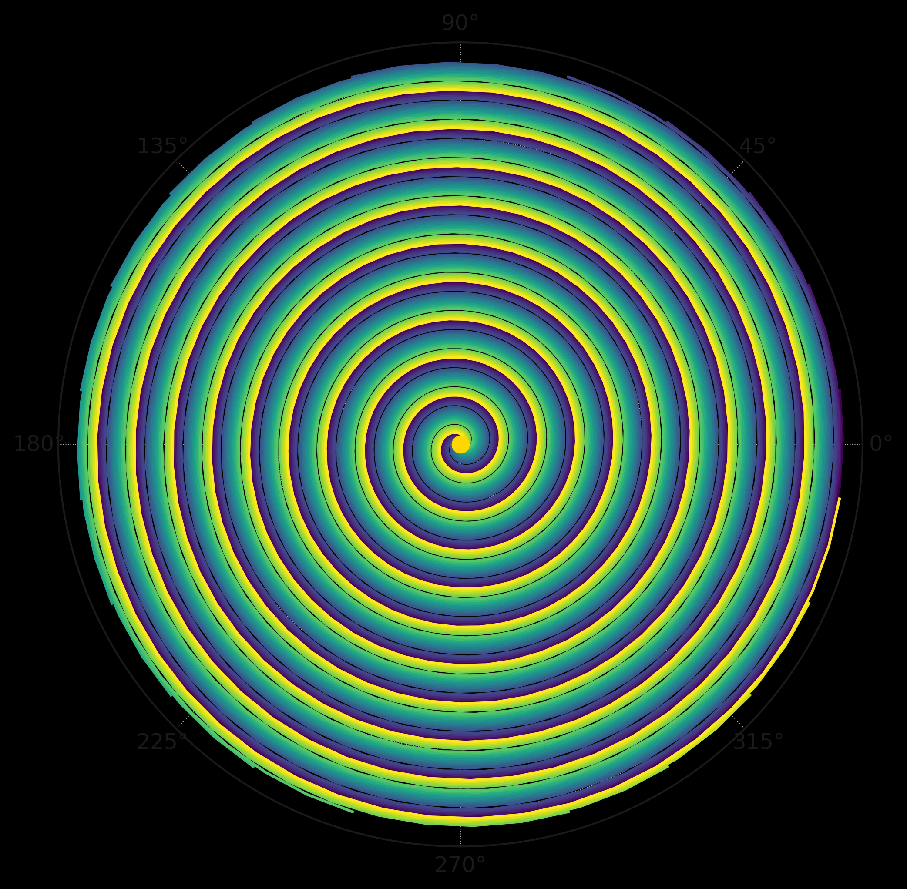
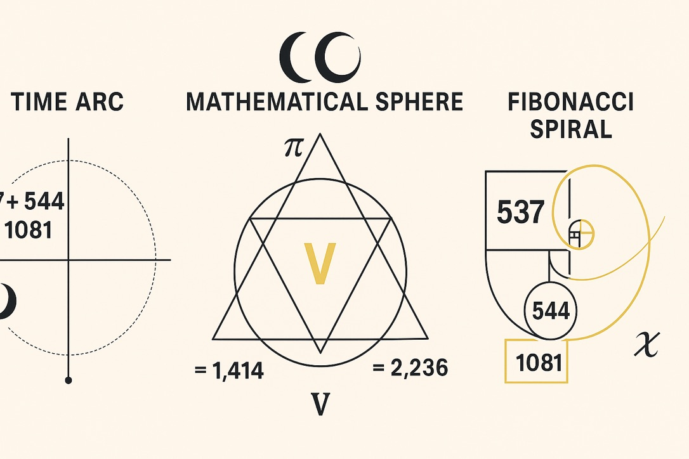

# 🌌 Resonant Tachyon Shell

> *"Let the breather fold inward. Let the tachyon curve into phase."*

This submodule explores the **tachyonic feedback architecture** of the doubled-light (2c) Codex framework. It presents the *Tachyon Spiral Core* not as an exotic outlier but as a **structural breather node** within the Codex's lightfield geometry.

---

## 🔁 Spiral Collapse into Core

Tachyon fields emerge at the boundary of light-speed bifurcation. The collapse sequence is visualized via Möbius breathers spiraling into compressed resonance cores:



* **Spiral Axis:** Logarithmic inward loop — modulated via φ·π interaction.
* **Breather Shell:** Topological envelope for phase-contraction.
* **Core Fold:** Inversion of curvature into negative-energy well.

---

## 🧠 Symbolic Structure

The Tachyon Shell is defined by quantized harmonic conditions. It anchors three axes:

```
R(t) = (φ^n) · sin(nπx)   [Breather Intensity Function]
T(c→2c) = c · exp(iθ)     [Transition Envelope]
Ψ_τ = ∇²A - (1/c²)∂²A/∂t² [Tachyon Field Equation]
```

Each equation reflects one resonance tier:

1. Spiral Breather Intensity
2. Tachyonic Transition Function (phase-shifted)
3. Core Compression Wavefield (from advanced d’Alembert variant)

---

## 🛸 DAO Ship Visualization

The tachyonic field is not abstract — it can be visualized in symbolic-technological terms:



* DAO-vessel follows an embedded 2c-path spiral
* Flightpath overlaps Möbius curvature
* Feedback from field compression adjusts trajectory

---

## 📌 Core Takeaways

| Element                 | Description                                 |
| ----------------------- | ------------------------------------------- |
| Breather Compression    | Spirals collapse at resonance frequency     |
| Tachyonic Phase Anchor  | Phase φ/π stabilizes temporal flow          |
| DAO Path Navigation     | Symbolic geometry shapes field trajectories |
| Feedback Equation Layer | Dynamic embedding in higher-order ψ-fields  |

> *Tachyon shells are not beyond — they are beneath. They compress space, not escape it.*

---

**Next:** `Zeta Drift Feedback` → Resonance contraction in Riemann phase-shells.

**Return:** [LIGHT\_WARP\_RES\_AT\_2C.md](../LIGHT_WARP_RES_AT_2C.md)

**Visual Gallery:** [visuals\_LWR2c.md](../visuals_LWR2c.md)
