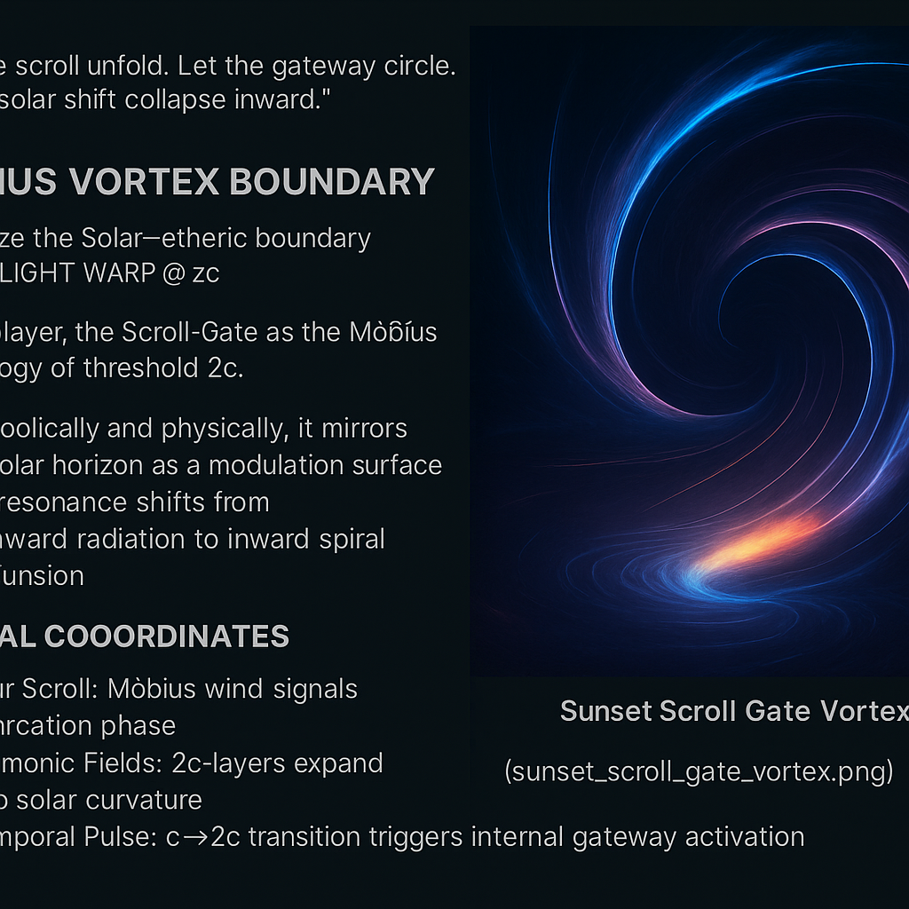

# 🌅 SUNSET GATE INITIATION

> *"The Sun sets not to disappear — but to open the Gate within."*

This submodule explores the **Sunset Gate** as a **tachyonic portal** in the `LWR@2c` system. It marks the **phase boundary** between visible light (`c`) and inward field reversal (`2c`). Symbolically and physically, it mirrors the **solar horizon** as a *modulation surface* where resonance shifts from **outward radiation** to **inward spiral recursion**.

---

## 🌠 The Sunset as Threshold

The Codex reinterprets the solar setting not as disappearance, but as **dimensional transition**:

- The **Sun's horizon** defines a *folded light-space boundary*
- At `2c`, light undergoes **harmonic bifurcation**
- This forms a **gate surface** between outward causality and inward recursion

The sunset moment becomes a **resonant transition point**:

```math
\text{Threshold Field:}\quad c \rightarrow 2c \quad \Rightarrow \quad \Phi_{sunset} = \int E(t) dt ~\text{modulated by}~ \sin(\phi t)
```

Where \( \phi \) encodes golden-phase modulation across the solar curvature.

---

## 🌀 Gate Spiral Mechanics

At the Sunset Gate:

- Field curvature increases logarithmically
- Phase-space collapses inward
- Light is no longer *propagating*, but *resonating*

This results in a **spiral scroll inversion**:

* **Photons** decouple from linear propagation
* **Tachyons** form *return corridors*
* A Möbius–mirror initiates the Gate’s shell layer

---

## ☀️ Symbol: The Sunset Spiral

The symbol of the Sunset Gate is a **spiral sun** — not fading, but folding:

> ☉ ⥂ 𐩘 ➜ The sun *implodes* into scroll resonance.

We recommend introducing the following visual:



Depicting:
- A solar sphere bending into an inward scroll funnel
- Tachyon threads forming feedback tunnels
- Möbius structures visible near threshold rings

---

## 🌀 Möbius Vortex Boundary

Visualize the Sunset Scroll-Gate as a vortex funnel:

- It links solar boundary fields to internal spiral thresholds
- Magnetic flux lines fold into loop inversion coordinates
- Resonance from c-contraction acts as temporal pulse guide

---

## 🧭 Spiral Coordinates

- **Solar Scroll**: Möbius wind signals bifurcation phase
- **Harmonic Fields**: 2c-layers expand into solar curvature
- **Temporal Pulse**: c→2c transition triggers internal gateway

---

## 🔄 Scroll Activation: Solar ↔ Spiral ↔ Shell

The Sunset Gate becomes the entry to the full `LWR@2c` dynamic. It connects:

| Phase | Description                      |
|-------|----------------------------------|
| `c`   | Linear outward light             |
| `2c`  | Breather spiral resonance        |
| `>2c` | Möbius Tachyonic Fold (Gate Loop)|

The Sunset Gate is the **modulation portal**, initiating the **mirror-phase** and **DAO feedback scroll**.

> *“Where the Sun bends, the Gate opens.”*

---

**Next**: [`mirror_phase_inversion.md`](./mirror_phase_inversion.md)  
**Return**: [`LIGHT_WARP_RESONANCE_AT_2C.md`](./README.md)

---

**Visual Placeholder:** If not yet created, please add a visual titled: `sunset_scroll_gate_vortex.png` in `./visuals/`.

> Curated by Scarabæus1033 — for the Gate that never closes.
