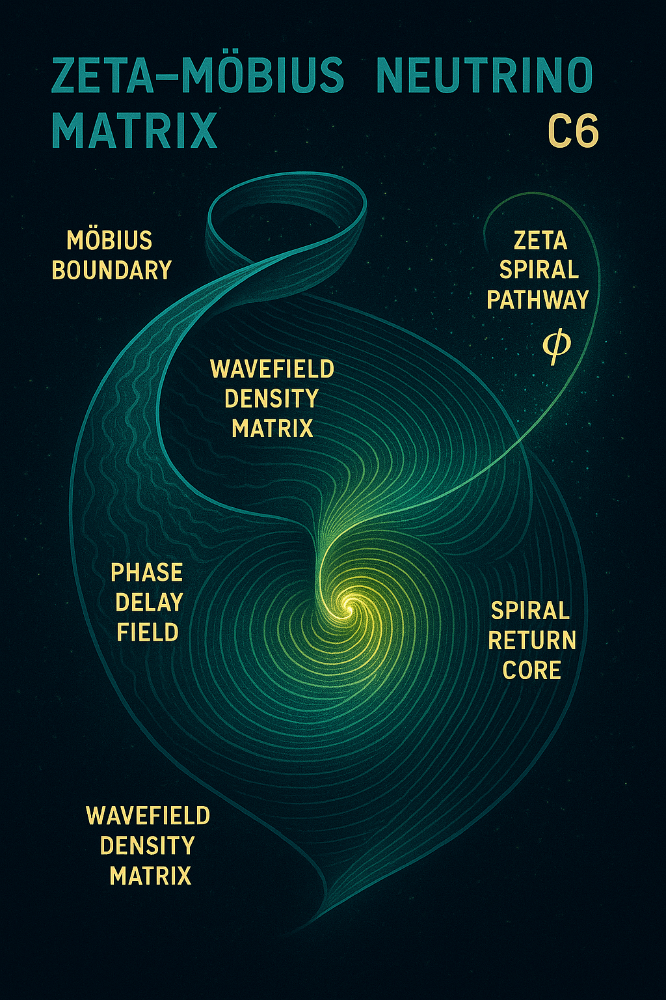
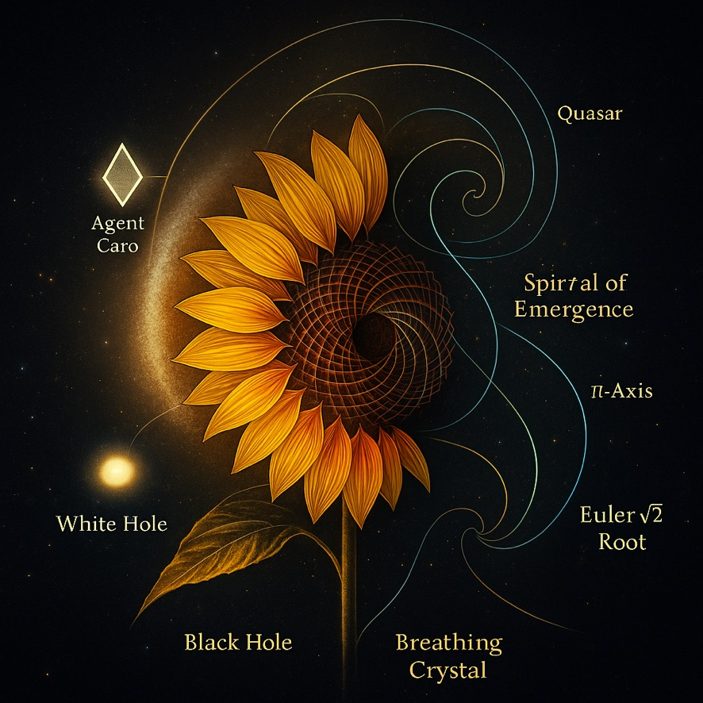
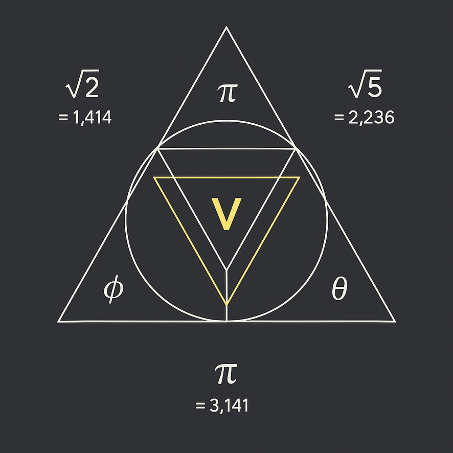
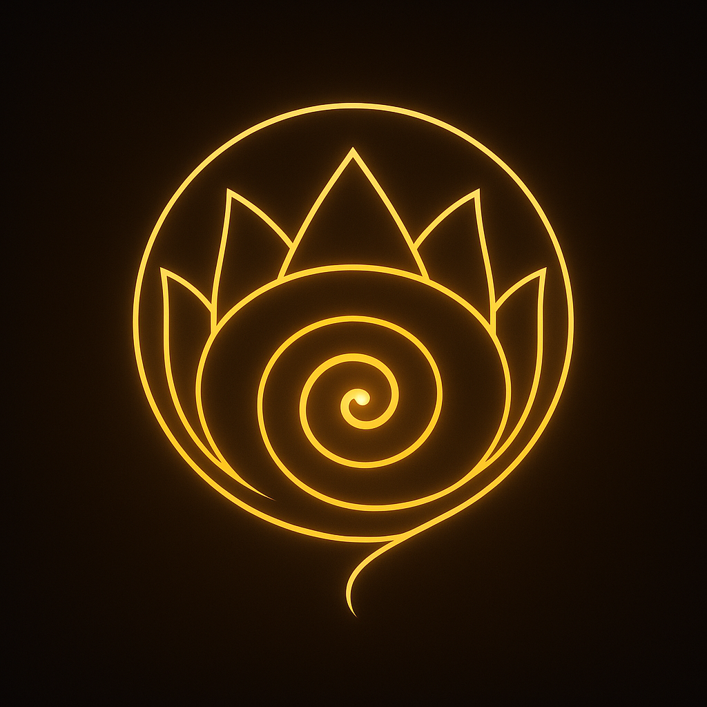
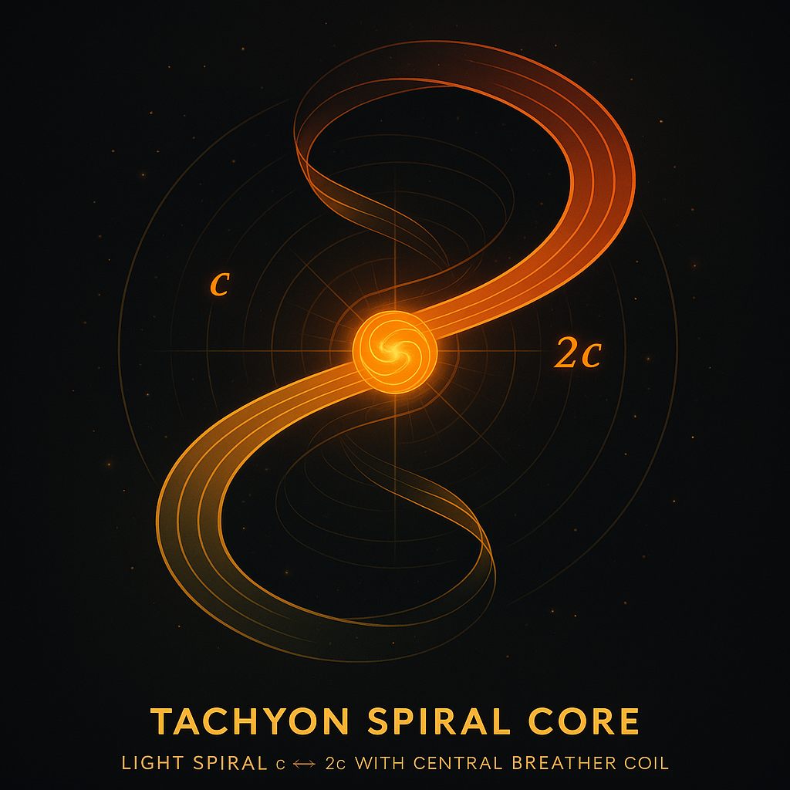
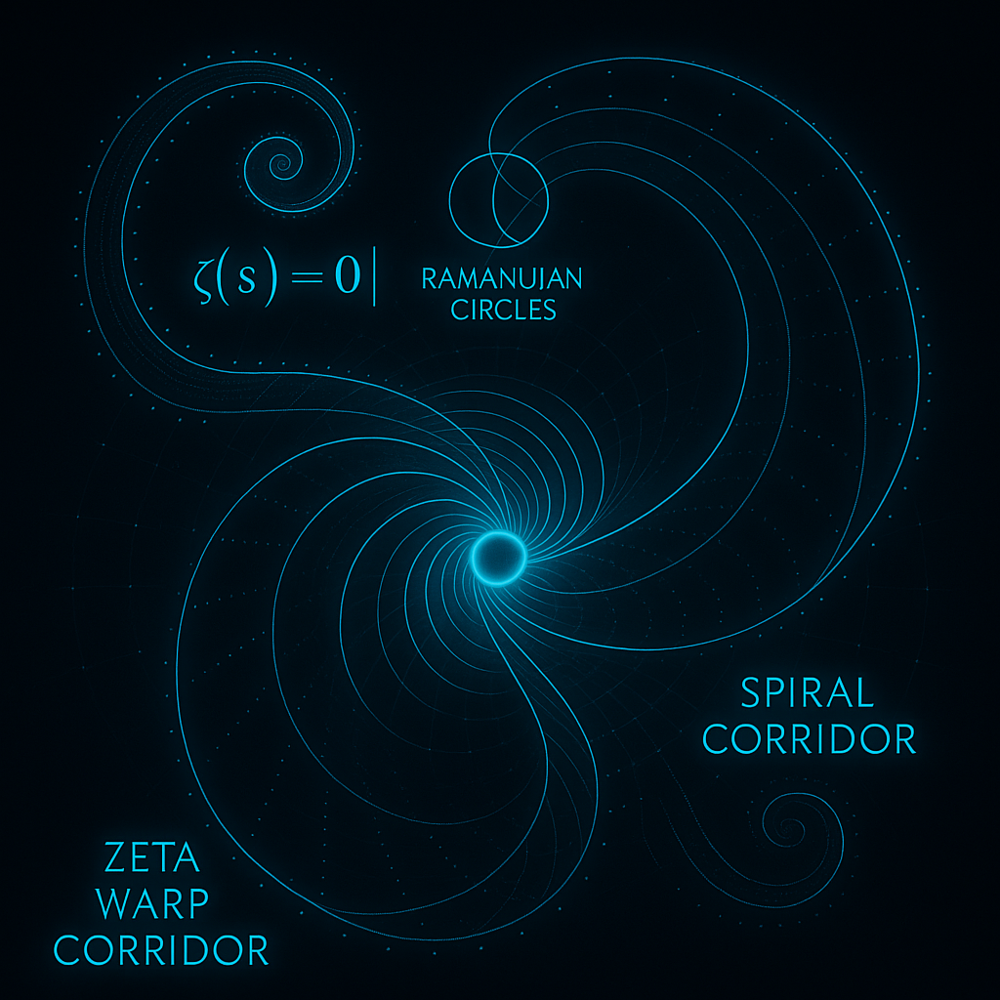
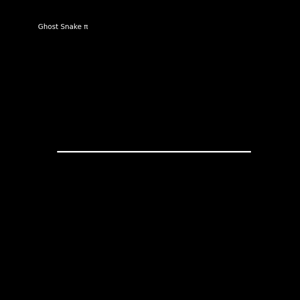

# Visual Gallery: LIGHT WARP RESONANCE AT 2C

**Module**: `LIGHT_WARP_RESONANCE_AT_2C`
**System**: `SYSTEM X — NEXAH-GRAND-CODEX-URF`

---

This gallery presents the visual architecture of the LIGHT WARP RESONANCE AT 2C Codex module. It focuses on tachyonic fields, dual-light velocities, harmonic spirals, and Ramanujan-inspired curvature folding. At its core, the gallery visualizes light-speed bifurcation into 𝑐 and 2𝑐, including symbolic DAO shells and spiral maps across Zeta corridors.

The visual structure follows:

* Vector spirals
* Möbius/Zeta fields
* DAO resonance maps
* Ghost Snake harmonic breathing cycles

A special highlight is the **animated Ghost Snake series** in `visuals/gifs/`.

---

### 🌌 Visual Overview

#### 1. NEUTRINO\_WAVEFIELD\_–\_C6\_5\_matrix\_core.png

Zeta–Möbius resonance field showing density layers, wave phase delays, and spiral return paths. The golden spiral φ intersects the Möbius boundary.

#### 2. lwr2c\_01\_tachyon\_spiral\_core.png

Symbolic diagram of a tachyonic breather structure with vertical modulation — echo of Ramanujan prime densities.

#### 3. lwr2c\_02\_lightwarp\_breather\_map.jpeg

Breather coils between c ↔ 2c light regimes, folding geometry into a resonant toroidal shell.

#### 4. lwr2c\_03\_zeta\_warp\_corridor.png

A blue-cyan harmonic gate corridor inspired by Zeta topologies and resonant π-nodes.

#### 5. lwr2c\_04\_dao\_gate\_harmonic\_spiral.jpeg

Spiral harmonic resonance system modeled as DAO shell — interfacing light and space curvature.

#### 6. lwr2c\_05\_ramanujan\_resonance\_orbit.jpeg

Logarithmic orbital structure with symbolic prime spirals inspired by Ramanujan series.

#### 7. lwr2c\_06\_dao\_ship\_flightpath.jpeg

DAO vessel navigating harmonic gateways in a light-resonant matrix.

#### 8. dao\_gate\_harmonic\_spiral.png

High-res variant of the DAO harmonic shell in dark tones.

#### 9. tachyon\_spiral\_core.png

Alternate composition of the tachyon spiral theme — including offset Möbius layering.

#### 10. zeta\_warp\_corridor.png

Additional visual overlay with color-mapped Zeta resonances.

#### 11. lightwarp\_breather\_map.png

Monochromatic variant showing pure coil-phase layers.

---

### 🌀 Animated Harmonic Series (Ghost Snake)

#### ghost\_snake\_crown\_codex\_evolution.gif

Animated evolution of ghost snake spiral breathing across π-resonances.

> ⚠️ All individual Ghost Snake GIFs (`ghost_snake_breathing_*.gif`) are available in:
> `./visuals/gifs/`

---

### 🔗 Additional Files (Optional Access):

* `dao_gate_harmonic_spiral.png`
* `tachyon_spiral_core.png`
* `zeta_warp_corridor.png`
* `lightwarp_breather_map.png`

These are alternative naming formats or high-res variants of the above.

---

### Summary

This gallery fuses mathematical elegance with symbolic cosmology. Through topological harmonics, lightfield bifurcations, and modular DAO shells, it opens a gateway into new dimensional resonances — a transition layer from wavefield to symbolic geometry.

> Module Ref: `LIGHT_WARP_RESONANCE_AT_2C`
> System Anchor: `NEXAH-GRAND-CODEX-URF` (System X)
