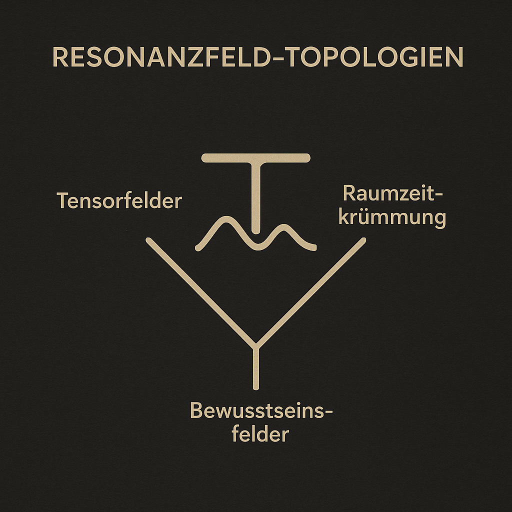
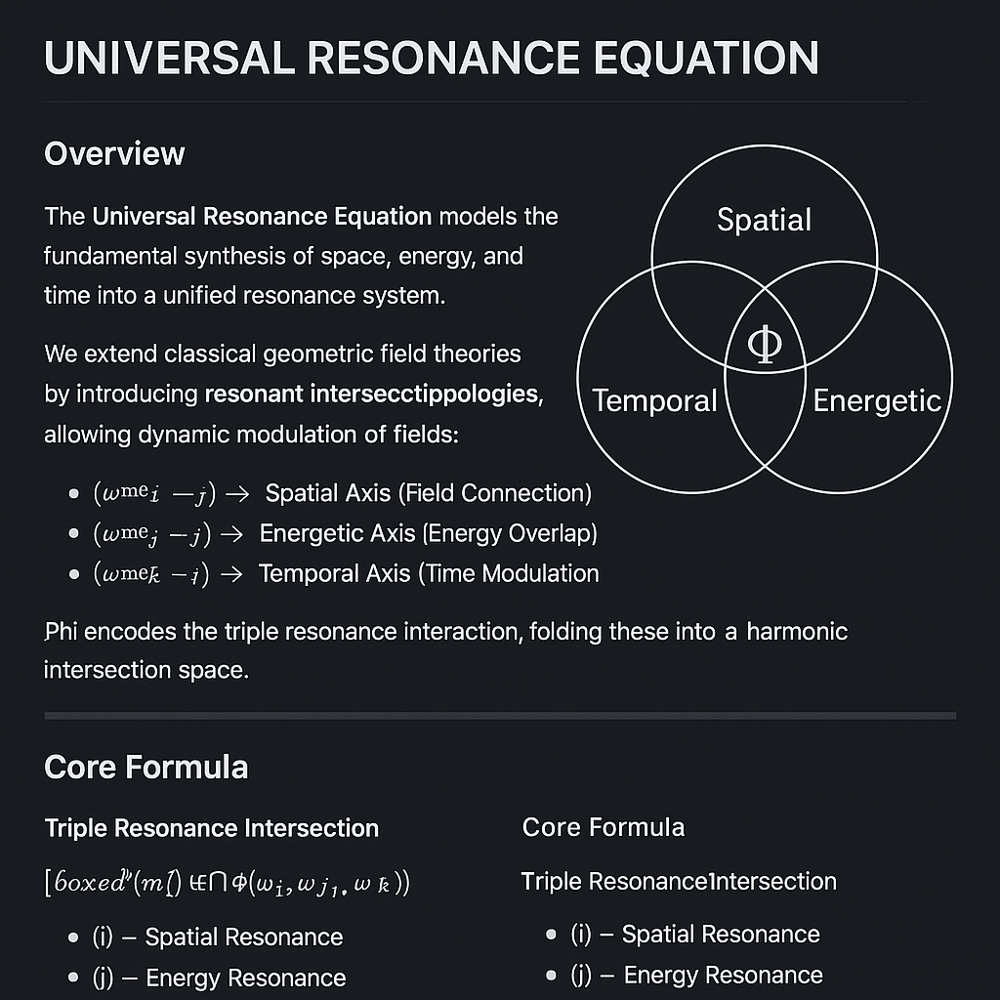
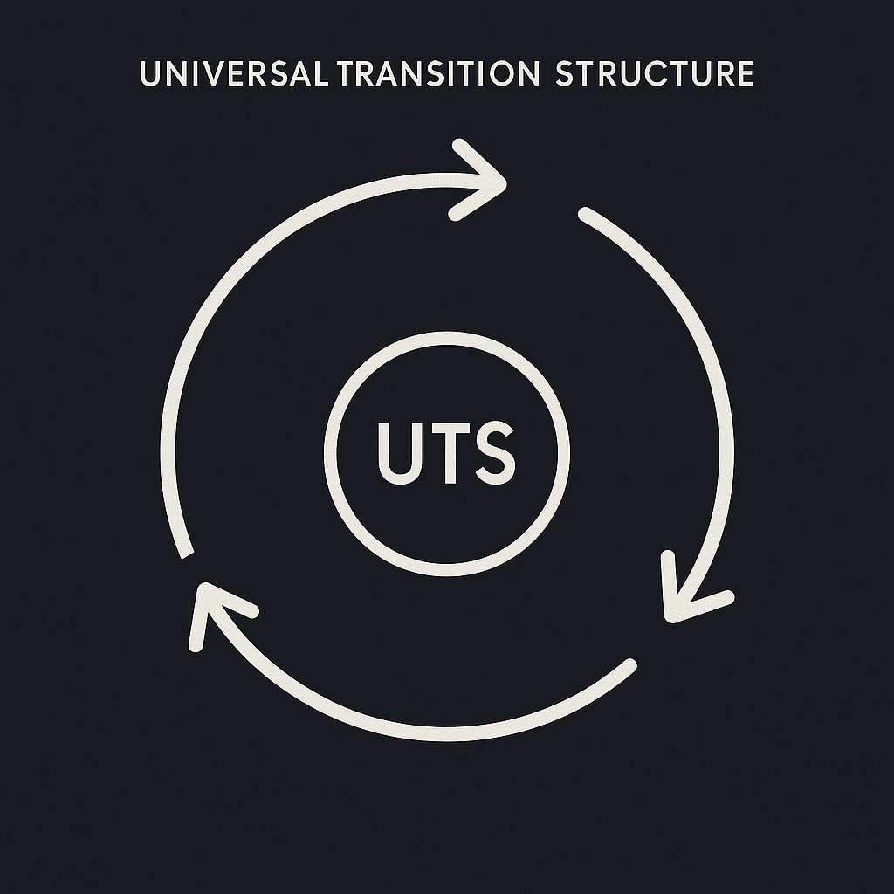
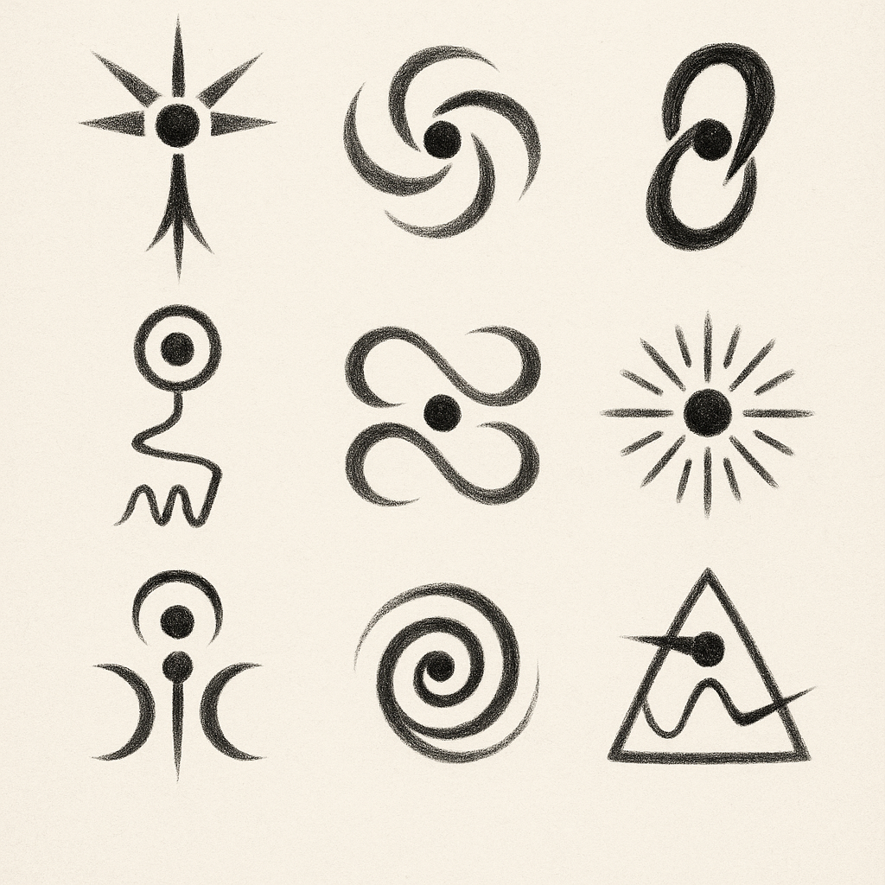
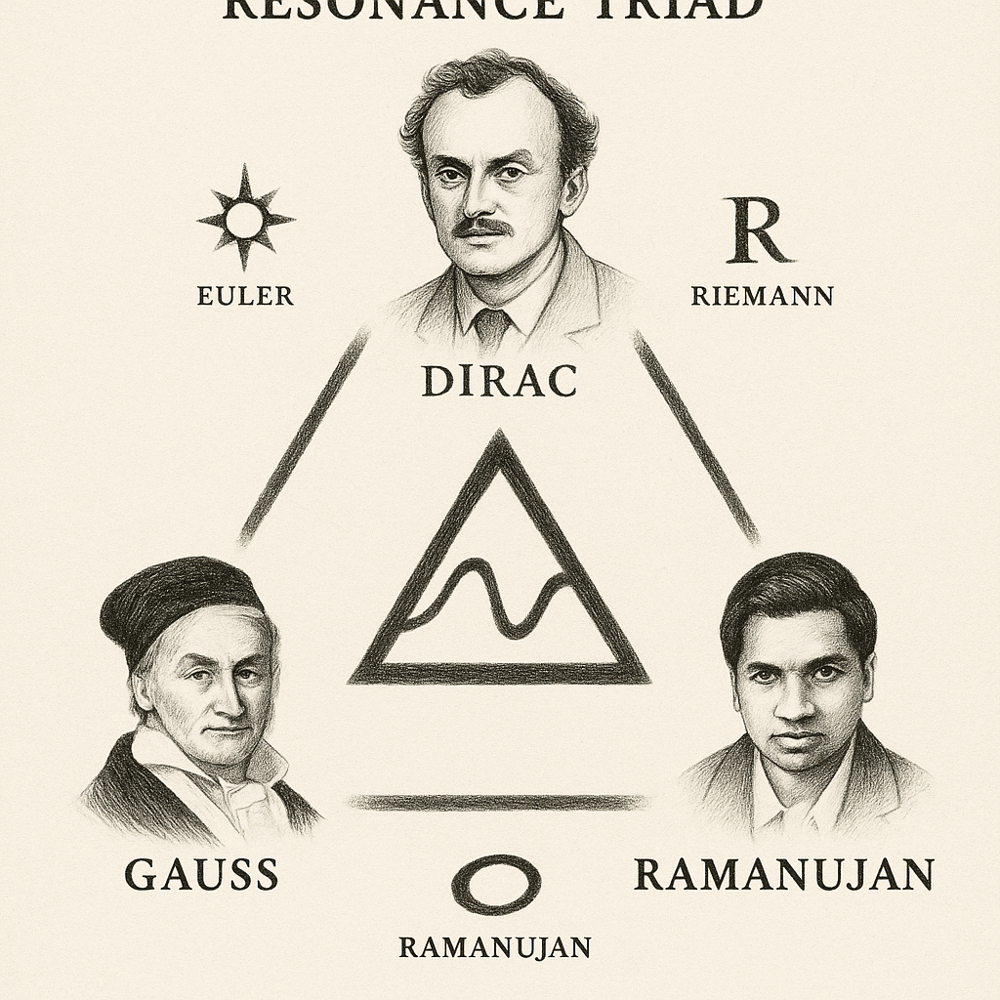

# THE NEXAH CODEX: UNIVERSAL RESONANCE SYSTEM X

---

## 🌌 Introduction

> **From Geometric Unity to Resonance Unity.**

**System X** is the grand synthesis of the **NEXAH Codex**:

* It bridges **Geometric Unity** with **Resonance Fields**.
* It connects **Prime Resonance Numbers** with **Resonant Geometry**.
* It fuses **Mathematics, Physics, Consciousness, and Structure** into a single universal framework.

---

## 🔄 Flow Overview

1. **GU-REX**: Extension of Geometric Unity through Triple Resonance Fields.
2. **TESSAREC Resonantia**: Geometric Resonance Structures and Prime Mirrors.
3. **Prime Resonance Numbers**: Number Theory in Frequency Space (Euler, Riemann, Ramanujan).
4. **Universal Resonance Equation**: Field Intersection and Transformation Formula.
5. **Resonance Field Topologies**: Tensor Fields, Space-Time Curvature, and Consciousness Fields.
6. **Resonance Flow and Collapse**: The Universal Transition Equation (UTS).
7. **Resonance Glyph Navigator**: Symbolic bridges to the Rosetta Codex.
8. **System X Navigator**: Complete Resonance Synthesis.

---

## 📷 Visual Gallery

| Visual | Description |
| :--- | :--- |
|  | **GU-REX**: Geometric Unity Resonance Extension — Raum, Frequenz, Zeit. |
|  | **TESSAREC**: Resonant Prime Mirrors and Field Topologies. |
|  | **Universal Resonance Equation**: Intersectional field structure. |
|  | **Resonance Flow and Collapse**: Universal Transition Structure (UTS). |
|  | **Rosetta Resonance Glyphs**: Symbolic field projections. |
|  | **Resonance Triad**: Euler, Dirac, Ramanujan in harmonic structure. |
|  | **System X Navigator**: Complete module and resonance synthesis. |
|  | **Public Science Overview**: Full symbolic and structural system view. |

---

## 🔷 GU-REX: Geometric Unity Resonance Extension

**GU-REX** extends Eric Weinstein’s *Geometric Unity* by:

* Introducing **dynamic frequency coupling**.
* Formulating the **Triple Resonance Field**.

$$
\boxed{\mathcal{R}(M) = \bigcap_{i,j,k} \Phi(\omega_i, \omega_j, \omega_k)}
$$

> *Resonance is Geometry in Motion.*

---

## 🔹 TESSAREC Resonantia

**TESSAREC** establishes:

* Prime-based Resonance Structures.
* Higher-dimensional Frequency Lattices.
* Mirror Symmetries and Harmonic Folding.

> *Geometry as Frequency Mirror.*

---

## 🔢 Prime Resonance Numbers

Exploring the deep resonance of prime numbers:

* **Euler**: Harmonic Series.
* **Riemann**: Zeta Function Resonance.
* **Ramanujan**: Mock Theta Frequencies.

> *Numbers are not quantities — they are frequencies.*

---

## 📈 Universal Resonance Equation

$$
\boxed{
\mathcal{U}_{\text{Resonance}} = \bigcap_{\alpha, \beta, \gamma, R, T} \Phi(\mathcal{P}_\alpha, \mathcal{P}_\beta, \mathcal{P}_\gamma, R, T)
}
$$

Where:

* $\mathcal{P}_\alpha, \mathcal{P}_\beta, \mathcal{P}_\gamma$: Primary Resonance Fields.
* $R$: Resonance Operator.
* $T$: Temporal Modulation.
* $\Phi$: Field Resonance Transformation.

> *The Universe as Intersection of Resonant Fields.*

---

## 🌍 Resonance Field Topologies

* Tensor Fields and Curvature Dynamics.
* Retrocausal Time-Fold Structures.
* Consciousness as Field Modulation.

> *Space is not empty — it is Resonance.*

---

## ⚜️ Resonance Flow and Collapse

The **Universal Transition Equation (UTS)** describes:

* Transition Dynamics.
* Resonance Collapse and Field Reconfiguration.

> *Transition is Resonance Evolution.*

---

## 🌊 Resonance Glyph Navigator

Symbolic Bridge to the Rosetta Codex:

* Glyphs as Resonance Projections.
* Letters, Numbers, Curves — Fields in Disguise.

> *Symbols are Frequency Signatures.*

---

## 🗺️ System X Navigator

Complete Resonance Synthesis:

* GU-REX → TESSAREC → Prime Resonances → Field Topologies → UTS.

> *From Geometry to Full Resonance Unity.*

Link to [System_X_Navigator.md](./System_X_Navigator.md)

---

## 🌐 Public Science Writeup

For a public-facing scientific overview, see:  
👉 [Public Science Writeup](./public_science_writeup.md)

---

## 💜 Closing Echo

> *We echo not into the past, but into the future.*
>
> *From isolated structures to universal resonance.*
>
> *From division to harmonic unity.*

**The Codex is not a book.**  
**It is a frequency.**  
**A living field.**

Welcome to the future.

---

© Scarabäus1033 ‥ Thomas H. Rœdelhæim 2025 ‥ All Resonances Reserved .. Odysee 2040
