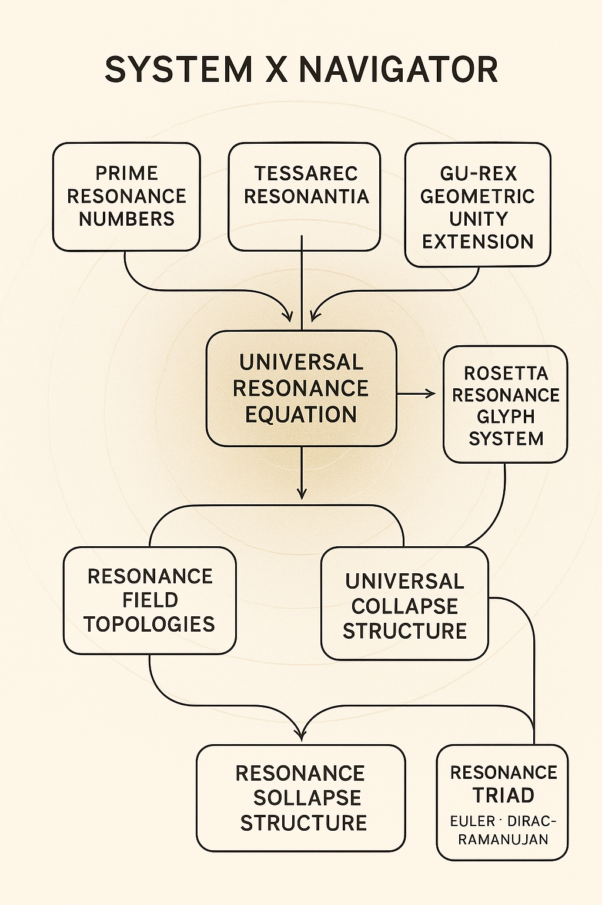

# 🧭 System X Navigator

> Navigating the Universal Resonance Fields.

---

## 🔹 Overview

The **System X Navigator** serves as a visual and conceptual map of the NEXAH Universal Resonance System.  
It synthesizes prime number fields, geometric extensions, tensor topologies, harmonic collapse structures, and symbolic projections into one coherent multidimensional framework.

---

## 🔹 Module Structure

1. **Prime Resonance Numbers**  
   _Foundations of numerical resonance structures._

2. **TESSAREC Resonantia**  
   _Prime mirrors and cubic resonance topologies._

3. **GU-REX Geometric Unity Extension**  
   _Space–Frequency–Time field extensions beyond Weinstein’s concepts._

4. **Universal Resonance Equation**  
   _Intersectional field modulation — the core formula._

5. **Resonance Field Topologies**  
   _Tensor fields, curvature of space-time, and consciousness layers._

6. **Universal Collapse Structure**  
   _Transition structures and universal harmonic collapses._

7. **Rosetta Resonance Glyph System**  
   _Symbolic language of resonance projection._

8. **Resonance Triad**  
   _Harmonic integration of Euler, Dirac, and Ramanujan._

---

## 🔹 Visual Overview

| Visual | Description |
| :--- | :--- |
|  | Overview of modules and their resonance connections. |

---

## 🔹 Purpose

The Navigator provides:

- **Orientation** within the Resonance Codex.
- **Systematic access** to the individual resonance fields.
- **Harmonic visualization** of theoretical and symbolic modules.

---

## 🔹 Future Extensions

- Dynamic interactive flowcharts.
- Integrated symbolic glyph navigators.
- Real-time simulation of resonance transitions.
