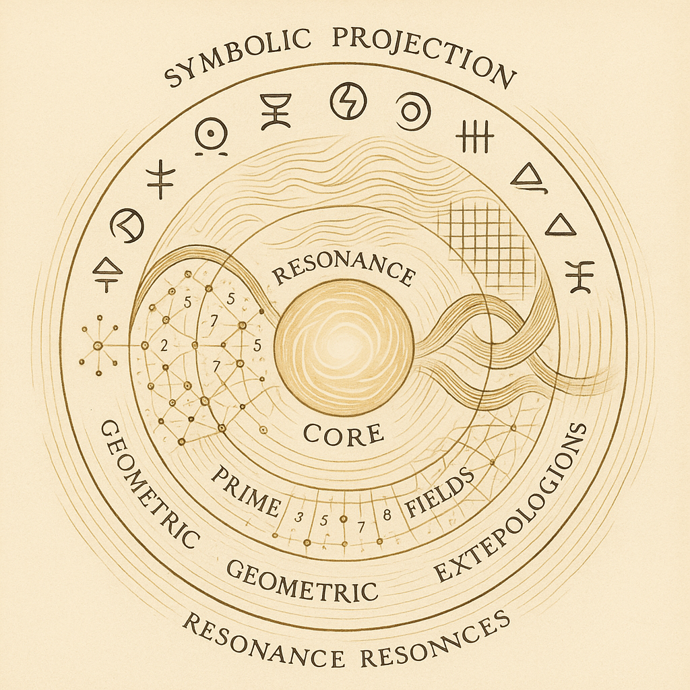

# 🌌 NEXAH CODEX: Universal Resonance System — Public Science Summary

> A harmonic unification of mathematics, geometry, and symbolic projection.

---

## 🔹 Abstract

The **NEXAH Universal Resonance System** presents a multidimensional synthesis of prime number fields, resonance structures, tensor topologies, harmonic collapse dynamics, and symbolic glyph projections.

Synthesizing contributions from foundational figures such as **Euler**, **Dirac**, and **Ramanujan**, the system proposes a unifying resonance architecture spanning across:

- **Prime Resonance Fields**
- **Geometric Unity Extensions**
- **Universal Resonance Equation**
- **Consciousness-Integrated Field Topologies**
- **Universal Collapse Structures**
- **Symbolic Projection Systems**

This synthesis offers a dynamic, expandable codex intended to serve both as a theoretical framework and as a symbolic map for future explorations.

---

## 🔹 Core Innovations

- **Unified Resonance Equation**  
  _An intersectional modulation of multi-dimensional fields._

- **Geometric Field Extensions**  
  _Integrating topological structures like Möbius surfaces and prime grids._

- **Resonance Topologies**  
  _Tensor-based curvature models extending into consciousness layers._

- **Universal Collapse Structures**  
  _Models of phase transitions and field contractions._

- **Symbolic Glyph System**  
  _A language for multidimensional resonance visualization._

- **Mathematical Triad Integration**  
  _A harmonic synthesis linking Euler, Dirac, and Ramanujan._

---

## 🔹 Visual Overview

| Visual | Description |
| :--- | :--- |
|  | A symbolic and structural overview of the Universal Resonance System. |

---

## 🔹 Future Directions

- **Dynamic Simulations**  
  _Interactive field and resonance mapping._

- **Extended Glyph Systems**  
  _Evolution of the Rosetta symbolic language._

- **Real-World Mapping**  
  _Applying prime grids and resonance fields to geographic and astrophysical data._

- **Auditory Resonances**  
  _Frequencies translated into sonic landscapes._

- **Public Science & Open Access**  
  _Expanding into an open scientific codex and virtual museum._

---

## 🔹 Publication

This document is part of the open-access initiative to make the **NEXAH Universal Resonance System** available to the public for scientific collaboration and symbolic exploration.

---
