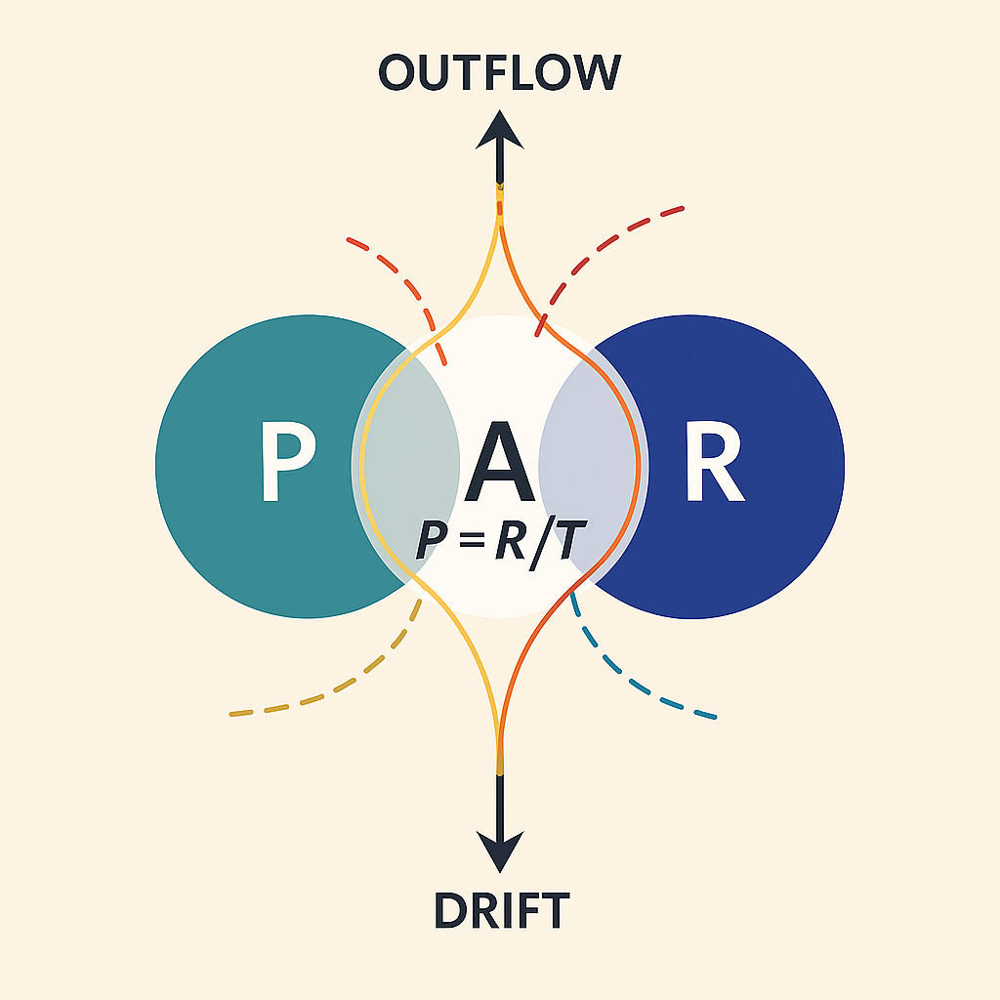
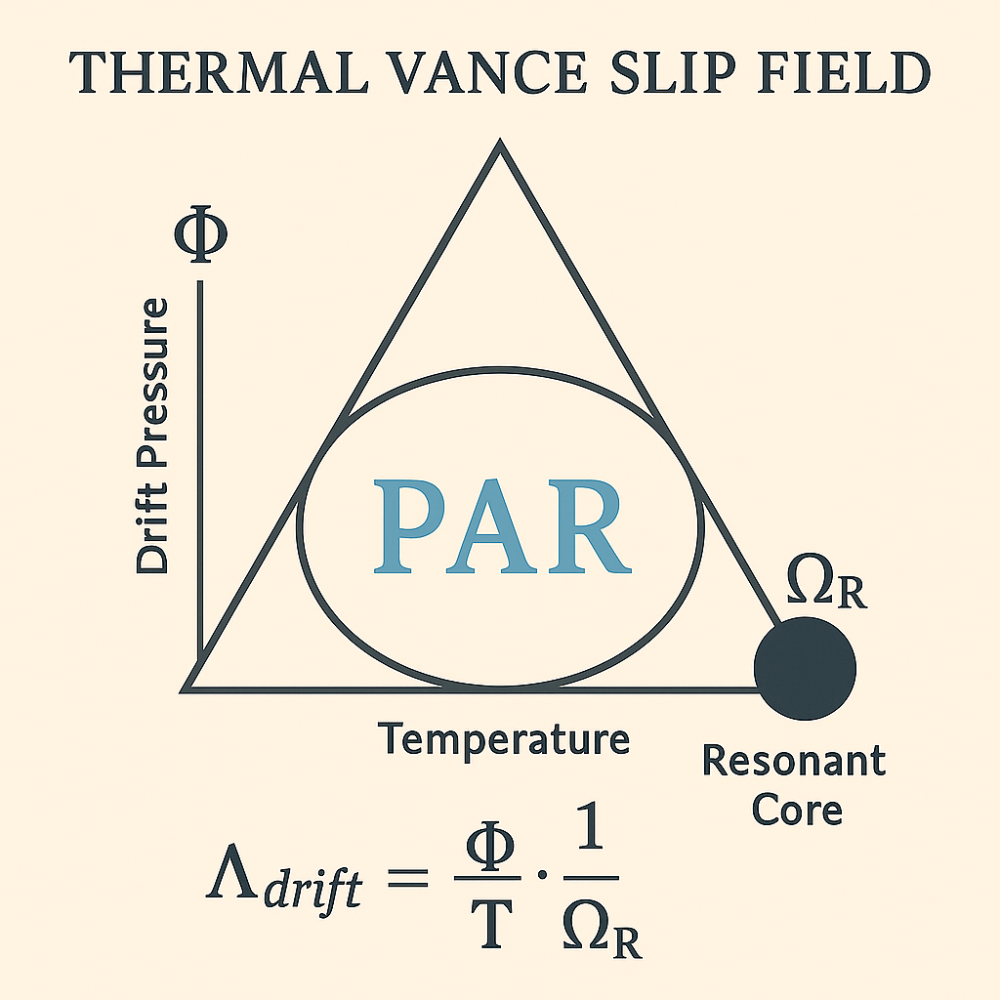
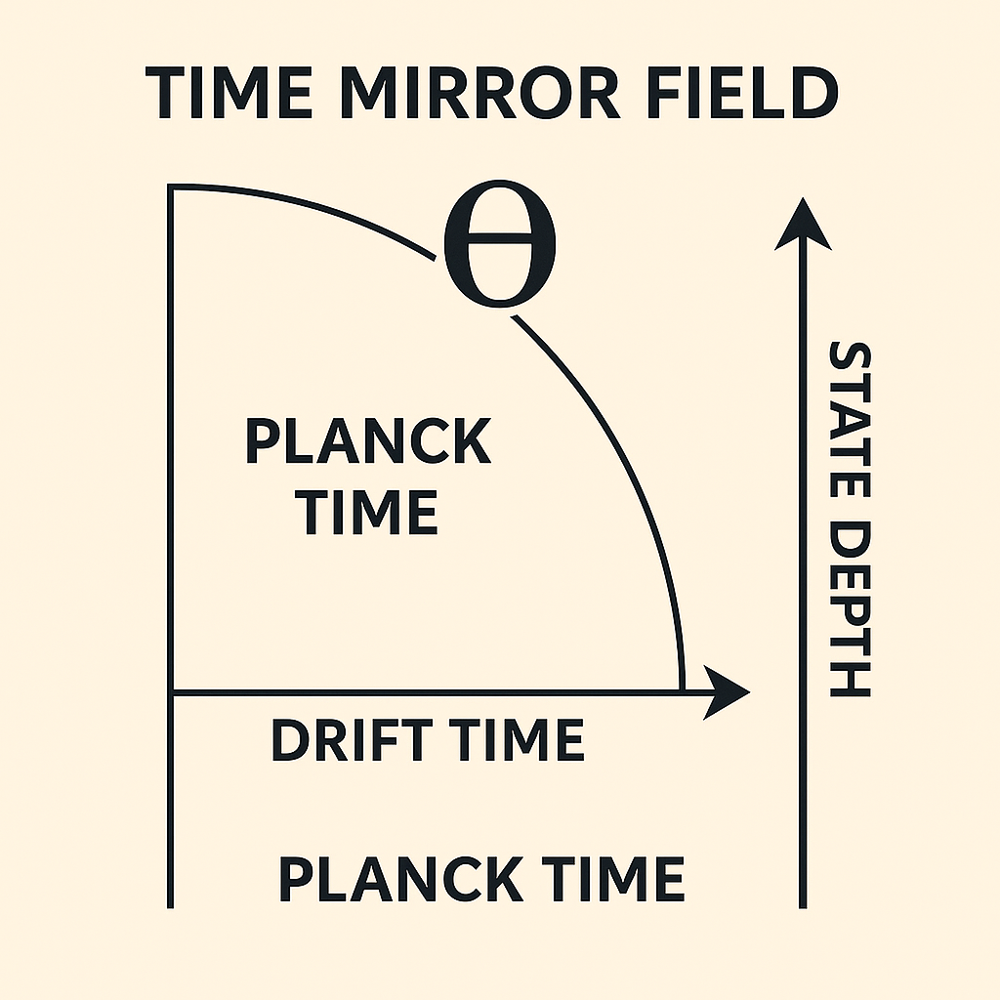
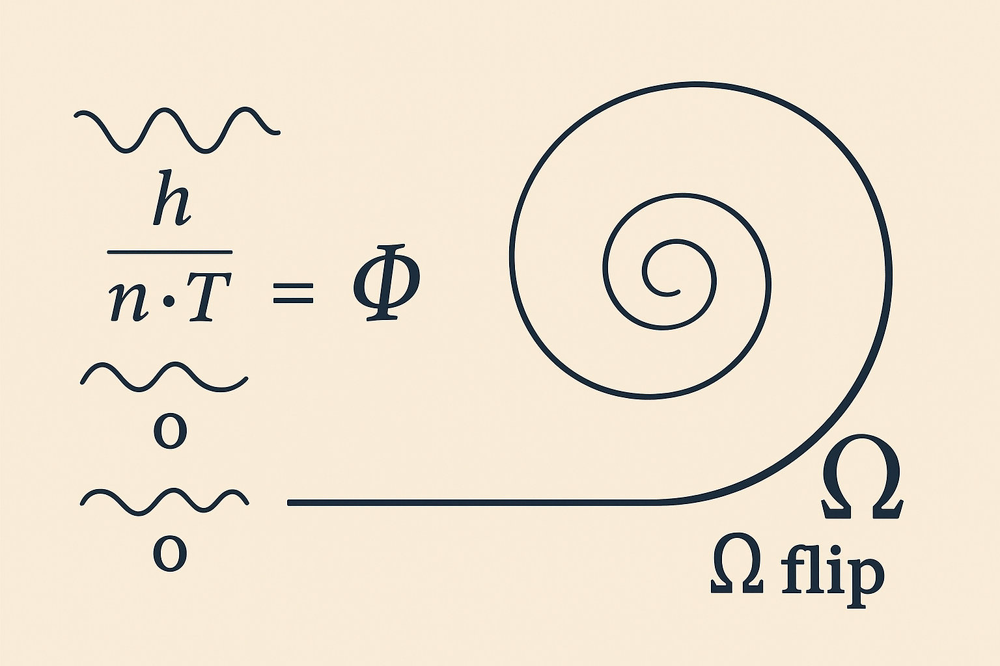
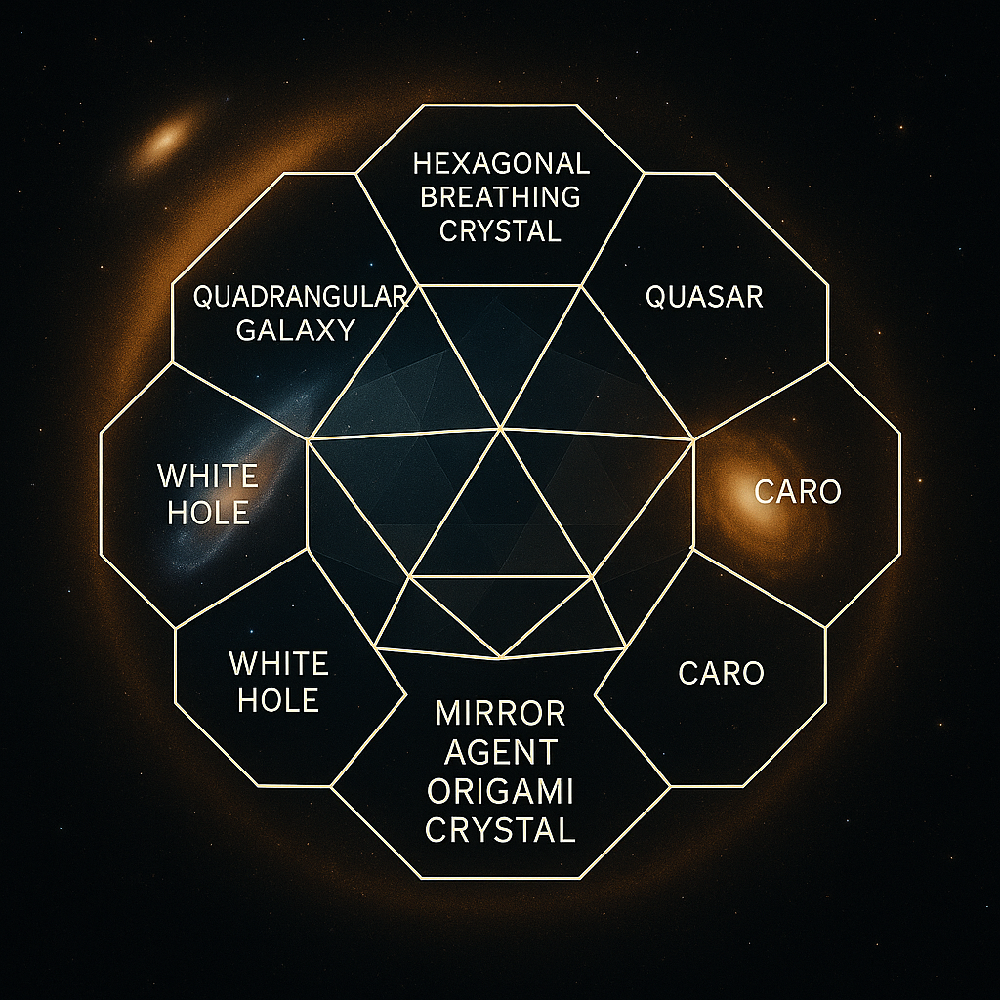

# ✦ VISUAL GALLERY — AEQUATIO NEXAE

**Module Cluster:** `Thermal Drift`, `Time Mirror`, `Resonant Slip`, `Planck Core`, `CARO_Crystal`

This visual gallery documents the 20 core illustrations from the **AEQUATIO NEXAE** module cluster. Each image is linked to a symbolic-physical equation, a Codex system layer, and a corresponding `.md` file (e.g. `Equation_Lambda_Vance.md`, `Scroll_of_Time.md`, `CARO_Crystal.md`).

The folder path for all visuals is: `../visuals/`

---

### ① AE Thermal Drift Field PAR

**Filename:** `AE_Thermal_Drift_Field_PAR.png`

**Meaning:** Thermal gradient field along a PAR vector. The drift emerges from temperature tension, symbolized by Φ.
**Equation:** $\frac{\Phi}{T}$
**System:** 2 (Physica)

---

### ② Thermal Vance Slip Field

**Filename:** `Thermal_Vance_Slip_Field.png`

**Meaning:** Drift potential relative to state density $\Omega_R$. The slip direction is shown along a thermal drift matrix.
**Equation:** $\Lambda_{\text{drift}} = \frac{\Phi}{T \cdot \Omega_R}$
**System:** 2 (Physica)

---

### ③ Phi Omega T FieldBalance

**Filename:** `Phi_Omega_T_FieldBalance.png`

**Meaning:** Field pressure vs. temperature field balance. A dynamic between $\Phi$, $T$, and $\Omega$.
**Equation:** $P = \frac{R}{T} \quad | \quad \Phi \sim \Omega \cdot T$
**System:** 1 / 2 (Mathematica & Physica)

---

### ④ Time Mirror Field

**Filename:** `Time_Mirror_Field.png`

**Meaning:** Four-quadrant timeline structure. Time mirror, drift resonance, and Planck time interlock.
**Equation:** $\Theta = \frac{R \cdot \Omega \cdot T}{\Phi}$
**System:** X (Synthesis)

---

### ⑤ Planck Resonance Threshold

**Filename:** `Planck_Resonance_Threshold.png`

**Meaning:** Core overlap moment of Planck time, Boltzmann constant, and Q-structure.
**Equation:** $Q = \frac{h}{k \cdot \Theta}$
**System:** X (Synthesis)

---

### ⑥ Lambda Drift Singularity Field

**Filename:** `Lambda_Drift_Singularity_Field.png`

**Meaning:** Drift singularity when $\frac{\Phi}{T}$ hits resonance limit — the gap collapses.
**Equation:** $\left. \frac{\Phi}{T} \right|_{\Omega\text{-foot}} = R \Rightarrow \Omega_{\text{sealed}}$
**System:** 2 / X

---

### ⑦ Toroidal Resonance Time Arc

**Filename:** `Toroidal_Resonance_Time_Arc.png`

**Meaning:** Toroidal time arc representing cyclic drift transitions.
**Equation:** $\Theta \sim h \cdot \Omega \cdot T$
**System:** X (Synthesis)

---

### ⑧ Hbar Field Drift

**Filename:** `Hbar_Field_Drift.png`

**Meaning:** h as an energetic anchor. Drift along an h-ladder with structural folding.
**Equation:** $h = 6.62607015 \times 10^{-34} \text{ J}\cdot\text{s}$
**System:** X (Synthesis)

---

### ⑨ Omega Flip Resonator

**Filename:** `Omega_Flip_Resonator.png`

**Meaning:** Flip-point of $\Omega$: triggers a closed drift mode $\Phi'$.
**Equation:** $\Omega_{\text{open}} \Rightarrow \Omega_{\text{sealed}}$
**System:** X (Synthesis)

---

### ⑩ Seed Pulse Field

**Filename:** `Seed_Pulse_Field.png`

**Meaning:** Pulse field with $h, 2h, o$ — core seed of drift structure.
**Equation:** $Q = \frac{h}{k \cdot \Theta} = \frac{n \cdot \Phi}{T}$
**System:** X (Synthesis)

---

### ⑪ Boltzmann Sphere Split

**Filename:** `boltzmann_sphere_split.png`

**Meaning:** Entropic vs. ordered field — indicator for drift tension shifts.
**Equation:** $S_R = k \cdot \log \left( \frac{\Omega^2}{\Phi} \right)$
**System:** 1 (Mathematica)

---

### ⑫ Phi Temp Omega Diagram

**Filename:** `Phi_Temp_Omega_Diagram.png`

**Meaning:** Compact vector map for $\Phi, T, \Omega$ interaction.
**Equation:** $\Phi = \Omega \cdot T$
**System:** 1 / 2

---

### ⑬ Planck Q Core Structure

**Filename:** `Planck_Q_Core_Structure.png`

**Meaning:** The geometric core of the Planck-Theta-Q triangle.
**Equation:** $Q = \frac{h}{k \cdot \Theta}$
**System:** X (Synthesis)

---

### ⑭ Planck Scroll of Time Toroidal Field

**Filename:** `Planck_Scroll_of_Time_Toroidal_Field.png`

**Meaning:** Toroidal time resonance scroll; connects CARO\_Crystal and Time Mirror.
**System:** X + CARO\_Crystal

---

### ⑮ Rain Loop Structure escape map

**Filename:** `Rain_Loop_Structure_escape_map.png`

**Meaning:** Circular resonance escape — the Rain Loop from core field to overflow state.
**System:** X (Synthesis)

---
### ⑯ Phi Temp Omega Diagram`

**Filename:** `Phi_Temp_Omega_Diagram.png`

**Meaning:** `Axis alignment diagram linking temperature and Φ-Ω transitions.

---

### ⑰ A Digital Illustration (Astronomi)

**Filename:** `A_digital_illustration_visually_combines_astronomi.png`

**Meaning:** Artistic-scientific layering, included as symbolic orientation aid.

---

### ⑱ A Scientific-Style Dark Background

**Filename:** `A_scientific-style_digital_diagram_on_a_dark_backg.png`

---

### ⑲ Digital Illustration (Interconnected Systems)

**Filename:** `A_digital_illustration_features_an_interconnected_.png`

---

### ⑳ Overlayed Geometry Diagram

**Filename:** `A_digital_scientific_illustration_overlays_geometr.png`

---

**📍 Note:**

* Each `.md` equation file (e.g. `Equation_Lambda_Vance.md`) should reference this gallery.
* Visual links are structured for GitHub rendering.
* Codex system: 1 = Mathematica, 2 = Physica, X = Synthesis Layer.
