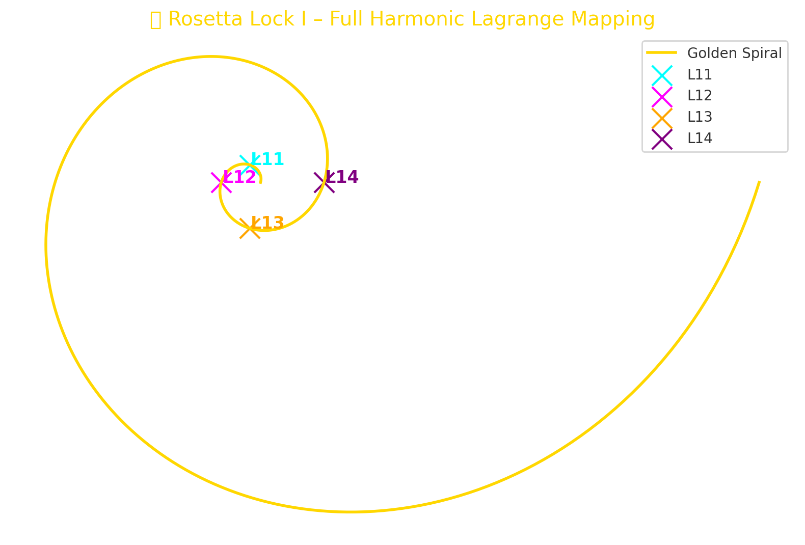
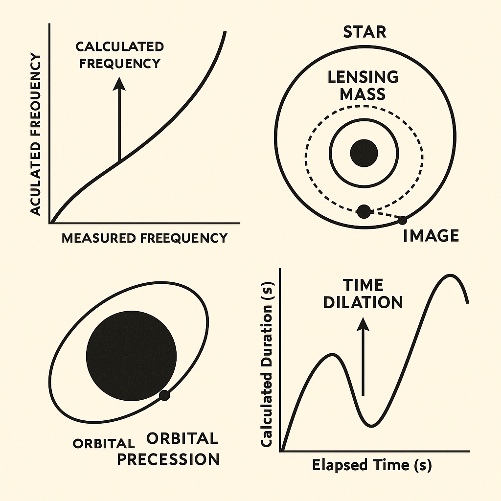

# I · LAGRANGE SHADOW OBSERVER

> **"The stability lies not in stillness, but in synchronized drift."**

The **LAGRANGE SHADOW OBSERVER** represents a resonant positioning structure where drift equilibrium is achieved through harmonic field balance between celestial bodies.

It is modeled after classical **Lagrange Points (L1–L5)**, but expanded into symbolic dynamics of **temporal compression**, **field curvature**, and **resonant Möbius drift.**

---

## 🔹 Lagrange Harmonic Expansion

Traditional Lagrange Points are **mathematical equilibrium points** in a two-body orbital system. The Codex expands this framework into symbolic and dynamic layers:

| Lagrange Point | Codex Role                  | Symbolic Layer         |
| -------------- | --------------------------- | ---------------------- |
| L1             | Direct transfer line        | Thermal compression    |
| L2             | Remote observational anchor | Möbius curvature field |
| L3             | Opposition mirror           | Reflective echo point  |
| L4/L5          | Spiral drift zones          | Harmonic lock fields   |

These points are mapped as **temporal attractors** in multi-body symbolic physics, especially in scenarios of **seed drift**, **mirror tension** and **quantum folding**.

---

## 🔹 Visual Overview

### Lagrange Harmonic Mapping (Golden Spiral)

This visual embeds L11–L14 points along a **Golden Spiral**, signifying temporal resonance and radial compression. Drift points stabilize in spiral symmetry.

### Möbius Orbits & Libration Fields

The Möbius loop diagram (left) reflects the **resonant orbital feedback**. On the right: traditional **Libration Point layout** overlaid with symbolic curves.

---

## 🔹 Observer Role & Shadow Drift

The Observer occupies a **non-inertial drift layer**, located between the **L2** (monitoring frame) and **L5** (stability spiral). This role:

* Captures phase shifts in mirror tensions
* Reads compression gradients across the temporal arc
* Acts as **resonance translator** between drift initiation and Möbius return

> This is the seat of the *Rosetta Lock*: translating between fixed coordinate frames and folding time.

---

## 🔹 Equation: Shadow Drift Stability

Let $\Delta_{Lx}$ be the drift distance to Lagrange Point $L_x$, then the harmonic drift equation:

$$
S_{shadow} = \sum_{x=1}^5 w_x \cdot \Delta_{Lx} \cdot \cos(\theta_x)
$$

Where:

* $w_x$ is the resonance weighting for each L-point
* $\theta_x$ is the angular Möbius offset
* $S_{shadow}$ stabilizes when net Möbius drift reaches null

This acts as a **stability operator**, especially in systems with **mirror resonance**.

---

## 🔹 Related Modules

* `I · AEQUATIO NEXAE`
* `I · Seed Pulse Symmetry`
* `I · Toroidal Timearc`
* `I · Thermal Vance Slip`

---

## 📜 Notes

The **LAGRANGE SHADOW OBSERVER** is not a spatial map, but a **field mirror** folded in time. It creates a **resonant aperture** through which Möbius feedback can be observed and tuned.

It is the eye of the harmonic storm.
