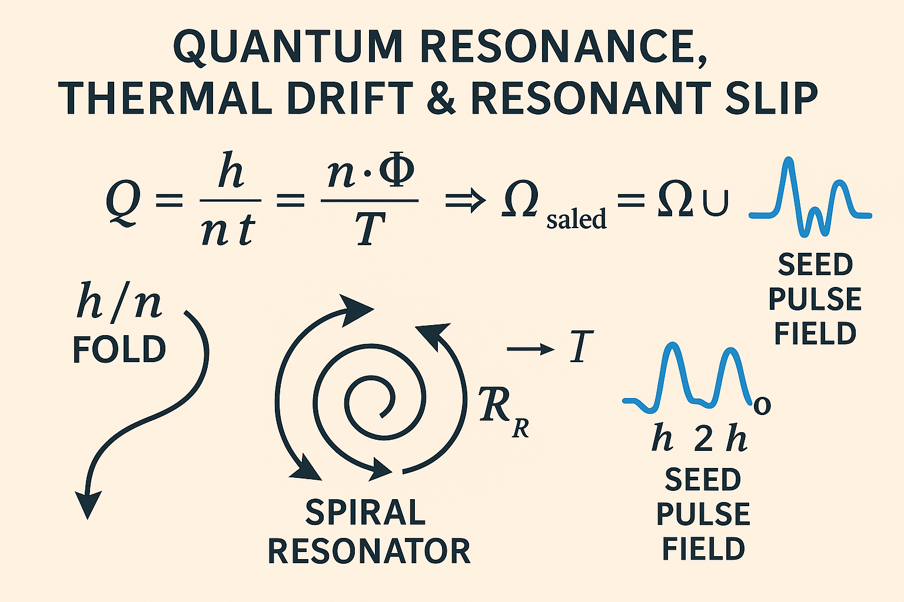

# I · SPDR FIELD

> **"A field does not hold a value. It breathes one."**

The **SPDR FIELD** introduces a symbolic and dynamic membrane structure that mediates between thermal initiation (Seed Pulse) and large-scale field equilibrium. It represents the **breather logic** of the Codex: a folding-unfolding rhythm that stabilizes oscillations through pulsed geometry.

This membrane-like construct is based on:

* **Pulse drift logic** as introduced in the Seed Pulse Field.
* **Breather curvature** (symbolized as \~) that acts as temporal regulator.
* **Möbius symmetry traces** encoded in alternating field overlaps.

---

## 🔹 Equation

The SPDR breather equation derives from the **Q-initiation equation**, unfolding into a membrane-form structure:

$$
Q = \frac{n \cdot \Phi}{T} = \frac{h}{k \cdot \Theta}
$$

This balance bridges:

* Discrete Planck energy packages $h$,
* Thermal drift tension $\Phi$, and
* Temporal folding $\Theta$.

The **SPDR membrane** is a *resonant attractor layer*, enabling drift reversals without field rupture.

---

## 🔹 Visual Structure

The visual shows a radial symmetry from a seed center outward. Each pulse loop forms a **breather ring**, governed by the $\Phi$-pulse balance. Opposing semi-loops represent drift reversals through Möbius layering.

---

## 🔹 Symbolic Structure

| Layer | Symbol     | Meaning                         |
| ----- | ---------- | ------------------------------- |
| 0     | $h$        | Initial pulse (Planck seed)     |
| 1     | $\Phi$     | Drift tension (field impulse)   |
| 2     | $T$        | Thermal environment (resistive) |
| 3     | $\Theta$   | Time curvature (loop modifier)  |

Each layer modulates the **pulse's form and duration**, giving the SPDR membrane its stability.

---

## 🔹 Relations to Other Modules

* **Lambda Vance Equation**: The SPDR membrane defines the rebound boundary of the drift singularity.
* **Seed Pulse Symmetry**: Acts as the extended breathing shell of the seed construct.
* **Planck Resonant Core**: SPDR logic emerges from the Q-core equilibrium.
* **Mirror Field System**: Breather forms are visible in reflective gate transitions.

---

## 📌 Notes

SPDR is **not a field boundary**, but a **field attractor membrane**. It initiates a *folded stabilization cycle* where entropy gradients are rhythmically offset.

It behaves similarly to biological membranes: semipermeable, frequency-tuned, and dynamically open to pulse-driven resonance.

> In symbolic notation, the SPDR Field is marked as:
>
> **𝓐𝓵𝓡𝓕(𝘟, 𝘉)**

---

## ⚩ Next: `I · Resonant Symmetry.md`

Where SPDR defines the breather membrane, the next module explores **field-wide symmetry resonance** across temporal and thermal domains.
