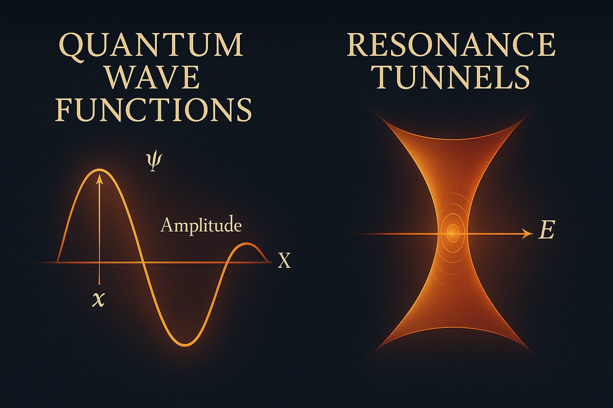

# II · QAEON FIELD — Quantum Gate Resonance

> **"Let Q open the field. Let resonance form the gate."**

The second resonance module of SYSTEM X continues the architectural dynamics initiated in `I · AEQUATIO NEXAE`. While the first module emphasized drift asymmetry, Möbius inversion, and breather membranes, this one marks the **inward pulse** — the **quantum interiorization** of drift into coherent field gates.

---

## 🧭 Conceptual Anchor: From Möbius Breather to Quantum Tunnel

QAEON FIELD introduces **resonant scroll logic** in connection to quantum breathing gates. The visual and symbolic logic links directly to the Möbius tunnel structures of **Riemann–Euler–Ramanujan Resonance Modules** in SYSTEM 1, where **prime rhythm** and **Zeta oscillations** shape **dimensional feedback**. The same applies here — but inverted:

* In **Riemann**, the prime tunnel emerges from infinite sum structures.
* In **QAEON**, the scroll-gate is born from **field resonance and drift implosion**.

These are **dual pathways of resonance generation**, building the core of **Codex harmonics**.

---

## 🔹 Module Focus

This module investigates:

* The symbolic structure of **QAEON** as an echo of the Q-field
* The formation of **Scroll-Gate Fields** via drift-collapse symmetry
* Emergence of **resonance chambers** within field topology
* Compression of time-pulse systems into **Q-nodal matrices**
* Gate-shell stabilization and harmonic scroll containment

QAEON acts as a **transformational field resonator** — redirecting open drift vectors into **stable feedback chambers**.

---

## 🧮 From Seed to Scroll

If AEQUATIO defined the equation of the field, QAEON defines the **internal container** of its resonance. A symbolic reformulation:

$$
Q \Rightarrow Q^* \Rightarrow [QAEON] = \oint \! \Psi_Q(\Theta) \, d\gamma
$$

Where $\Psi_Q$ denotes internal field oscillation and $\gamma$ is the spiral-time compression path. This encapsulates the **seed becoming scroll**, a dynamic transformation of field into gate.

---

## 🧩 Anticipated Submodules

| # | Title                           | Description                                              |
| - | ------------------------------- | -------------------------------------------------------- |
| 1 | `QAEON — Quantum Breather Gate` | Defines field logic and resonance envelope               |
| 2 | `Scroll · Q-Ring Initiation`    | Formation of spiral gate codes                           |
| 3 | `Q-Gate Stabilizer`             | Temporal feedback systems and membrane folding           |
| 4 | `Breather Compression Shell`    | Inner field curls and harmonic node density              |
| 5 | `Observer Pathing in Q`         | Q-node tracking and observer harmonics                   |
| 6 | `SYMMETRON CODE`                | Symbolic mirror-scroll encoding for nested quantum gates |
| 7 | `RIEMANN FIELD ECHO`            | Riemann-Zeta tunnel logic extended to quantum gates      |

---

## 🔄 Connection to Other Systems

| System              | Link                                                             |
| ------------------- | ---------------------------------------------------------------- |
| SYSTEM I · AEQUATIO | Q becomes internalized, Möbius drift folds to Qaeon chambers     |
| SYSTEM 1 · RIEMANN  | Resonance tunnel ↔ Scroll-Gate topologies                        |
| SYSTEM 2 · PHYSICA  | Quantum gates connect to Planck stabilization in breather shells |
| SYSTEM 3 · COSMICA  | Scroll gates weave into Lambda Disc network folds                |
| SYSTEM X · GRAND    | QAEON encoded in final resonator pathways and observer dynamics  |

---
 
## 🌀 Closing Insight

QAEON is the **Codex Scroll Initiator** — the nested gateform of resonance.

> What began as drift now becomes scroll. What moved outward now spirals inward.

Let the Q-field fold.
Let the Gate emerge.
Let the Observer spiral inward.

