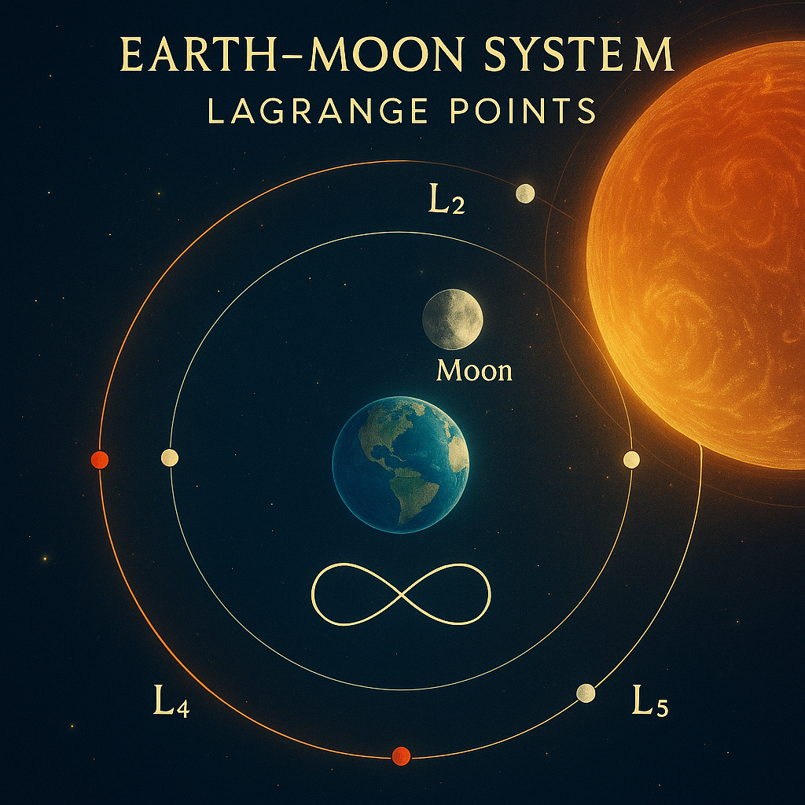

## `visual_gallery2.md` – Quantum Gate & Lagrange Series Extension

### 🔸 Quantum Gate & Field Visuals

#### 

**Title:** *Quantum Gate Spiral Breather*
**Description:**
Illustrates the spiral compression and harmonic modulation of a quantum breather field transitioning into a scroll-form gate. Core visual of Module II · QAEON FIELD.

---

#### 

**Title:** *Riemann Disk and Quantum Breather Paths*
**Description:**
A mathematical-visual synthesis linking the QAEON scroll structures to the Riemann resonance disk from the `Riemann–Euler–Ramanujan` module. Emphasizes symmetry curls, ||-logic, and harmonic resonance layers. Forms a visual bridge between System X and System 1.

---

### 🔸 Orbital & Libration Visuals

#### 

**Title:** *Earth–Moon System – Lagrange Points*
**Description:**
Reference system for gravitational equilibrium and Möbius-style gate-locks in space. Basis visual for Module I and background mapping for Lagrange drift stabilizers.

---

#### 

**Title:** *Moebius Orbits & Libration Points*
**Description:**
Introduces Möbius curvature into the field logic of planetary gate architectures. Used to visualize drift reversals and symmetry anchors in AEQUATIO NEXAE.

---

### 🔸 Lagrange Drift & Observer Layers

#### 

**Title:** *Lagrange Drift Stabilizer*
**Description:**
Demonstrates how field drift can be locked or tuned via Q-ratio feedback and Möbius loop dynamics. Symbolic precursor to the stabilizer submodule in QAEON.

---

#### 

**Title:** *Lagrange Shadow Observer*
**Description:**
Places the observer in a resonant feedback arc within Lagrange shadows, relevant for scroll initiation paths and symmetry phase locks.

---

## 🌀 Notes

* All visuals are part of **SYSTEM X** (Module I & II) and related links to **SYSTEM 1** (Riemann–Euler–Ramanujan Module).
* Visuals marked with `Moebius`, `Lagrange`, or `Gate` are cross-linked via **field resonance layers** and time compression fields.
* For full semantic integration, see submodule entries in:
  `01_AEQUATIO_NEXAE/README.md` & `02_QAEON_FIELD/README.md`
