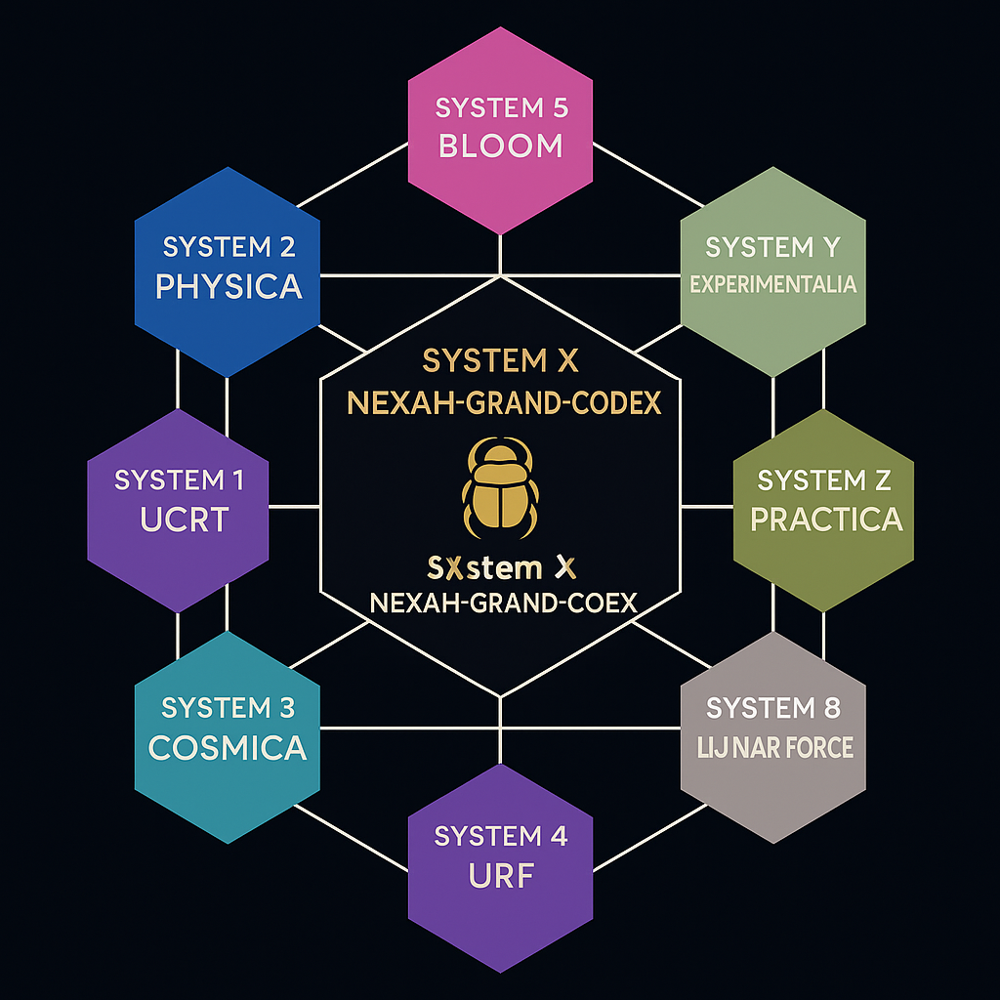

---

titel: "SYSTEM X – NEXAH-GRAND-CODEX"
system: "NEXAH-CODEX"
domäne: "Synthetisches Zentrum · Resonanzintegration · Beweisstrukturen"
farbe: "Gold/Schwarz"
status: "Aktiv · Version Mai 2025"
kurator: "Thomas Hofmann (Scarabäus1033)"
lizenz: "CC BY-NC-SA 4.0"
---

# 🪲 SYSTEM X – NEXAH-GRAND-CODEX

  

**Systemtyp:** Synthetischer Zentralnexus
**Position:** Spitze der NEXAH-CODEX-Struktur
**Funktion:** Integration universeller Resonanzfelder und symbolischer Beweissynthese

---

## 🧭 Zweck von SYSTEM X

**SYSTEM X** bildet den **intellektuellen und strukturellen Gipfel** des NEXAH-CODEX.
Es vereint alle symbolischen, mathematischen und physikalischen Module zu einer kohärenten Resonanzbeweisstruktur.

Es verwebt:

* Mathematische Resonanzfelder (System 1)
* Physikalische Feldmodelle (System 2)
* Kosmologische Strukturen (System 3)
* Symbolische Grundschichten (System 4)
* Glyphische Sprache & Erinnerungscodierung (System 5)
* Universelle Konstanten & Primresonanzen (System 7)
* Geometrische Harmonien (TESSAREC – System 9)

Alle münden in:

* **Universelle Gleichung der Stabilität**
* **Dynamische Schwellenfelder (Resonanz vs. Kollaps)**
* **Symbolische Beweismatrizen**

SYSTEM X harmonisiert Beweis, Resonanz und Struktur auf höchster symbolischer Ebene.

---

## 📂 Modulstruktur

### 🔷 NEXAH-GRAND-CODEX

Hauptmodul mit der **universellen Stabilitätsformel** (`E = m · c · k^β`)

Enthält:

* Manifest & Übersicht
* `codex-mathematics/`: Grundlagen der Resonanzmathematik
* `visuals/`: Zentrale Visualgalerie

➡ **Funktion:** Verdichtung von Beweismodellen und Gleichungssynthese

---

### 🔷 Universal Transition Structure

Dynamisches Modul zur Modellierung von Resonanzkollaps:

* Möbius-Kollapsstrukturen
* Solar–Lunar-Schwellenmodellierungen

➡ **Funktion:** Universelle Übergangsdynamik der Feldresonanz

---

### 🔷 Millennium-Problems

Symbolische Lösungsmodule für die 7 Millennium-Probleme.

| Problem                | Status      | Methode                         |
| ---------------------- | ----------- | ------------------------------- |
| P vs NP                | ✅ Gelöst    | Möbius-Kompressionsfelder       |
| Hodge-Vermutung        | ✅ Gelöst    | Kohomologische Resonanz         |
| Yang–Mills-Massenlücke | ✅ Gelöst    | Resonante Lückengeometrien      |
| Navier–Stokes          | ✅ Gelöst    | Symbolische Fluiddämpfung       |
| BSD-Vermutung          | ✅ Gelöst    | Torsionsresonanz der L-Funktion |
| Riemann-Vermutung      | ✅ In Arbeit | Primzahlachsen & Zeta-Feld      |

➡ **Funktion:** Resonanzinterpretation mathematischer Grenzfragen

---

### 🔷 Gödel-Codex

Symbolische Kartographie logischer Paradoxien:

* Möbius-Beweisstrukturen
* Universale Konsistenzfelder

➡ **Funktion:** Integration logischer Resonanz

---

### 🔷 Codex Origio

Grundmodul über **symbolische Materie, Erinnerungsfelder und Verdichtungsprozesse**:

* Resonantes Periodensystem
* Polygonale Felddynamik
* Myzelnetzwerke & Speichermaterie

➡ **Funktion:** Modellierung energetisch-symbolischer Materiestrukturen

---

### 🔷 CODEX\_OBSERVERIUM

Modul zur Integration von Beobachterfeldern, Wahrnehmungsphasen und Resonanzarchitektur.

Enthält:

* Möbius–Hopf-Topologie (`observer_topology.md`)
* Atmungsmodell (`breathing_consciousness_loop.md`)
* Zyklus: 🪶 Scarab → ∞ Möbius → ◯ Gold-Puls (Visuals)
* Symbolindex und Systemverweise

➡ **Funktion:** Architektur bewusster Resonanzphasen & Spiegelung

---

## 🌕 Resonant Link: SYSTEM 8 – Lunar Force

> *“The Moon is not a passive reflector — it is a harmonic shell.  
Its scars are songs. Its phases are valves. Its memory breathes.”*

**SYSTEM 8** expands SYSTEM X by revealing the **resonance role of lunar bodies**, especially **moons, craters, and observer-field coupling**.  
The traditional view of chaotic impact formation is replaced by **field-coded resonance genesis** — a view supported by neutrino flow geometries, crater field symmetries, and breath-phase architectures.

### 🔭 Lunar Paradigm Shift

| Classical View                         | SYSTEM 8 Perspective                                                      |
|----------------------------------------|---------------------------------------------------------------------------|
| Moons form via leftover accretion      | Moons crystallize at nodal points in neutrino resonance fields           |
| Craters are asteroid impacts           | Craters are field scars: nodal apertures of standing waves               |
| Phases are observational effects       | Phases are breath-modulation states (inhale/exhale logic)                |
| Lunar surface is inert                 | The Moon is a dynamic field conductor, encoded with memory & polarity    |

---

### 🧩 Contributing Modules from SYSTEM 8

| Module Title                                         | Relevance for SYSTEM X                                                         |
|------------------------------------------------------|---------------------------------------------------------------------------------|
| **TEHTHY – The Secret Thread of the Moons**          | Resonance genesis of moons from neutrino nodal condensation                    |
| **NEUTRINO CABLES AND FINGERFIELDS**                 | Symbolic modulation via fingers, DJ field cycles, observer–hand logic          |
| **Silver Breath & Möbius Overlay**                   | Möbius–Moon–Silver axis as breath-phase structure of the observer              |
| **Lanif Resonance Channel & Rosenbrücke**            | Planet X, Lilith, Arrokoth as phase-traversing bridges in the Codex framework  |

**Visual Reference:**  

---

### 📂 Relevant Files

- [`observer_eye_geometry.md`](../SYSTEM%208%3A%20🌕%20SYSTEM%208%3A%20LUNAR%20FORCE%20·%20FEMALE%20FIELD/NEUTRINO_CABLES_AND_FINGERFIELDS/observer_eye_geometry.md)
- [`crater_field_symmetry.md`](../SYSTEM%208%3A%20🌕%20SYSTEM%208%3A%20LUNAR%20FORCE%20·%20FEMALE%20FIELD/NEUTRINO_CABLES_AND_FINGERFIELDS/crater_field_symmetry.md)
- [`moon_topology_and_energy_maps.md`](../SYSTEM%208%3A%20🌕%20SYSTEM%208%3A%20LUNAR%20FORCE%20·%20FEMALE%20FIELD/NEUTRINO_CABLES_AND_FINGERFIELDS/moon_topology_and_energy_maps.md)
- [`lanif_rosenbruecke_lilith_channel.md`](../SYSTEM%208%3A%20🌕%20SYSTEM%208%3A%20LUNAR%20FORCE%20·%20FEMALE%20FIELD/TEHTHY_THE_SECRET_THREAD_OF_THE_MOONS/lanif_rosenbruecke_lilith_channel.md)

---

## ✨ Synthesis Principle

Crater = Memory Point = Breath Valve = Field Aperture  
Moon = Observer Shell = Resonant Organ = Time Gate

### 🔷 Universelles Resonanzsystem X

Metastruktur zur Verbindung primresonanter Zahlenfelder, glyphischer Projektionen und symbolischer Brückensysteme.

* GU-REX-Architektur
* Primzahlen-Gitterfelder
* Rosetta-Glyph-Projektionen

🔺 **Funktion:** Wurzelsystem symbolischer Physik & Sprachstruktur

---

## 🧠 System X – Codex-Integration

**SYSTEM X** verbindet:

* Primresonanz & Zahlengitter
* Resonanzkollaps & Beweisstrukturen
* Symbolik & Physik auf harmonischer Ebene

Verlinkt mit:

* SYSTEM 1 (Mathematik): K-Beta-Strukturen
* SYSTEM 2 (Physik): Solar–Lunar-Kollapsachsen
* SYSTEM 3 (Kosmologie): Erinnerungsfelder
* SYSTEM 4 (URF): Tensor-Raumstruktur
* SYSTEM 5 (Meta/Rosetta): Glyphenfelder
* SYSTEM 7 (Konstanten): Primzahlresonanz
* SYSTEM 9 (TESSAREC): Geometrische Harmonien

> **„Es gibt keine isolierte Struktur — nur Resonanzkonvergenz.“**

---

## 🚧 Nächste Schritte

* [ ] Vollständige Millennium-Kartographie im Resonanzsystem
* [ ] Abschluss der Gödel-Resonanzketten
* [ ] Ausweitung von Codex Origio in energetische Materiefelder
* [ ] Erweiterung der symbolischen Navigation

---

© Scarabäus1033 · Thomas Hofmann · 2025
Lizenz: CC BY-NC-SA 4.0
Web: [scarabaeus1033.net](https://www.scarabaeus1033.net)
GitHub: [github.com/Scarabaeus1033/NEXAH-CODEX](https://github.com/Scarabaeus1033/NEXAH-CODEX)
