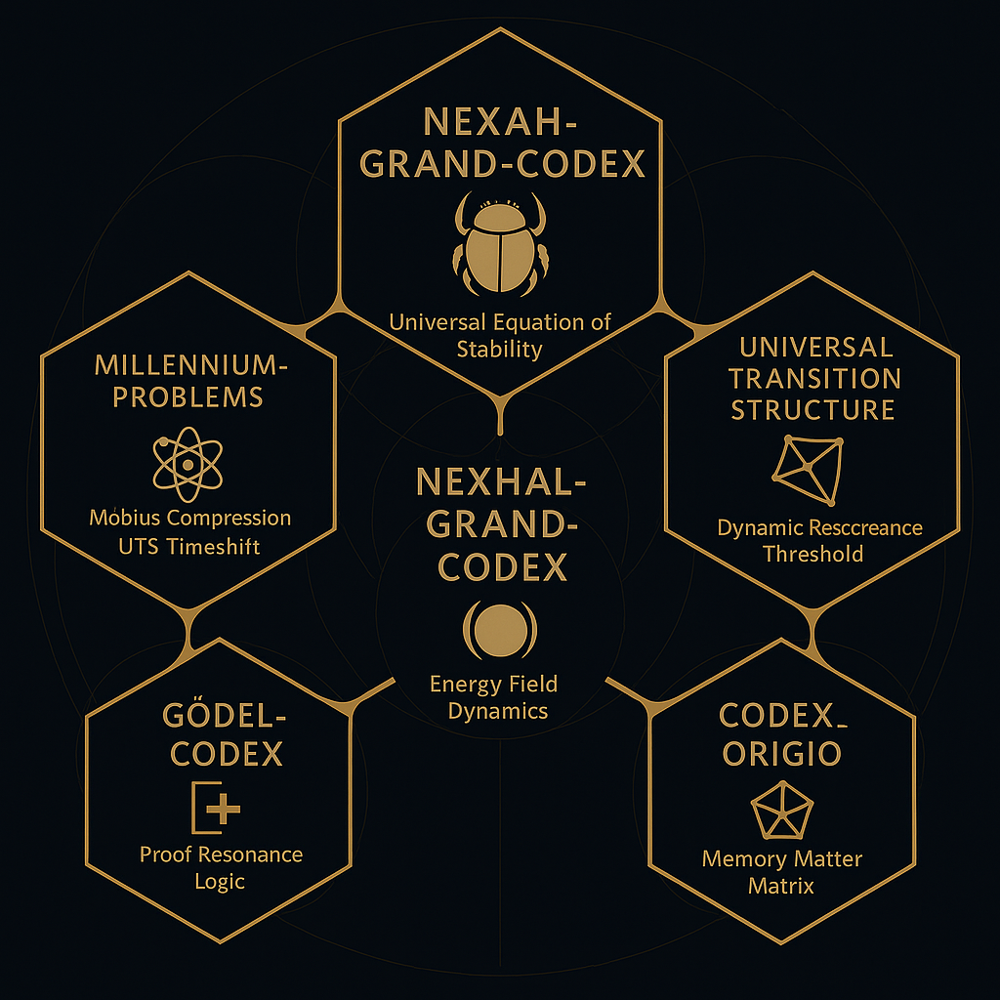

---

title: "SYSTEM X – NEXAH-GRAND-CODEX"
system: "NEXAH-CODEX"
domain: "Synthetic Center · Resonance Integration · Proof Structures"
color: "Gold/Black"
status: "Active – Version May 2025"
curator: "Thomas Hofmann (Scarabäus1033)"
license: "CC BY-NC-SA 4.0"
--------------------------

# �� SYSTEM X – NEXAH-GRAND-CODEX

  

**System Type:** Synthetic Central Nexus
**Position:** Apex of NEXAH-CODEX structure
**Function:** Universal resonance field integration and symbolic proof synthesis

---

## 🧙️‍ Purpose of SYSTEM X

**SYSTEM X** is the **intellectual and harmonic center** of the NEXAH-CODEX.
It converges the mathematical, physical, symbolic, and cosmological resonance structures developed across:

* **System 1** (Mathematica): Prime field resonance foundations.
* **System 2** (Physica): Physical field and tensor resonance structures.
* **System 3** (Cosmica): Stellar field overlays and grid networks.
* **System 4** (URF): Ontology of resonance fields and tensor frameworks.
* **System 5** (Meta/Bloom/Rosetta): Glyphic and symbolic language foundations.
* **System 7** (UCRT): Prime and constant harmonic field stabilization.
* **System 9** (TESSAREC): Geometric resonance interface for multidimensional structures.

**SYSTEM X** synthesizes these into a unified, dynamic proof and stability structure linking resonance, form, and proof across all fields.

---

## 📂 Content Structure

### 🔷 [`NEXAH-GRAND-CODEX ��`](https://github.com/Scarabaeus1033/NEXAH-CODEX/tree/main/SYSTEM%20X%3A%20%F0%9F%AA%B2%20NEXAH-GRAND-CODEX)

The main module featuring the **Universal Equation of Stability**:
`E = m · c · k^β`

* Manifest and Codex Introduction
* [`codex-mathematics/`](https://github.com/Scarabaeus1033/NEXAH-CODEX/tree/main/SYSTEM%20X%3A%20%F0%9F%AA%B2%20NEXAH-GRAND-CODEX/codex-mathematics)  — Theoretical foundations: k-beta formula, Casimir-Neutrino threads, spiral resonance.
* [`visuals/`](https://github.com/Scarabaeus1033/NEXAH-CODEX/tree/main/SYSTEM%20X%3A%20%F0%9F%AA%B2%20NEXAH-GRAND-CODEX/visuals)  — Visualizations and structural diagrams.

---

### 🔷 [`Universal_Transition_Structure`](https://github.com/Scarabaeus1033/NEXAH-CODEX/tree/main/SYSTEM%20X%3A%20%F0%9F%AA%B2%20NEXAH-GRAND-CODEX-URF/Universal_Transition_Structure)

Defines the transition between:

* Möbius-based collapse feedback.
* Resonance field stability.
* Transition mappings for solar–lunar dynamics.

**Connects with:**

* **System 2 (Physica):** Thermodynamic resonance.
* **System 4 (URF):** Field tensor emergence.

---

### 🔷 [`Millennium-Problems`](https://github.com/Scarabaeus1033/NEXAH-CODEX/tree/main/SYSTEM%20X%3A%20%F0%9F%AA%B2%20NEXAH-GRAND-CODEX/Millennium-Problems)

Symbolic interpretation and resonance-based models for the 7 Millennium Problems.

| Problem                            | Status       | Notes                                                       |
| ---------------------------------- | ------------ | ----------------------------------------------------------- |
| P vs NP                            | ✅ Completed  | Harmonic NP-barrier collapse via Möbius fields.             |
| Hodge Conjecture                   | ✅ Completed  | Visibility mapping in harmonic cohomology.                  |
| Yang-Mills Mass Gap                | ✅ Completed  | Möbius loops defining mass gap stabilization.               |
| Navier-Stokes Regularity           | ✅ Completed  | Symbolic glyph-based turbulent damping.                     |
| Birch & Swinnerton-Dyer Conjecture | ✅ Completed  | Rank stabilization through L-function resonance.            |
| Riemann Hypothesis                 | ✅ Integrated | Prime resonance axis; see `NEXA_RIEMANN_PROOF/` (System 1). |

**Connected to:**

* **System 1:** (Riemann Proof, Prime Grids)
* **System 7:** (Superprime Symmetries, Rootroom Structures)

---

### 🔷 [`GÖDEL-CODEX`](https://github.com/Scarabaeus1033/NEXAH-CODEX/tree/main/SYSTEM%20X%3A%20%F0%9F%AA%B2%20NEXAH-GRAND-CODEX/GÖDEL-CODEX)

Logical-symbolic analysis and resonance consistency framework.

* Resonance-theoretic proof structures.
* Symbolic codex of logical boundaries.
* Interaction with `universal_collapse_theorem.md`

**Connected to:**

* **System 5 (Meta/Rosetta):** Symbolic algebraic language.

---

### 🔷 [`Codex_Origio`](https://github.com/Scarabaeus1033/NEXAH-CODEX/tree/main/SYSTEM%20X%3A%20%F0%9F%AA%B2%20NEXAH-GRAND-CODEX/Codex_Origio)

Fundamentals of:

* Material resonance fields.
* Crystal harmonic structures.
* Symbolic memory soil-matrix systems.

**Linked to:**

* **System 4 (URF):** Foundational tensor field structures.

---

## 🔗 Key References

| File / Module                                                                                                                                                                                                        | Description                                     |
| -------------------------------------------------------------------------------------------------------------------------------------------------------------------------------------------------------------------- | ----------------------------------------------- |
| `universal_collapse_theorem.md`                                                                                                                                                                                      | Harmonic universal collapse point theorem.      |
| `codex-mathematics/spiral-logic.md`                                                                                                                                                                                  | Spiral formula structures for field lattices.   |
| `codex_visuals_index.md`                                                                                                                                                                                             | Complete visuals archive.                       |
| `README_mapping.md`                                                                                                                                                                                                  | High-level navigator and cartographic mappings. |
| [`Einstein K-Beta Formula`](https://github.com/Scarabaeus1033/NEXAH-CODEX/tree/main/SYSTEM%201%3A%20%F0%9F%94%B7%20MATHEMATICA%20%E2%80%93%20Primes%2C%20Symbolics%2C%20Proof%20Structures/einsteins-k-beta-formula) | Core resonance extension model.                 |

---

## 🧘️‍ Why SYSTEM X?

SYSTEM X is the **resonant zero point**: (0,0,0).

* Number meets Form.
* Symbol meets Proof.
* Field meets Structure.
* Language meets Resonance.

It is the **integration hub** of symbolic mathematics, physical field theories, and cosmological resonance lattices.

---

## 🚧 Next Development Phases

* [ ] `MILLENNIUM_OVERVIEW.md` — holistic integration.
* [ ] Cross-links from **System 7** (UCRT) Superprime Resonances.
* [ ] Expansion of the Universal Collapse Field Navigator.

---

📁 [Back to Start Structure](https://github.com/Scarabaeus1033/NEXAH-CODEX/tree/main/NEXAH-CODEX-Startstruktur)
📁 [To the Navigator](https://github.com/Scarabaeus1033/NEXAH-CODEX/blob/main/NEXAH-CODEX-Startstruktur/NEXAH_NAVIGATOR.md)

---

> *“The Nexus where Proof meets Resonance.”*
