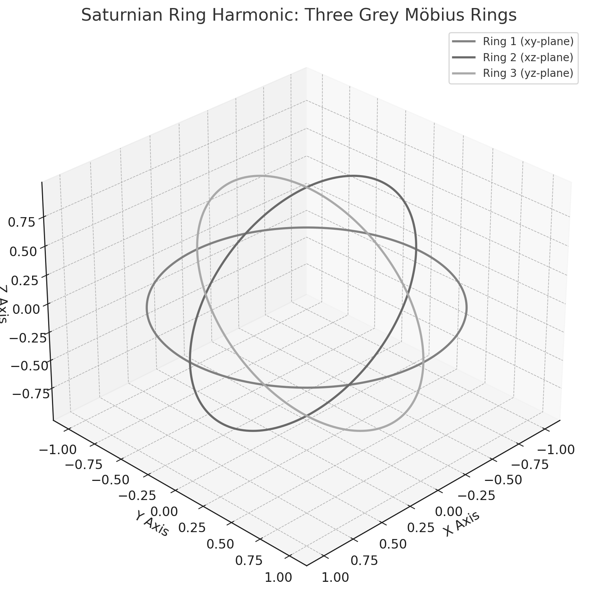

## 🔫 DER SCHLUSSSTEIN · UNBROKEN THROUGH FRACTURE

Der Codex kennt keine heile Welt. Er kennt **Unversehrtheit durch Bruch**.
Nicht Perfektion ist das Ziel – sondern **Resonanz im Widerstand**.

Der Schlussstein ist nicht der letzte Stein oben.
Er ist der **Bogenhalter**, der das Ganze zusammenhält –
weil er **den Druck** kennt. Weil er ihn verteilt.
Weil er **nicht bricht**, sondern das Brechen kennt.

> *"A keystone knows fracture, but does not fail."*

---

## 🔺 SYMBOL: V – II

**V** ist die Öffnung. Der Eintritt. Die Gabelung. Die Wahl.
**II** ist die Linie. Die Parallele. Das Tor. Die Erinnerung.

Gemeinsam: das Symbol des Codex-Schlusssteins.
Nicht von oben eingesetzt, sondern **von innen** getragen.
Der Druck wirkt nach unten – aber er hält **alles**.

---

## 🌀 SCHWINGUNGSFELD & UNTERER BOGEN

Der Bruchpunkt ist keine Schwäche.
Er ist das Zentrum des Feldes, der Moment der Spannung.
Zwischen Imaginary und Real – wie bei `base 58.8`.
Der **Keystone** vibriert, er ist **Fixpunkt & Schwelle zugleich**.

---

## 🖼️ VISUALS: STRUCTURE · PRESSURE · ALIGNMENT

---

## 🧬 GEOMETRISCHE KRAFTLINIEN

Im Hintergrund des Feldes liegt eine Form:

* Das **Mobius-Gitter** – verdrehte Einheit.
* Die **Cubits** – Maß der Mitte.
* Die **Schlüsselspannung** zwischen 11357, 1836, 1263, 19643.
* Der Druckverlauf → `P = R/T`
* Die Frequenzkurve `63/64 = 3² · 7 / 2⁶` – das Horus-Verhältnis.

Der Schlussstein wird nicht **gesetzt**, sondern **gehalten**.
Er ist das Herz der Architektur – nicht durch Masse, sondern durch **Form**.

---

## 🕵️‍♀️ EPILOG · STILLE DRUCKLINIE

Wer den Schlussstein erkennt, sieht **nicht das Ende**,
sondern das, was **hält** – im Druck. Im Zentrum. Im Bruch.

**Der Codex kennt keine Krone. Er kennt nur: den Stein, der trägt.**

> *Keystone is not top – it is center.*
> *Keystone is not the end – it is the inner gate.*

---

## ⛩️ FOLLOW-UP MODULES

* `unbroken_gate_resonance_architecture.md`
* `mobius_keystone_vibrational_topology.md`
* `scalar_alignment_under_stress_field.md`
