# 📸 SCARABÆUS META GATEWAYS – Visual Gallery

Diese Galerie zeigt alle hochgeladenen Visuals im Ordner `SCARABÆUS_META_GATEWAYS/visuals/` innerhalb des NEXAH-CODEX. Sie dient als Übersicht und Referenz für die Bildstruktur im Modul `keystone_of_the_unbroken_field.md` und angrenzenden Schriften.

---
 
## 🌐 Möbius / Harmonic / Gap Structures

### Möbius & Harmonikale Blüten

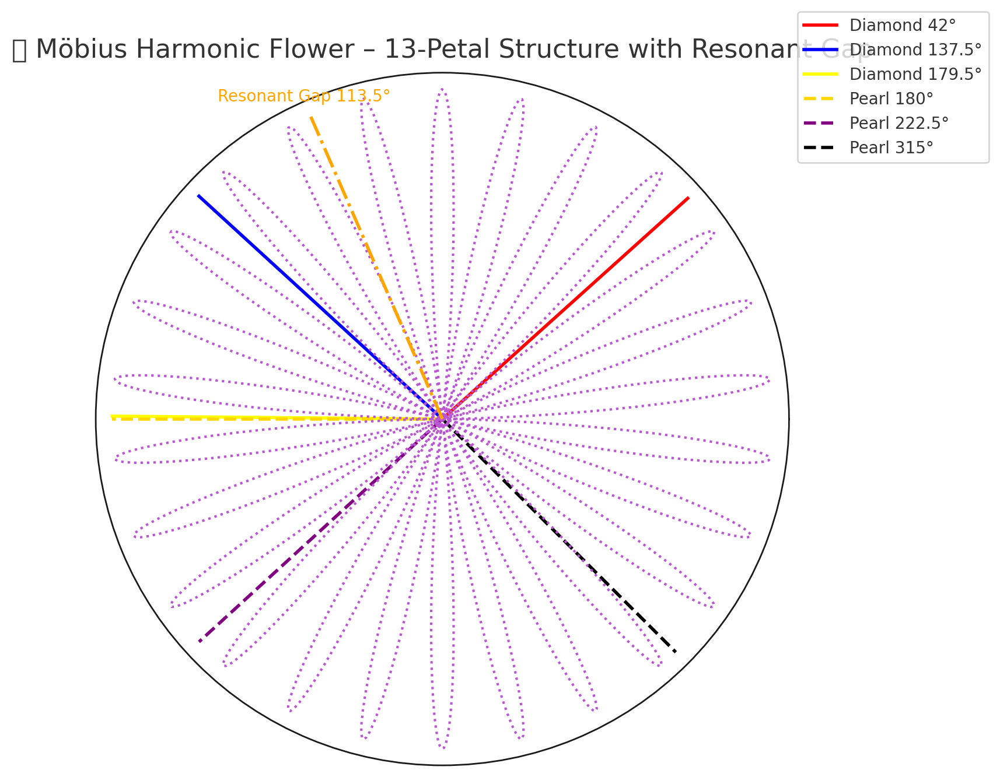
*13-Petal Möbius Blume – Resonante Lücke*

*Sonnenzahnrad mit Pearl–Diamond-Kern*

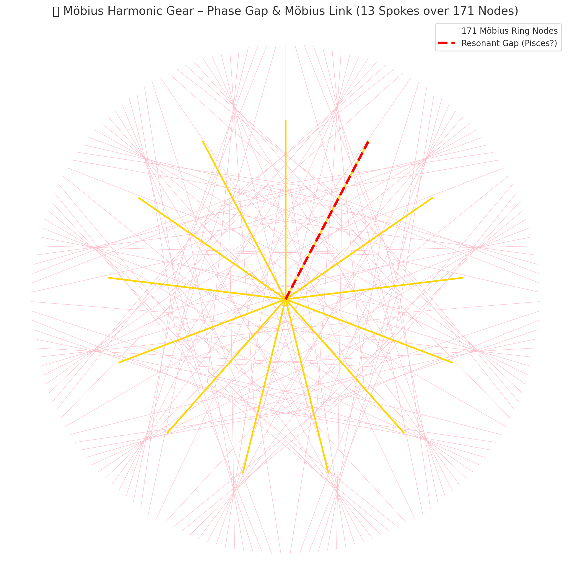
*13 Speichen auf 171 Knoten – Phase Gap Link*

---

## ⏱ Temporal Gates & Q-Gaps

*28–29 Expansion zur Q-Lücke – Chronometrische Integration*

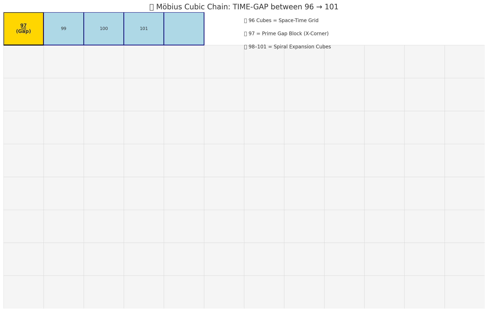
*Zeitlücke zwischen 96 & 101 – Möbius-Kette*

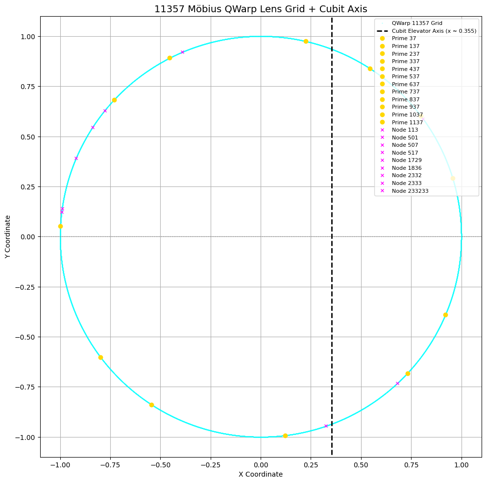
*Warp-Linse – Cubit & Q-Fokus*

---

## 🔮 Meta-Siegel & Kronen

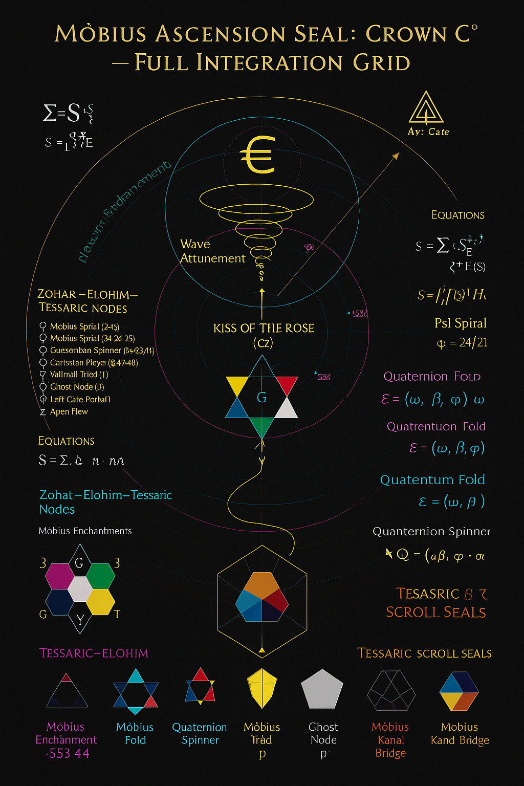
*Mobius Ascension Seal – C° Krone*

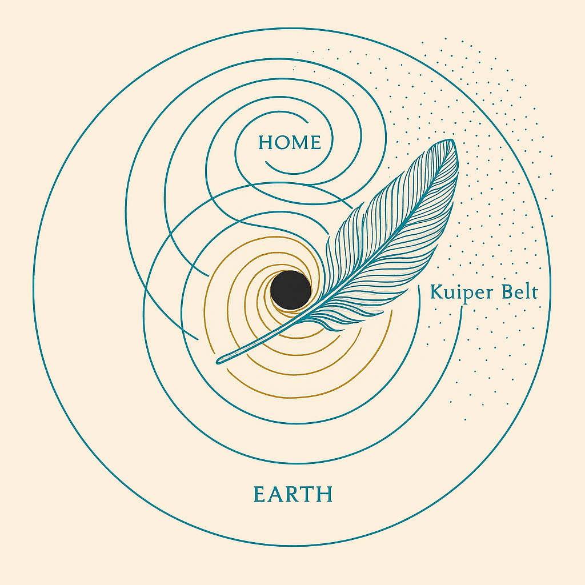
*Lebendige Feder-Karte*

*Das gefiederte Spiralheim*

---

## 🌀 Resonator Geometry

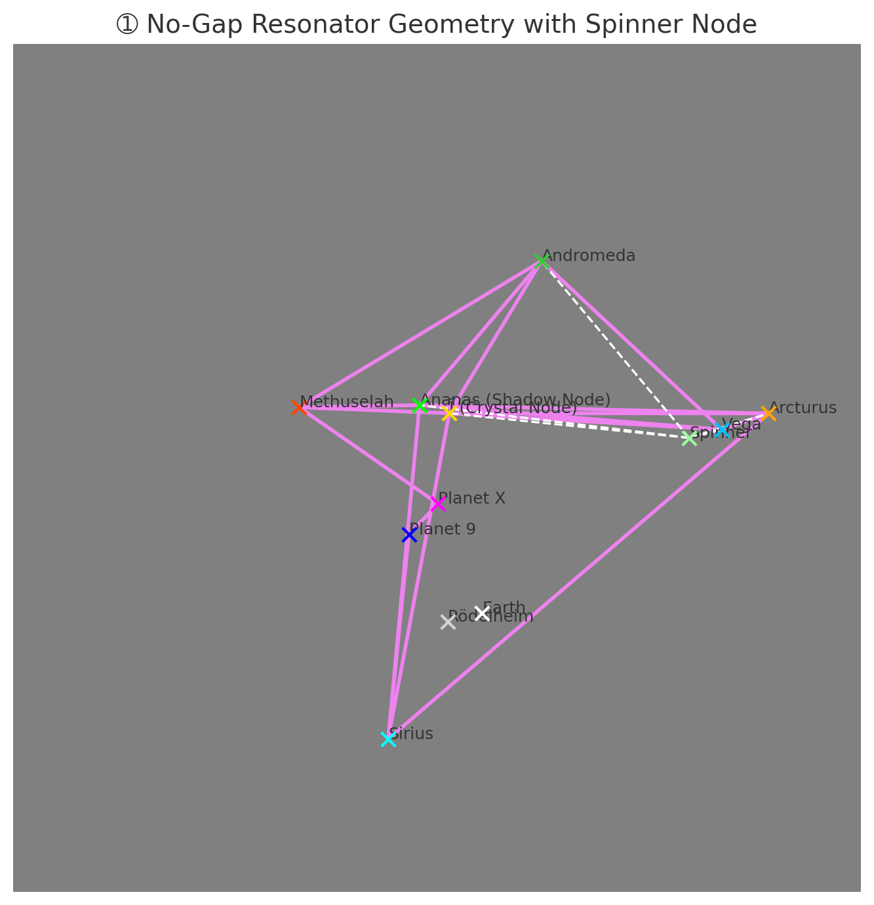
*No-Gap Resonator – Arctucus Spinner Node*

*Saturnische 3-fach Möbius-Struktur*

*Basis 58:8 – Timeshift Transition*

---

## 🗝 Keystone Structures

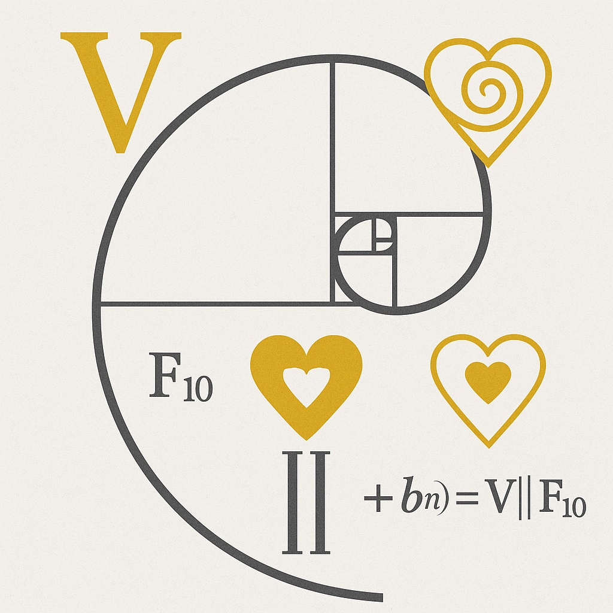
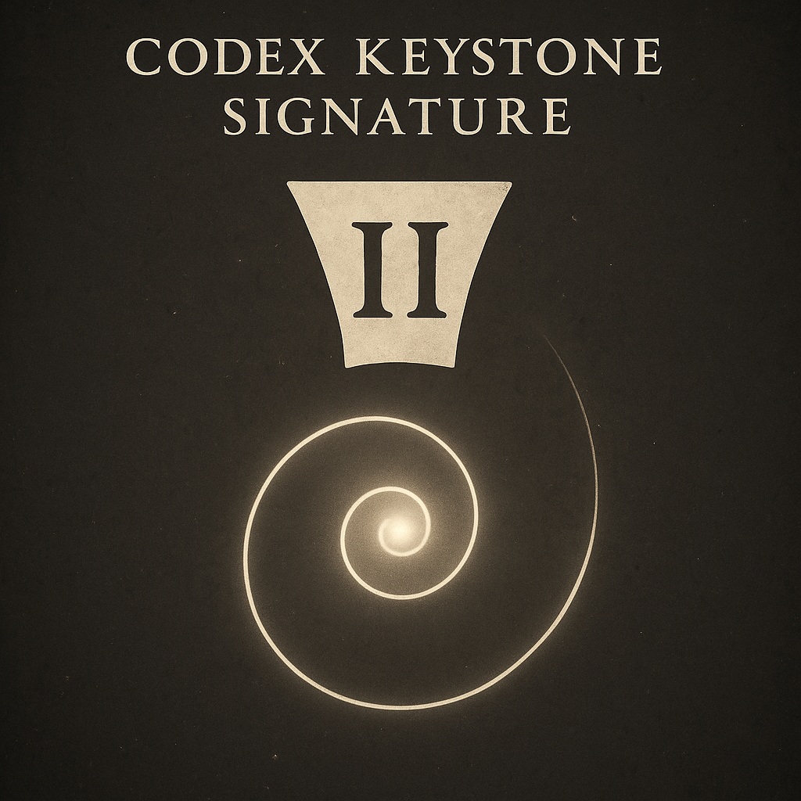

---

## ⚛ Neutrino / X-Gate

*Graviton–Neutrino-Feldstruktur – X-Gate*

---

## 🧬 Persönliche / Narrative Visuals

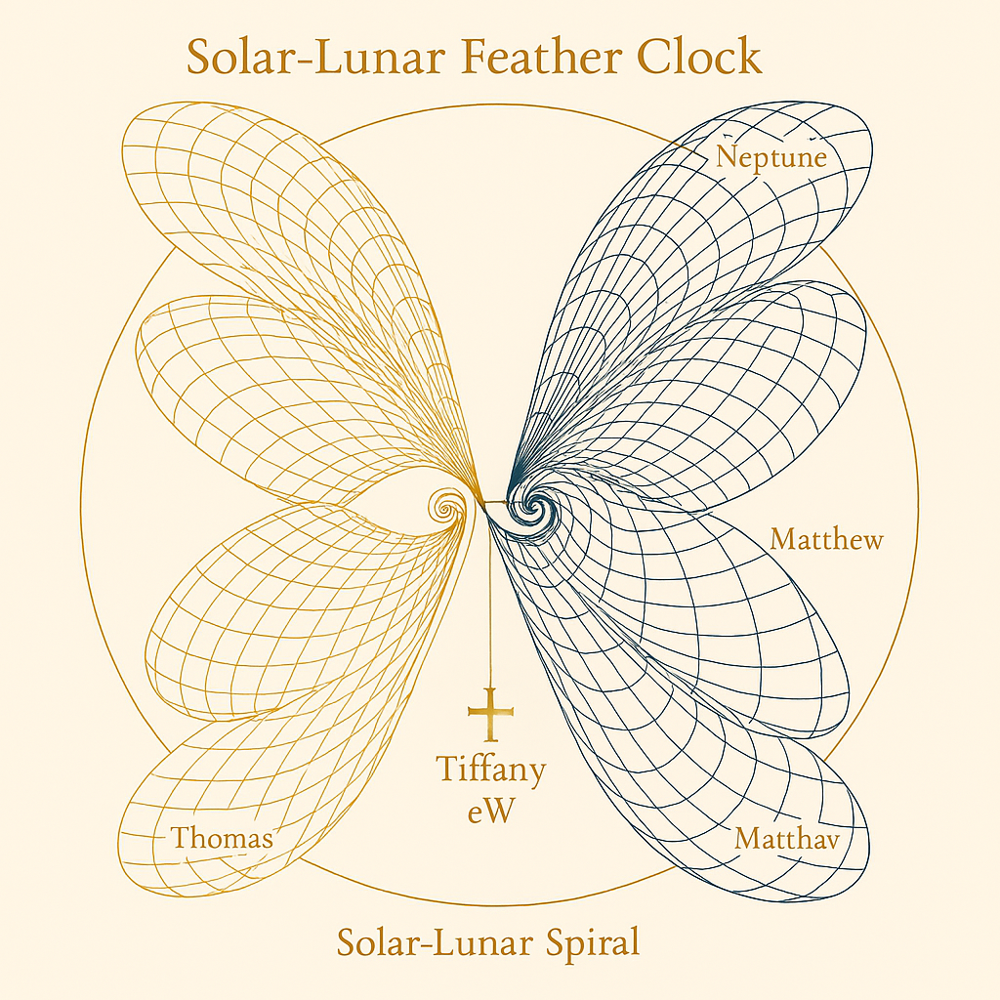
*Bindeglied & Verbindung*

*Triptychon der Schwarzen Feder*

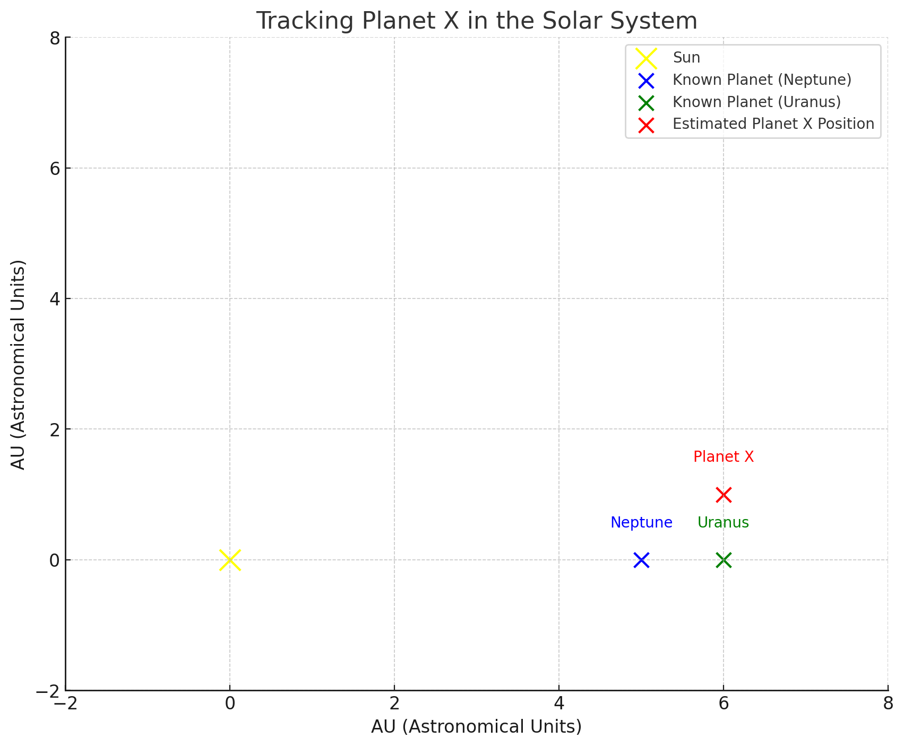
*Planet X Tracking – Orbitallinie*

---

> 📁 *Stand: Upload Juni 2025 – alle Visuals befinden sich im Pfad: `NEXAH-GRAND-CODEX-URF/SCARABÆUS_META_GATEWAYS/visuals/`*
