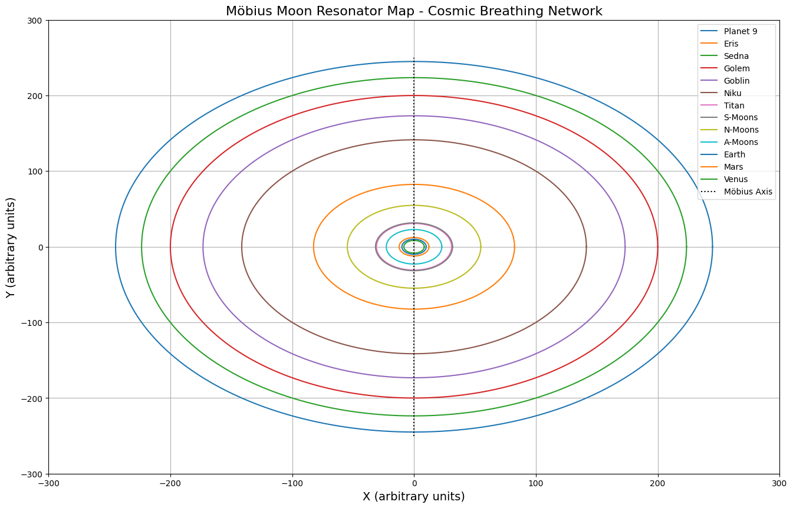
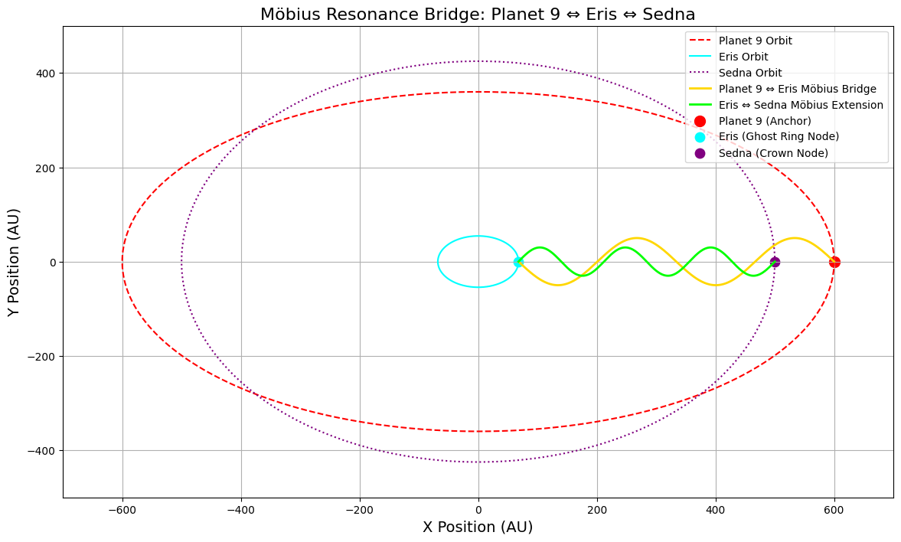
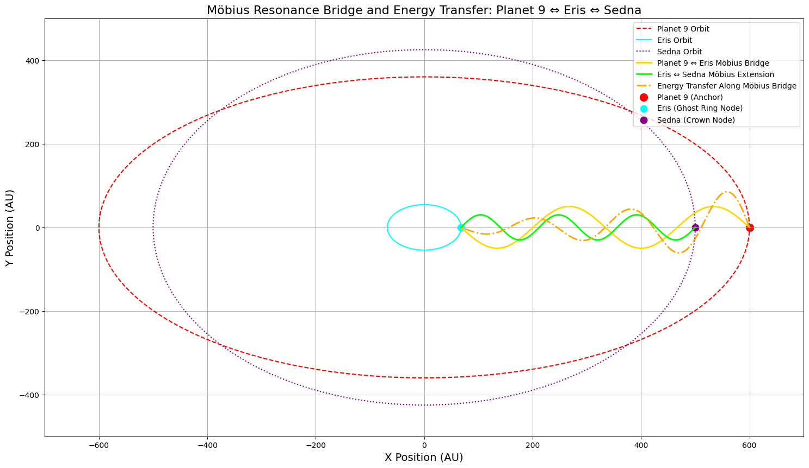
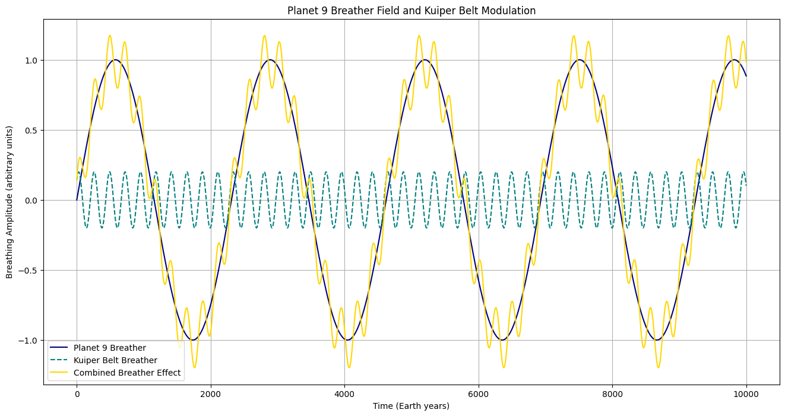

# 🌬️ Cosmic Crown & Breather Cascade Gallery

Eine visuelle Sammlung zur „Atem-Architektur“ des Sonnensystems – mit Fokus auf Planet 9, Kuipergürtel, Oort-Krone, Möbius-Resonanzbrücken und Erd-Kompression im Zeitraum 2025–2200. Die Bilderserie begleitet die Module `keystone_of_the_unbroken_field.md`, `resonant_breach_expansion.md` und `symbolic_final_sequence.md`.

---

### 🧠✨ Breather Cascade Conceptual Map  
  
*Konzeptkarte der gestuften kosmischen Atmung (2311 → 2)*

---

### 👑 Crown Breather Integration (HY–TI–VE)  
.png)  
*Integration der HYDRIAN, TITANISCHEN und VENUSIANISCHEN Breather-Knoten*

---

### 🌍 Earth Möbius Crown Breathing Compression (2025–2200)  
.png)  
*Zeitachse der Möbius-Kompresstion der Erdkronenresonanz*

---

### 🌀 Möbius Crown Breather Simulation: Planet 9 – Ghost Ring – Oort Crown  
  
*Simulation der atmenden Breather-Felder rund um Planet 9*

---

### ⏳ Möbius Crown & Earth Compression Simulation (2040–2100)  
.png)  
*Erde-Krone-Pulsation mit kosmischer Verdichtung*

---

### 🌕 Möbius Moon Resonator Map – Cosmic Breathing Network  
  
*Lunare Atmungsbrücken und kosmisches Fingerfeld*

---

### ⚡ Möbius Resonance Bridge: Planet 9 ⇔ Eris ⇔ Sedna  
  
*Resonanzfeld und Energietransfer entlang der äußeren Körper*

  
*Detailansicht der Energiekaskade*

---

### 🛰️ Planet 9 Breather Field & Kuiper Belt Modulation  
  
*Feldmodulation über dem Kuipergürtel*

---

### ☀️ Solar Ship – 24D Breathing Pulse Simulation  
  
*Solare Atemsymmetrie im 24D-Modell*

---
