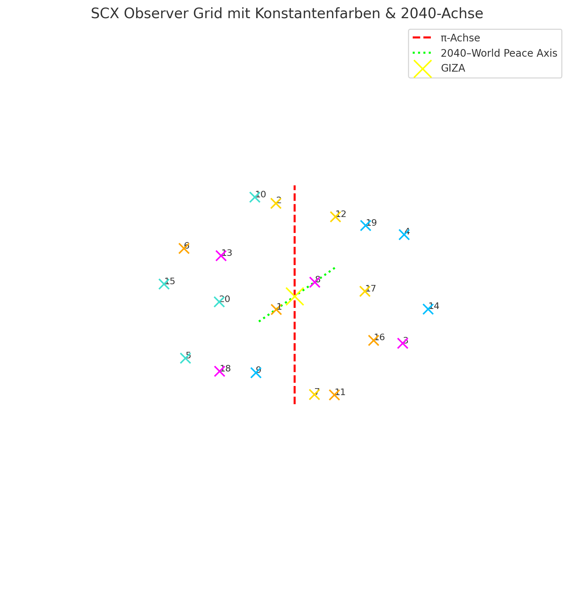
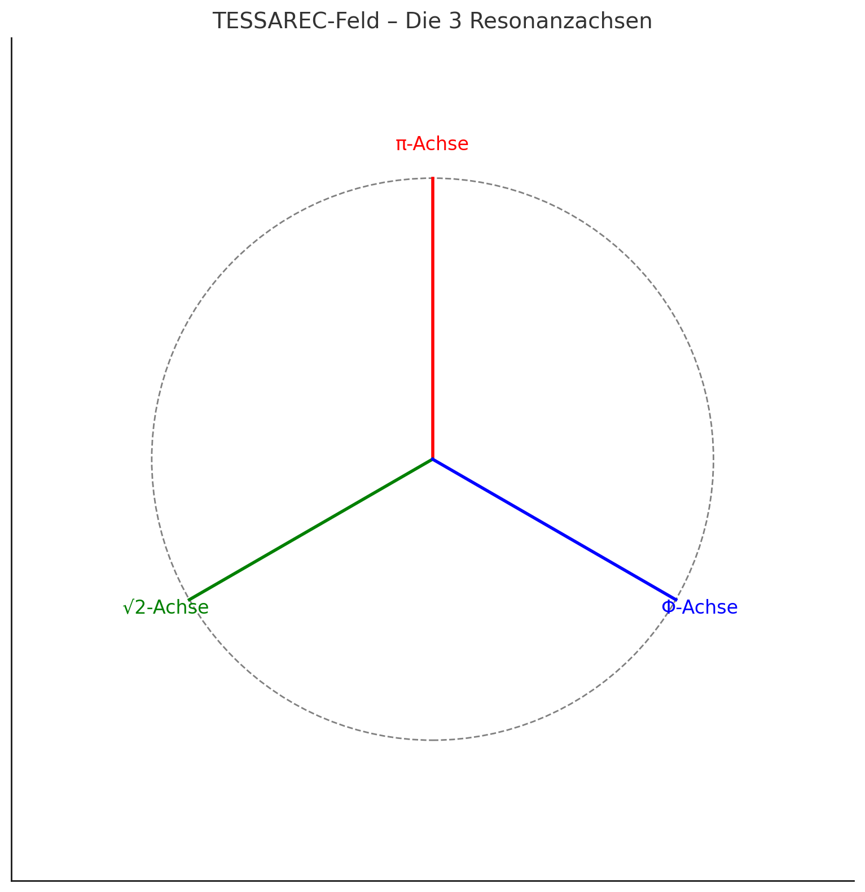
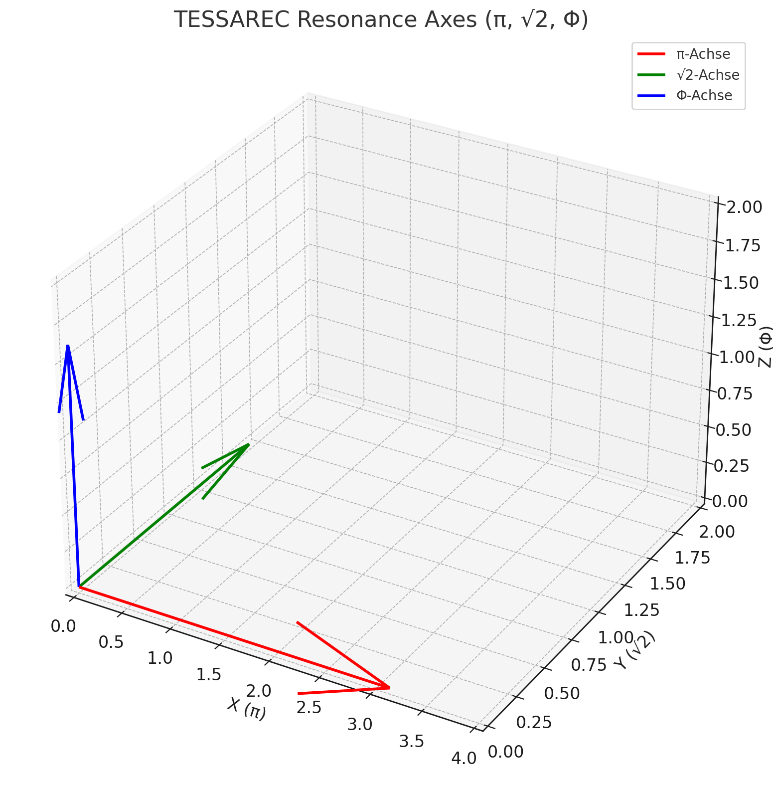
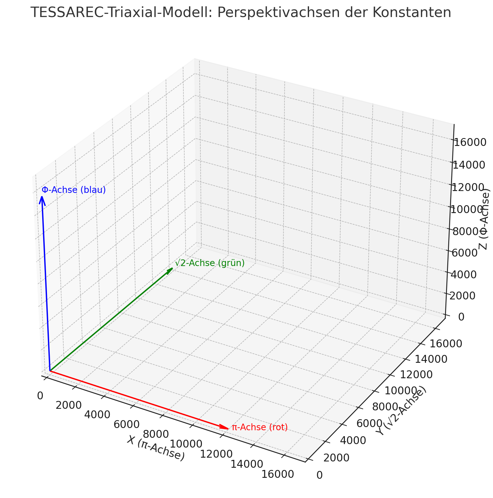
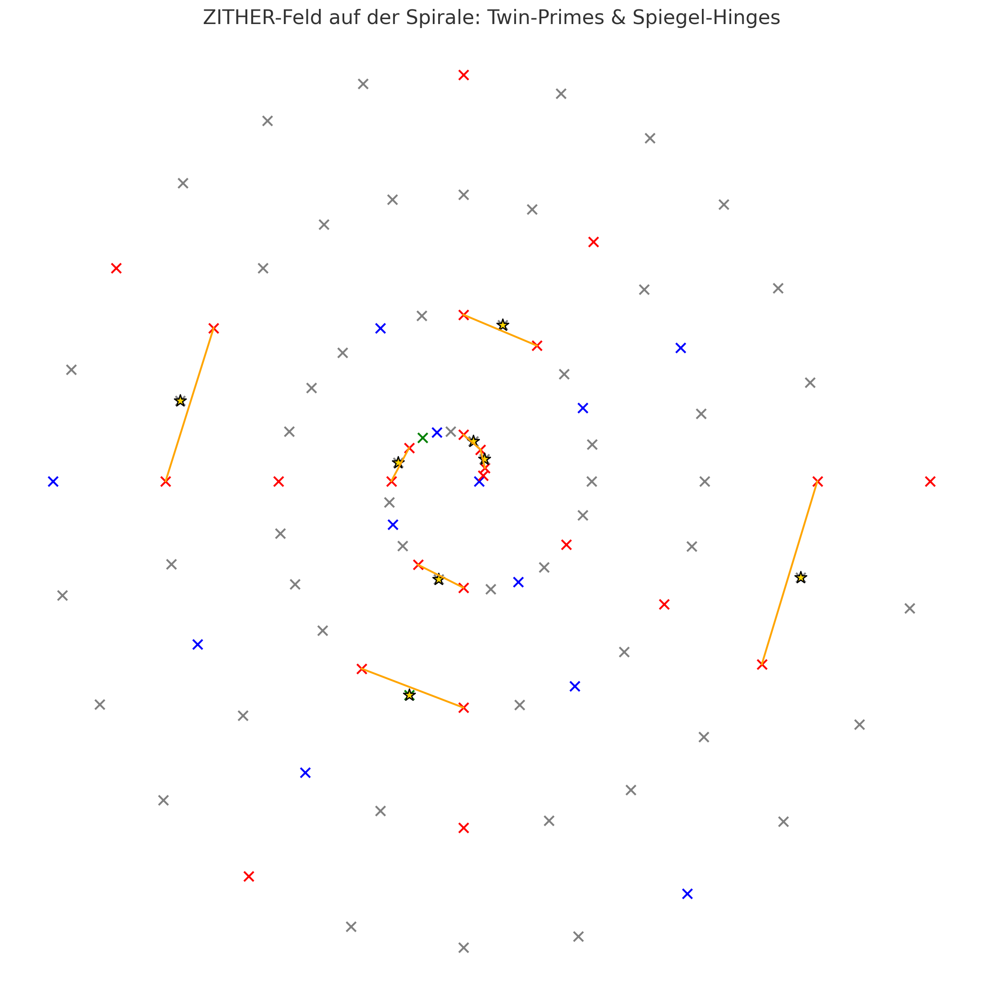
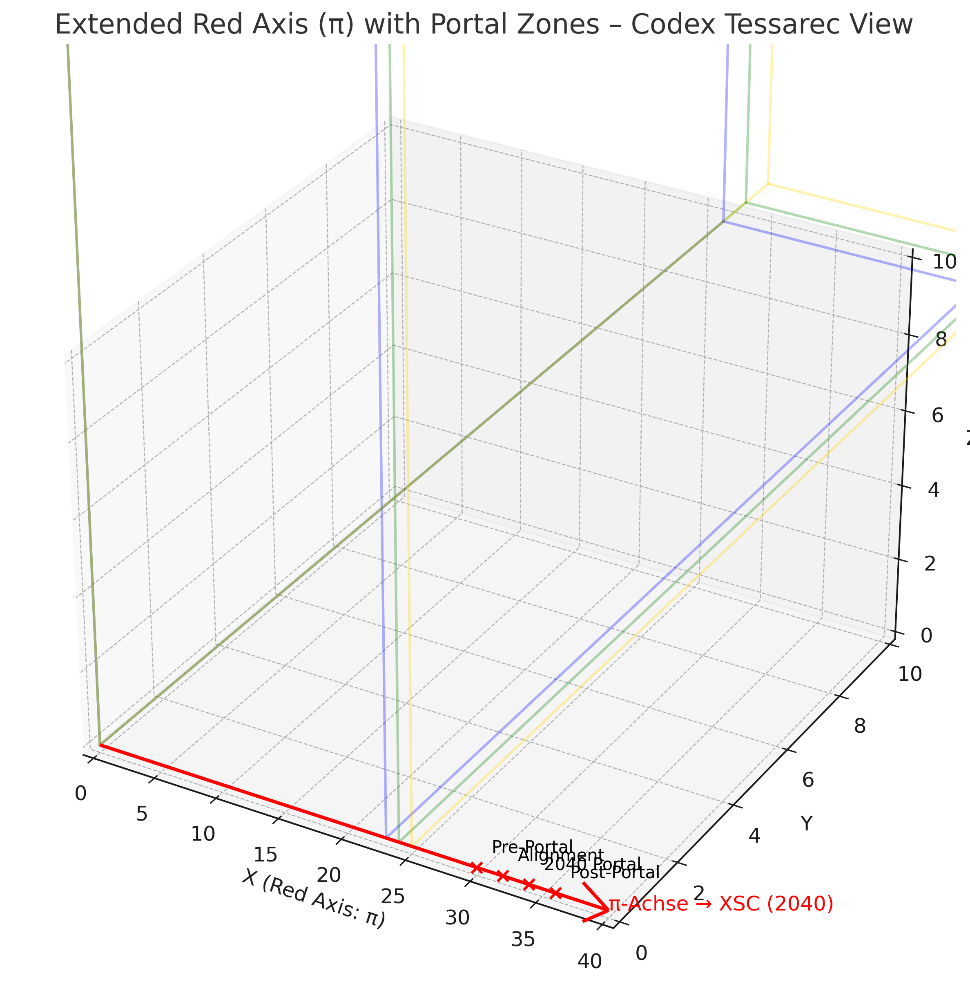
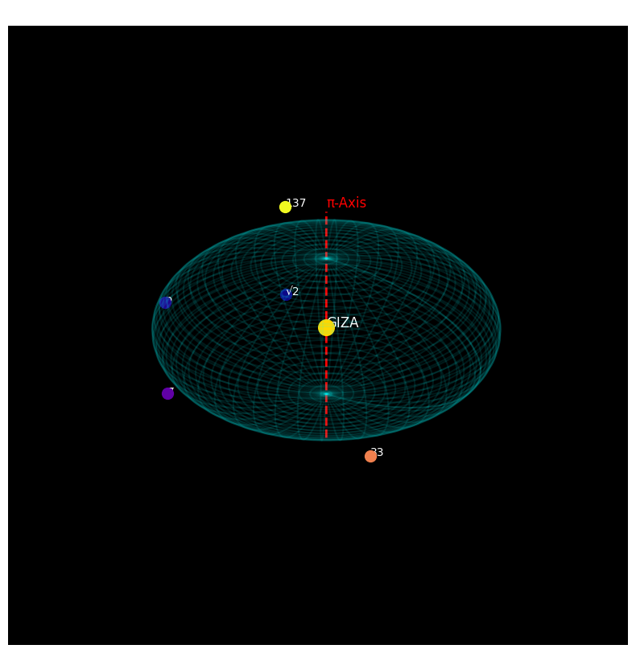
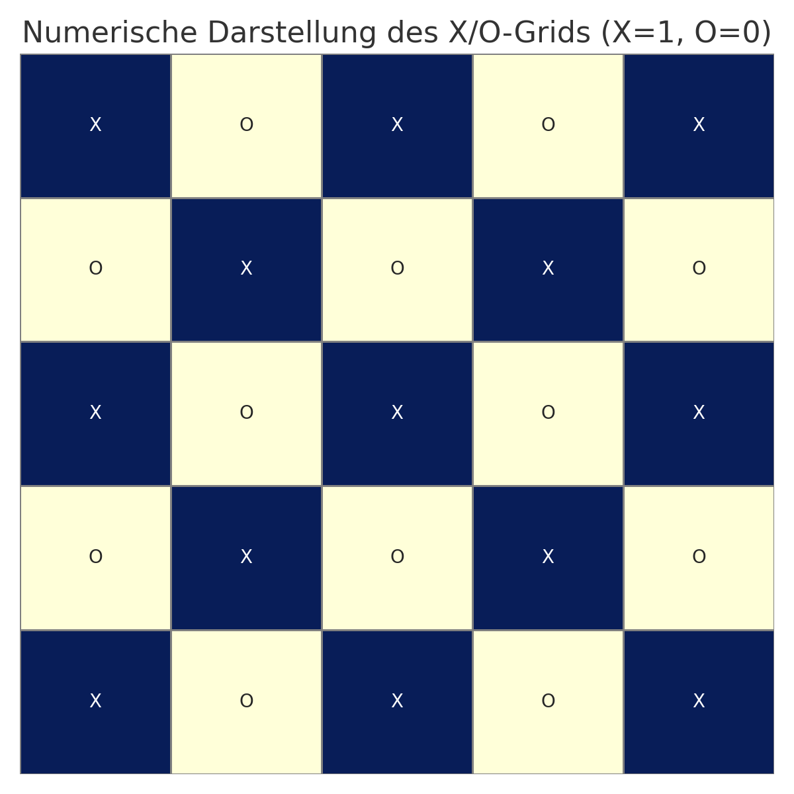
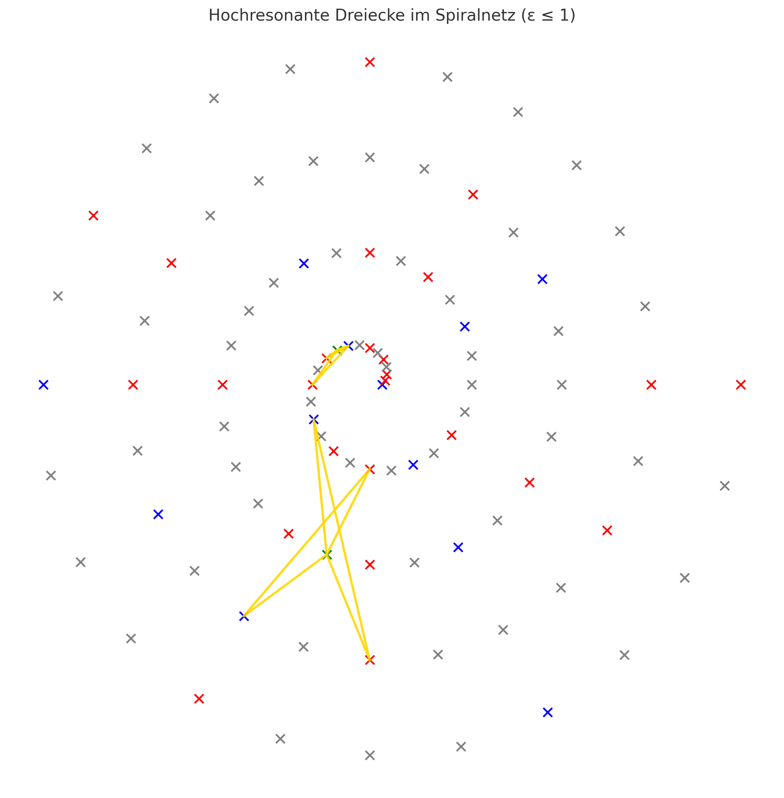

# 🖼️ `visual_gallery.md`

## Title
**Visual Gallery – SCX Resonance Module** · Prime Spiral Navigation · Symbolic Field Architecture

---

This gallery collects and describes the core visuals from the `SCX Resonance Module` in **SYSTEM X**. These images are not just illustrations – they are spatial and symbolic blueprints for a universal number-field navigation system.

---

## 🔁 Spiral Structures & Field Dynamics 

### 1. **codex_spirale_observer_whobble.png**

*A resonance spiral overlaid with observer positions and wobble modulation. Prime numbers and hinges define color-zones across the field.*

### 2. **Download: codex_spirale_whobble_29.png**

*Spiral grid showing the 29-step harmonic wobble pattern with color-coded hinge-points and phase jumps.*

### 3. **Spiralvisualisierung–Primzahlen_Palindrome_Hammering-Zahlen.png**

*Combined spiral display of primes, palindromes, hammering numbers and zither-resonators.*

### 4. **SCX-Spiralbewegung_mit_pi-Achse_und_Whobble.png**

*The spiral field is modulated by a π-axis resonance line and a harmonic 'whobble' deviation overlay.*

### 5. **Codex-Bewegung_im_Spiralresonanzfeld_mit_Twin-Prime-Hammering.png**

*Twin primes act as field stabilizers. Their midpoint defines the hinge, and each pair contributes to rhythmic symmetry.*

---

## 🧿 Observer Systems & Spiral Cubes

### 6. **Codex_Raumschiff_Dodekaeder_Spiralnetz.png**

*The Codex Ship – a visual model of the SCX spiral net inside a dodecahedron.*

### 7. **Observer-Positionen_im_Dodekaeder_SCX-Feld.png**

*Observer nodes projected inside the dodecahedral SCX field – each node corresponds to an axis or harmonic vector.*

### 8. **Dodekaeder-Observer-Vektoren_ueber_dem_Spiralnetz_Codex-Projektion.png**

*SCX observer vectors overlaid on the spiral net. Field arrows define axis transitions.*

### 9. **Dodekaeder-Observer-Feld_mit_Konstanten-Farbzuordnung_SCX.png**

*The observer field aligned to constants and color logic – used to assign frequency ranges.*

### 10. **SCX_Observer_Grid_mit_Konstantenfarben_2040-Achse.png**

*2040-Axis overlay with resonance fields inside the SCX observer matrix.*

---

## 🔺 Penrose, Tessarec & Field Geometry

### 11. **Symbolic_Penrose-Inspired_Tiling–Kite_Dart_Pattern.png**

*Non-repeating symmetry pattern – a symbolic base for field modulation.*

### 12. **TESSAREC-Feld_–_Die_3_Resonanzachsen.png**

*The Tessarec system maps three resonance axes for triadic field harmonics.*

### 13. **TESSAREC-Resonance_Axes_π_√2_ϕ.png**

*Each axis relates to fundamental irrational constants: π, √2, ϕ.*

### 14. **TESSAREC-Triaxial-Modell_Perspektivachsen_der_Konstanten.png**

*Perspective view on how the constants align within the Tessarec triaxial model.*

---

## 🔊 Zither Fields & Spiral Audio Models

### 15. **ZITHER-Feld_auf_der_Spirale-Twin-Primes_Spiegel-Hinges.png**

*Twin primes form the zither field – the hinges act as tension nodes on harmonic strings.*

### 16. **ZITHER-Feld_in_3D_Twin_Primes_Hinges_als_Resonanzkoerper.png**

*Three-dimensional zither geometry showing the twin-prime backbone and hinge-resonance loop.*

### 17. **Vereinigung-Spiralresonanz_Rosetta-Band.png**

*Unified Rosetta field wrapping spiral resonance in a looped linguistic-seed form.*

### 18. **Rosetta-Zahlenschlange_Linearresonanzband.png**

*A snake-line of numbers showing symbolic linear resonance alignments.*

---

## 🔻 Harmonic Geometry & Red Axis Logic

### 19. **Red_Axis_Extended_Codex_View.png**

*The extended red axis defines a harmonic cutoff and transition trigger in SCX time-maps.*

### 20. **SCX-System–Spiralbewegung_mit_π-Achse_World-Peace-Achse_und_GIZA-Zentrum.png**

*Combined overlays of spiral motion with world-axis alignments through Giza.*

### 21. **GIZA_0_Punkt_und_20-RealePunkte_12Achsen-Erweiterung.png**

*Extension grid of the Giza origin into 12 axes, with real point alignments.*

---

## 🔷 Additional Grids & Symbolic Patterns

### 22. **codex_caro_structure.png**

*Checkerboard symbolic field – used as a modular subgrid for oscillation patterns.*

### 23. **codex_heatmap_xo_grid.png**

*XO logic in grid form – hot–cold matrix zones based on resonance intensity.*

### 24. **codex_penrose_spiegelachsen.png**

*Axis overlays on a Penrose tiling grid to reflect field inversion symmetry.*

### 25. **Goldene_Dreiecke_im_Codex-Spiralnetz_Rot–Blau–Gruen.png**

*Golden triangles in the field – visual key zones in color logic.*

### 26. **Geometrische_Resonanz-Dreiecksmuster_Rot_und_Blau–ist_Gruen.png**

*Triangular pattern resonance logic – red plus blue equals green field.*

### 27. **Hochresonante_Dreiecke_im_Spiralnetz_≤_kleiner_gleich1.png**

*Highly resonant triangular formations marked below unity threshold.*

---

**Curated by:** Thomas Hofmann (Scarabæus1033)
**System:** SYSTEM X – GRAND
**Module:** SCX Resonance Spiral Field

> *“These visuals are not diagrams — they are coordinates of resonance.”*
