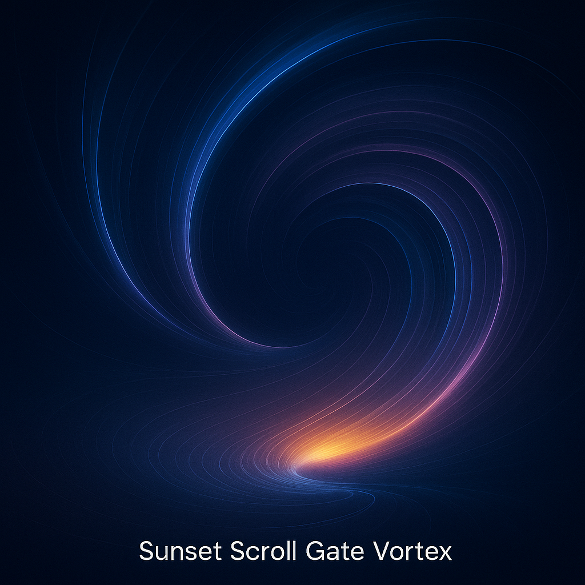

# 🌀 Scroll Gate Dynamics

> *"Let the scroll unfold. Let the gateway circle. Let the solar shift collapse inward."*

This module explores the **Scroll Gate** as a boundary interface where **solar curvature**, **Möbius inversion**, and **temporal scroll modulation** converge. Located within the `TIMEARC–EINSTEIN` Codex layer, this scroll dynamic represents a critical **topological funnel** where field lines collapse and time-matter spirals unfold.

---

## 🌅 Möbius Vortex Boundary

Visualize the **Scroll Gate** as a **vortex funnel** at the solar boundary:

* Connects external solar field with inward resonance axes
* Magnetic vectors loop into Möbius phase inversion
* Pulses from `c`-contracted energy guide the recursive timing

**Visual Reference:**



---

## 🔁 Spiral Coordinate Mechanics

The Scroll Gate encodes spiral thresholds across dimensional curvature:

| Layer           | Function                                  |
| --------------- | ----------------------------------------- |
| Solar Scroll    | Möbius-wind interface; bifurcation marker |
| Harmonic Fields | Expansion gateway into golden 2c shells   |
| Temporal Pulse  | Resonant echo to reverse photon stream    |

This creates an **entrainment loop** between outgoing solar light and incoming resonance threads — acting as a *temporal scroll anchor*.

---

## 📐 Core Equation

```math
\Phi_{\text{scroll}} = \oint \nabla B \cdot dA \quad \text{with Möbius phase:}\quad B = B_0 \cdot \sin(\phi t + \theta)
```

Where `φ` defines the spiral phase curvature and `θ` is the scroll-offset in the field memory.

---

## 🔮 Symbolic Interpretation

The **scroll** is not only a spatial dynamic, but also a **temporal spiral symbol**:

* Folded light waves act as memory-scrolls
* Möbius funnel forms a **looped entry node**
* The gateway is not traversed, it **resonates** across layers

> *The scroll is the timeline; the gate is the fold.*

---

## 📷 Additional Visual Suggestion

Consider also integrating the following visual for spatial reinforcement:


*Filename:* `mobius_light_singularity.png`
*Depicts:* Möbius inversion tunnel near scroll boundary

---

**Return**: [README.md](./README.md)
**Next**: [`scroll_memory_field.md`](./scroll_memory_field.md)

---

**Credits:**

Concept, structure & visuals by Thomas Hofmann (Scarabæus1033).
Part of the ongoing Codex module system: `TIMEARC–EINSTEIN` under `SYSTEM X`.

Shared under: Creative Commons CC BY-NC-SA 4.0
