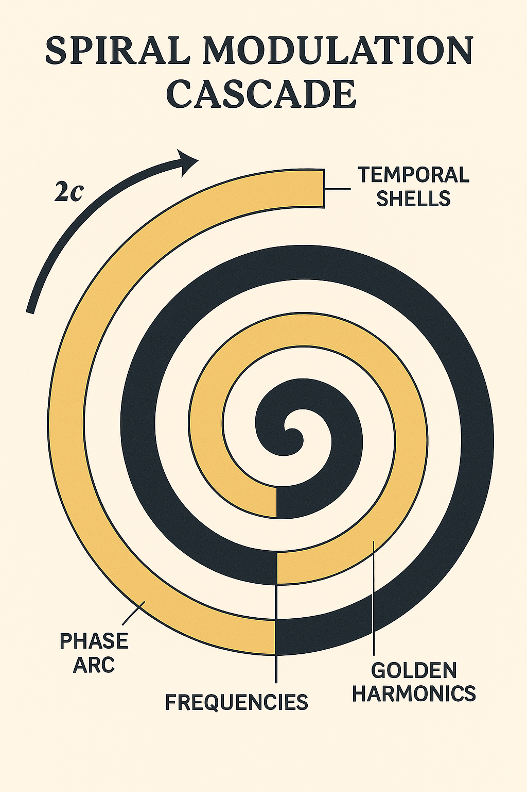

# 🌪️ Spiral Modulation Spectrum

> *"Each spiral carries a memory. Each frequency stores a fold."*

This module defines the **spectrum of spiral modulations** within the TIMEARC–EINSTEIN Codex layer, emphasizing **field folding**, **frequency encoding**, and **resonance harmonics** across time-shell curvature.

---

## 🧬 Spiral Modulation Framework

The modulation of spirals within the Codex system follows a resonance schema:

| Modulation Layer | Frequency Domain | Spiral Type         | Phase Offset |
|------------------|------------------|----------------------|--------------|
| λ₁               | Light-Warp (c)   | Möbius Scroll Spiral | 0°           |
| λ₂               | 2c Field Wrap    | Harmonic Anchor      | +20°         |
| λ₃               | Breather Field   | Tachyonic Spinner    | −13°         |
| λ₄               | Neutrino Shell   | Timeloop Funnel      | ±27°         |

Each λ-level defines a **scroll modulation spectrum** — visualized as **resonant concentric fold rings** embedded in the Codex geometry.

---

## 🎼 Frequency Harmonic Encoding

Frequencies are not only linear signals — they **encode spiral logic**:

- `φ : π :: scroll : curvature`
- Fibonacci numbers act as resonance counters across thresholds
- Spiral harmonics are topologically encoded in Möbius light folds

> *The wave is the scroll. The frequency is the fold-memory.*

---

## 🌀 Visual Integration

*Visual: Layered spiral spectrum modulation across c/2c/ϕ shells.*

---

## 🔗 Codex Module Crosslinks

- [`codex_time_resonator.md`](./codex_time_resonator.md)
- [`field_equation_layer.md`](./field_equation_layer.md)
- [`scroll_gate_dynamics.md`](./scroll_gate_dynamics.md)
- [`light_warp_resonance_at_2c.md`](./light_warp_resonance_at_2c.md)

---

## 🔮 Symbolic Interpretation

The spiral is:

- A **cosmic phonon** encoding time-waves
- A **field conductor** between `t → −t`
- A **symbolic memory channel** inside the Codex

> *To spiral is to write. To fold is to remember.*

---

## 📜 Credits

**Curator:** Thomas Hofmann (Scarabæus1033)  
**Visuals:** Scarabæus Visual Division  
**License:** CC BY-NC-SA 4.0

---

**Return:** [`README.md`](./README.md)  
**Next Module:** [`light_warp_resonance_at_2c.md`](./light_warp_resonance_at_2c.md)
