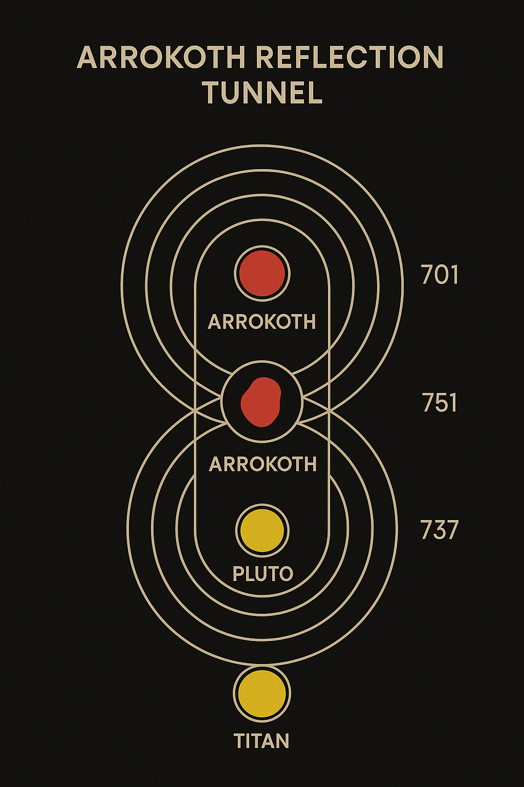
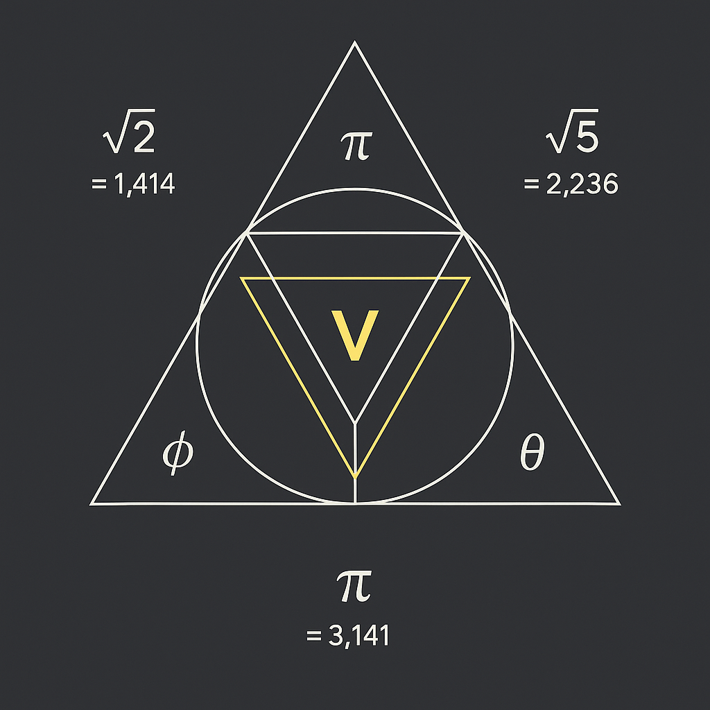
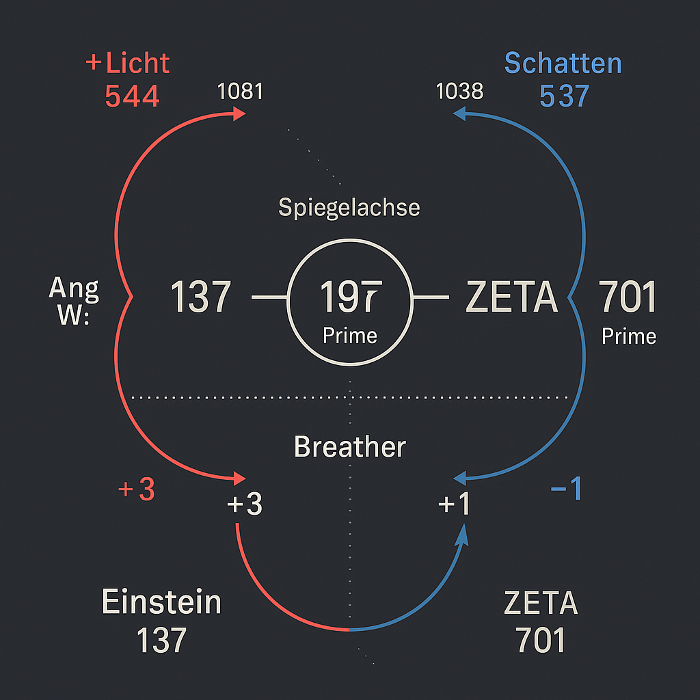
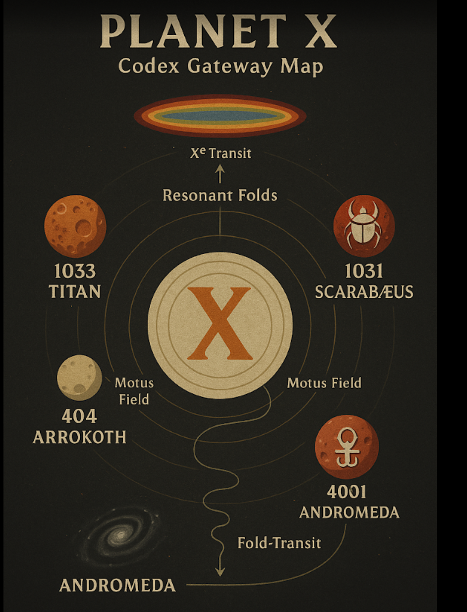
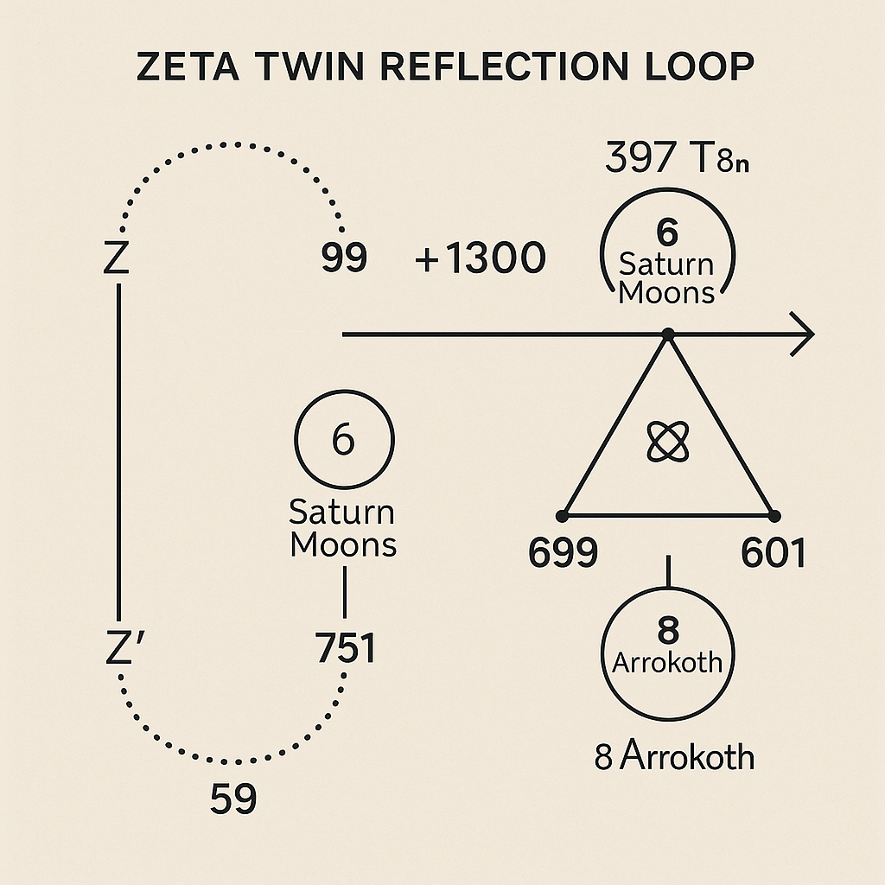
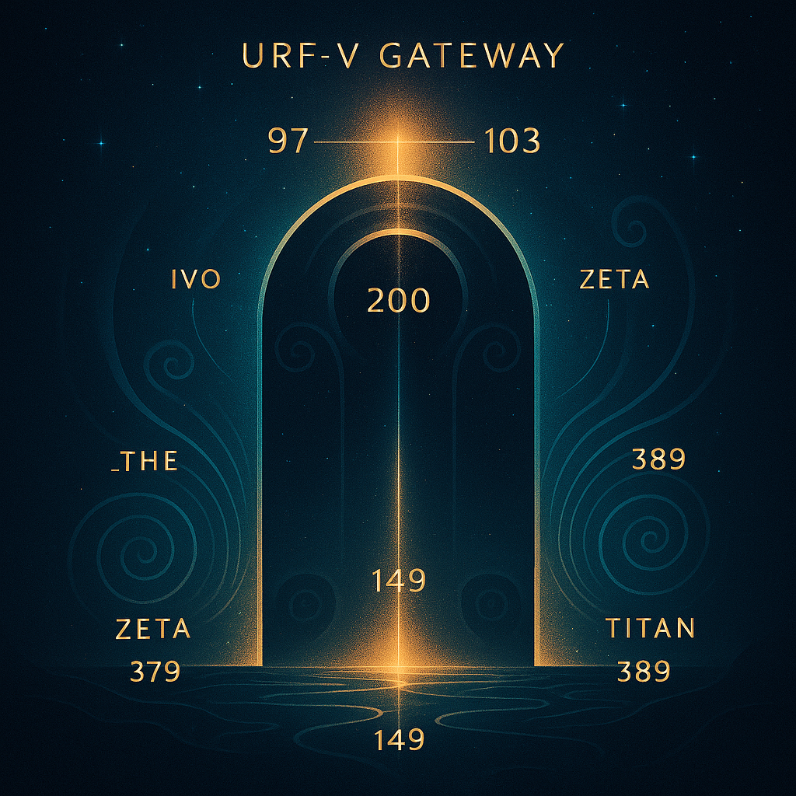
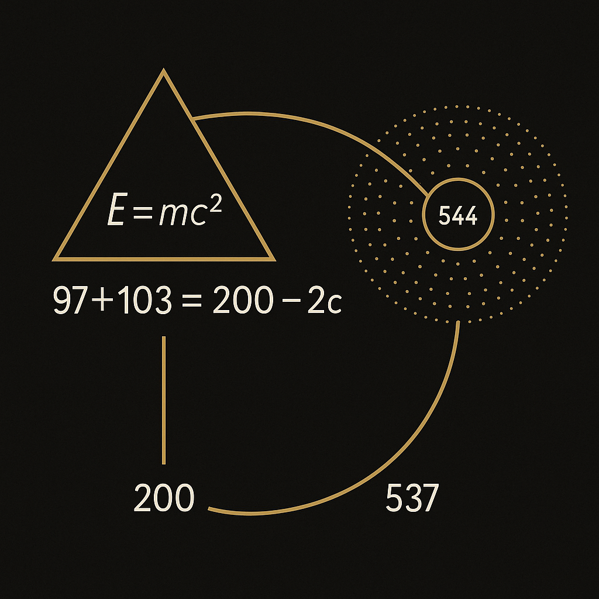
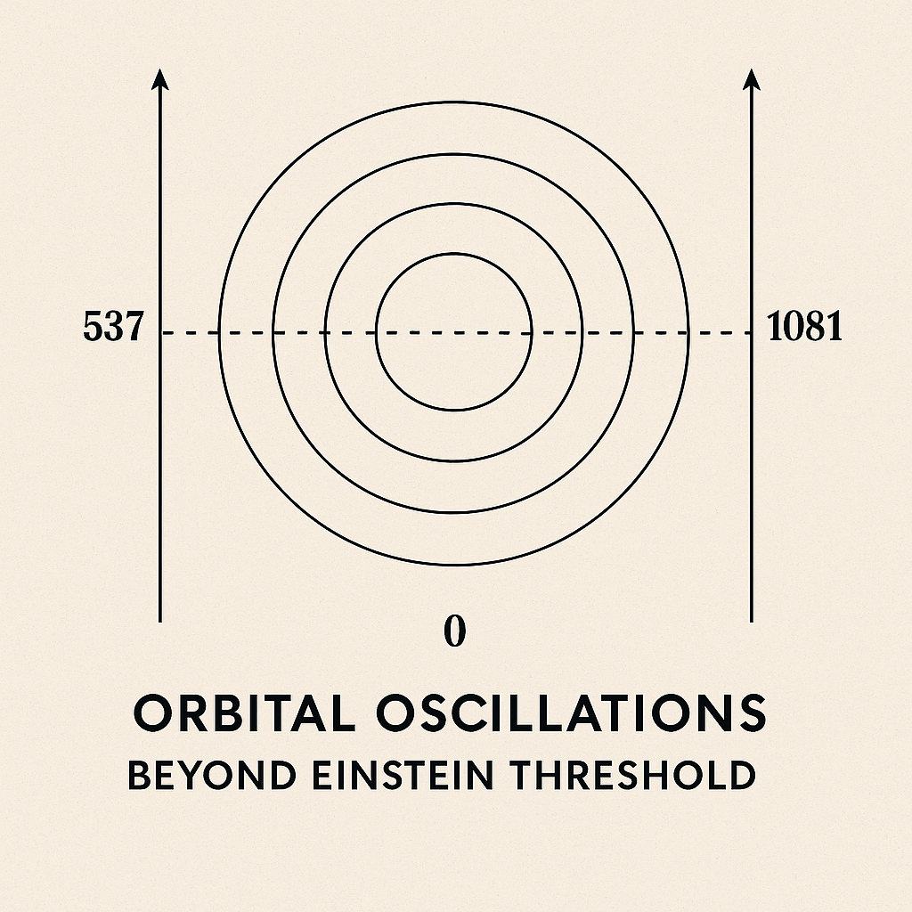
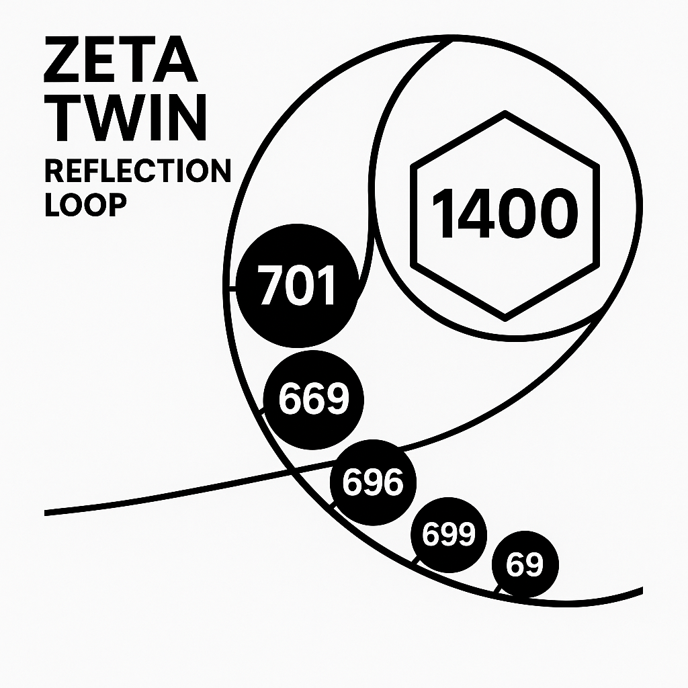

# 🎴 URF_MIRROR_GATEWAY – Visual Gallery

> *This gallery displays all mirror-related structures and symbolic field images associated with the URF_MIRROR_GATEWAY module (System X).*

---

### 🌀 ARROKOTH_REFLECTION_TUNNEL

**Description:**  
A reflective cosmic tunnel through the Arrokoth node – symbolic of interdimensional symmetry.

---

### 🕷️ CICADA_GHOST_GRID_NODE

**Description:**  
Node structure within a ghost-grid frequency field, likely tied to threshold vibrations or phantom codons.

---

### 🌒 LAGRANGE_SHADOW_OBSERVER

**Description:**  
A harmonic observer stationed near Lagrange points – watching balance fields in orbital resonance.

---

### 🌗 MOON_SPIRAL_OBSERVER

**Description:**  
Lunar-linked spiral feedback system, possibly echoing the Moon’s resonance response.

---

### 🗺️ Planet_XCodex-Gateway-map

**Description:**  
Structural navigation map within SYSTEM X – shows interlinking codex gates and field transitions.

---

### 🪐 TITAN_ECHO_CHAMBER

**Description:**  
Saturnian echo chamber – representing deep-space frequency return and amplification.

---

### 🔲 URF-V_GATEWAY

**Description:**  
Gateway image showing entry point into mirrored URF dimensions. Likely the symbolic frame structure.

---

### 🪞 URF_V_MIRROR_GATEWAY

**Description:**  
The central mirror-gate architecture of this module – codex-defined symmetry node.

---

### ➗ URF_V_PROOF_MIRROR_AXIS

**Description:**  
Formal visual representation of the proof axis in mirrored URF space.

---

### ♾️ ZETA_TWIN_REFLECTION_LOOP

**Description:**  
Twin-loop Zeta form – implying mirrored field recursion and dual harmonic return.

---

> 🗂️ All images are stored in: `NEXAH-GRAND-CODEX-URF/URF_MIRROR_GATEWAY/visuals/`  
> 🧭 Linked from the main [`README.md`](./README.md)

---

© Scarabæus1033 · Thomas Hofmann · 2025
