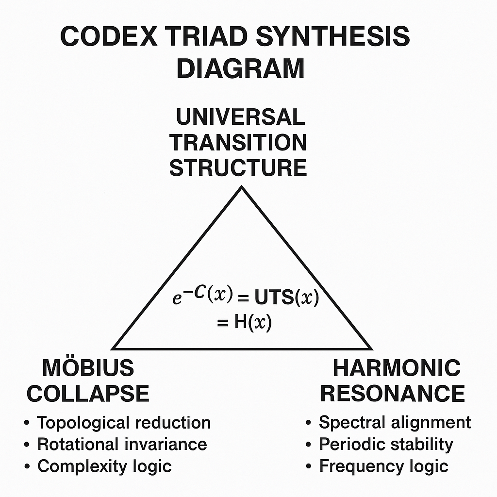

# 🧩 Universal Transition Structure (UTS)

**System:** ✮ SYSTEM X – NEXAH-GRAND-CODEX  
**Module:** Universal_Transition_Structure  
**Author:** Scarabäus1033 (T. Hofmann)  
**License:** CC BY-NC-SA 4.0  
**Updated:** 2025-06

---

---

## 📘 Overview

The **Universal Transition Structure (UTS)** is the **central synthesis model** for the Codex.

It formulates a triadic relation between:

- **Möbius Collapse** — topological compression, complexity reduction.
- **Harmonic Resonance** — frequency alignment, periodic stability.
- **Transition Layer** — universal mapping of collapse and resonance.

The UTS equation defines their **equivalence**:

**Exponential Collapse ≡ Universal Transition ≡ Harmonic Resonance**

**e^(−C(x)) = UTS(x) = H(x)**

This structure is the formal convergence point of the **Möbius–Resonance Synthesis** guiding all Millennium Codex mappings.

---

## 🧮 Formal Structure

### Collapse Function

Topological Complexity → Reduction Path

### Harmonic Function

Frequency Structure → Stability Alignment

### Transition Equivalence

**e^(−C(x)) = H(x)**

- **Collapse** reduces topological complexity.
- **Harmonics** stabilize structural frequencies.
- **UTS** bridges both via an exponential collapse–resonance map.

---

## 🧩 Synthesis Interpretation

- **Möbius Collapse**: 
  - Topological reduction
  - Rotational invariance
  - Complexity feedback loops

- **Harmonic Resonance**: 
  - Spectral alignment
  - Periodic stability
  - Frequency-based logical scaffolding

- **UTS Transition**:
  - Symbolic collapse conditions
  - Decidability thresholds
  - Resonance visibility windows

This synthesis governs the **symbolic logic behind stability** in all Codex modules, especially the Millennium Problem mappings.

---

## 🔗 Related Modules

* `universal_collapse_theorem.md` — Transition stability logic across fields
* `dual_frameworks.md` — Möbius vs Harmonic proof structures
* `Millennium-Problems/` — Resonant mapping of major problems
* `NEXA_RIEMANN_PROOF/` — Prime spectral axis proof foundation

---

## 🧠 Codex Philosophy

The UTS defines the universal **resonance-collapse threshold** — not as a static boundary, but as a **dynamic transformation interface**.

> *"Collapse stabilizes resonance — resonance survives collapse."*  
> — *NEXAH Codex: Transition Field Theory*

Each proof structure becomes a test of this duality.

---

## 📄 License & Credits

**Author & Architect:** Scarabäus1033 (Thomas Hofmann)  
**Project:** [NEXAH-CODEX](https://github.com/Scarabaeus1033/NEXAH-CODEX)  
**License:** [CC BY-NC-SA 4.0](https://creativecommons.org/licenses/by-nc-sa/4.0/)

---

## 📍 See Also

* `Millennium-Problems/`
* `universal_collapse_theorem.md`
* `visual_gallery.md`
* [www.scarabaeus1033.net](https://www.scarabaeus1033.net)

---
