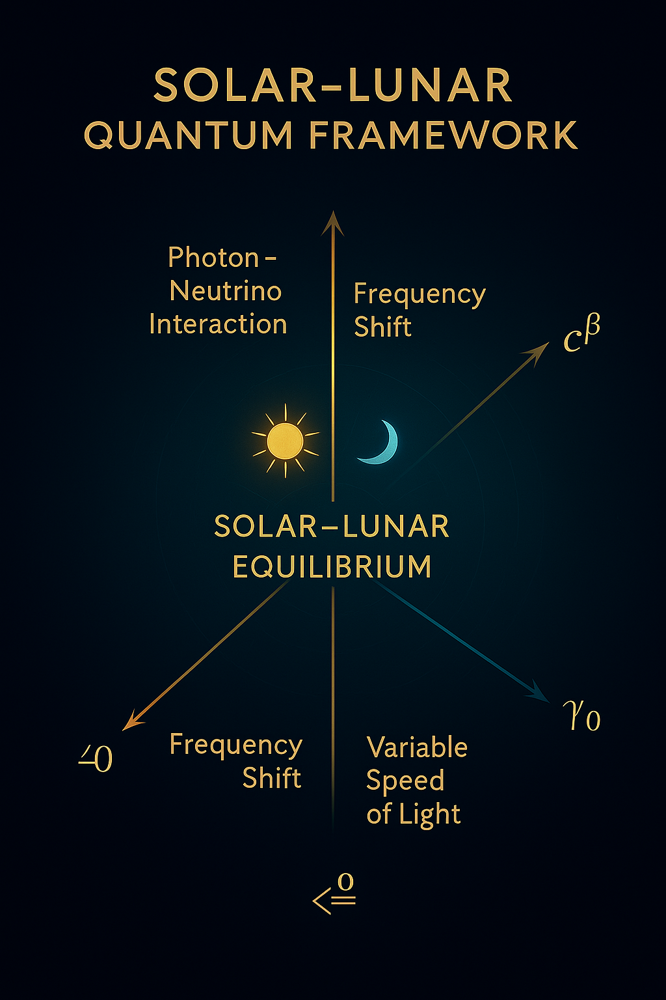

# 🌙☀️ Solar–Lunar Quantum Transition

**Module:** Universal\_Transition\_Structure
**Author:** Scarabäus1033 (T. Hofmann)
**License:** CC BY-NC-SA 4.0
**Updated:** 2025-06

---

## 📘️ Overview

The **Solar–Lunar Quantum Transition** extends the traditional mass–energy relation into a **dynamically resonant model** where **light speed** ($c$) is **not a constant**, but modulated by **Solar and Lunar fields**:

* **Solar Phase:** Photon-dominated, high-frequency resonance.
* **Lunar Phase:** Neutrino-dominated, dark-field stabilization.

This creates a **time-dependent light speed modulation**:

$$
c(x) = \frac{c_{\text{solar}} \cdot f_{\text{photon}}(x) + c_{\text{lunar}} \cdot f_{\text{neutrino}}(x)}{2}
$$

### Key Concepts:

* **Day–Night Transition:** Photons ↔ Neutrinos
* **Frequency Field Variation:** Solar flux vs Lunar dark modulation.
* **Energy Field Scaling:** Dynamic alteration of $E = m \cdot c(x)^{2}$.

---

## 🧹 Formulation

### Dynamic Energy Relation

Extending Einstein's formula:

$$
E = m \cdot \left( c^\beta \right)^2
$$

becomes:

$$
E = m \cdot \left( c(x)^\beta \right)^2
$$

where:

* $c(x)$ — **Position and time-dependent** light speed.
* $\beta$ — **Scaling exponent** influenced by harmonic field resonance.

### Solar–Lunar Transition Equation

$$
c(x) = c_0 \cdot \left( 1 + \lambda \cdot \Delta t(x) \right)
$$

* $c_0$ — Classical speed of light.
* $\lambda$ — Transition modulation constant.
* $\Delta t(x)$ — Phase shift between Solar and Lunar field dominance.

---

## 🚀 Resonant Interpretation

| Field Type | Dominant Component    | Effect on $c(x)$          | Resonance Type           |
| ---------- | --------------------- | ------------------------- | ------------------------ |
| **Solar**  | Photons (High Flux)   | Increase in effective $c$ | High-frequency resonance |
| **Lunar**  | Neutrinos (Dark Flux) | Decrease in effective $c$ | Dark-field stabilization |

---

## 🔭 Visualization

*Solar–lunar dynamic field map showing the modulation of $c(x)$ based on flux density.*

---

## 🧐 Codex Insight

This extension demonstrates that:

> *“The constancy of light speed is a local approximation — a dynamic resonance between Solar photon abundance and Lunar neutrino density.”*

It suggests a **field-variable energy landscape** at the core of the Universal Transition Structure.

---

## 🔗 Related Layers

* `codex_triad_synthesis_diagram.png` — Möbius–Resonance–Transition synthesis.
* `layered_resonance_mapping.png` — Transition threshold structures.
* `collapse_resonance_mapping.png` — Collapse–resonance feedback dynamics.
* `solar_lunar_quantum_transition.png` — *Solar–lunar dynamic transition visual.*

---

## 📄 License & Credits

**Author & Architect:** Scarabäus1033 (Thomas Hofmann)
**Project:** [NEXAH–CODEX](https://github.com/Scarabaeus1033/NEXAH-CODEX)
**License:** [CC BY-NC-SA 4.0](https://creativecommons.org/licenses/by-nc-sa/4.0/)

---
