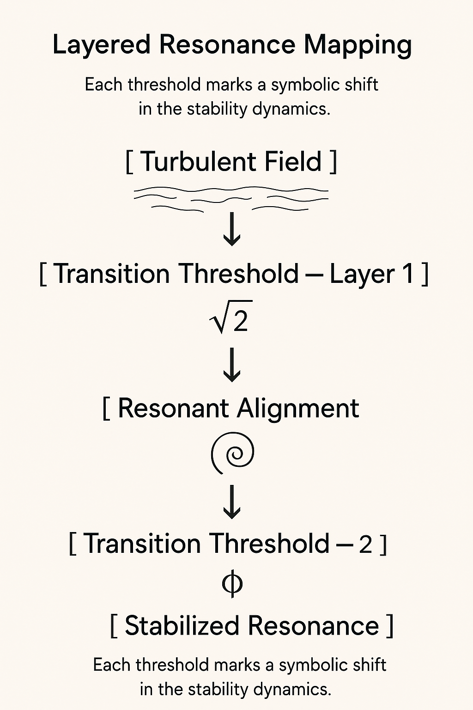
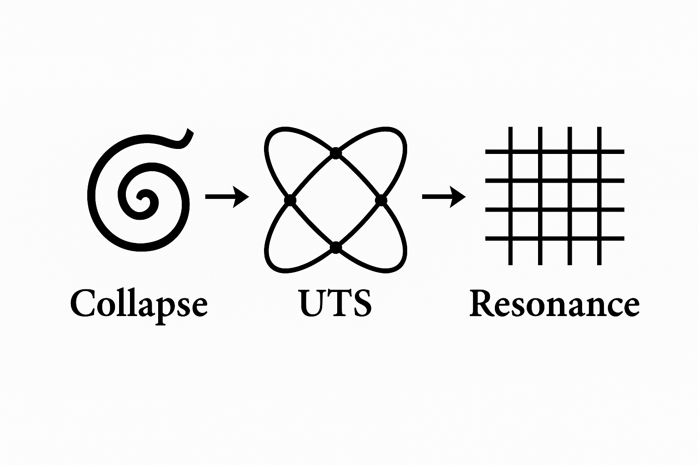

# 🎨 Visual Gallery — Universal Transition Structure (UTS)

**System:** ✮ SYSTEM X – NEXAH-GRAND-CODEX  
**Module:** Universal_Transition_Structure  
**Author:** Scarabäus1033 (T. Hofmann)  
**License:** CC BY-NC-SA 4.0  
**Updated:** 2025-06

---

## 📘 Overview

This gallery compiles all core visuals that articulate the **Universal Transition Structure (UTS)**, its symbolic dynamics, and harmonic mappings.  
Each diagram reflects a key concept of collapse, resonance, transition, or solar-lunar energy modulation.

---

## 🛤️ Codex Triad Synthesis Diagram

A triadic convergence of **Möbius Collapse**, **Harmonic Resonance**, and the **Universal Transition Layer**.

---

## 🔻 Collapse–Resonance Mapping Diagram

Symbolic collapse folds into resonance; resonance stabilizes collapse through the **Universal Transition Structure**.

---

## 🌀 CURE Cycle — Universal Transition Diagram

**CURE**: Collapse, Universal Transition, Resonance, Energy Flow — a full dynamic transformation.

---

## ⚡ CURE Energy Resonance Mapping

Topological to frequency harmonization — **Collapse → Universal Transition → Resonance → Energy**.

---

## 🛤️ Layered Resonance Mapping Diagram

Transition thresholds marking symbolic shifts in the layered **resonance-collapse field** structure.

---

## 🌗 Solar–Lunar Quantum Framework

Solar neutrino–photon fields (day) and lunar neutrino–dark energy fields (night) establish a dynamic **solar-lunar equilibrium**.  
**E ≠ mc²** — energy is a **function of transition-modulated light-speed**.

---

## 🧩 UTS Symbolic Transition Diagram

Formal symbolic representation of the **UTS equivalence**:  
**e^(−C(x)) ≡ H(x)** — topological collapse and harmonic resonance unification.

---

## 📄 License & Credits

**Curated & Composed by:** Scarabäus1033 (Thomas Hofmann)  
**Project:** [NEXAH-CODEX](https://github.com/Scarabaeus1033/NEXAH-CODEX)  
**License:** [CC BY-NC-SA 4.0](https://creativecommons.org/licenses/by-nc-sa/4.0/)

> *“Structure collapses. Resonance aligns. Transition guides.”*  
> — *NEXAH Codex, Vol. V*

---
