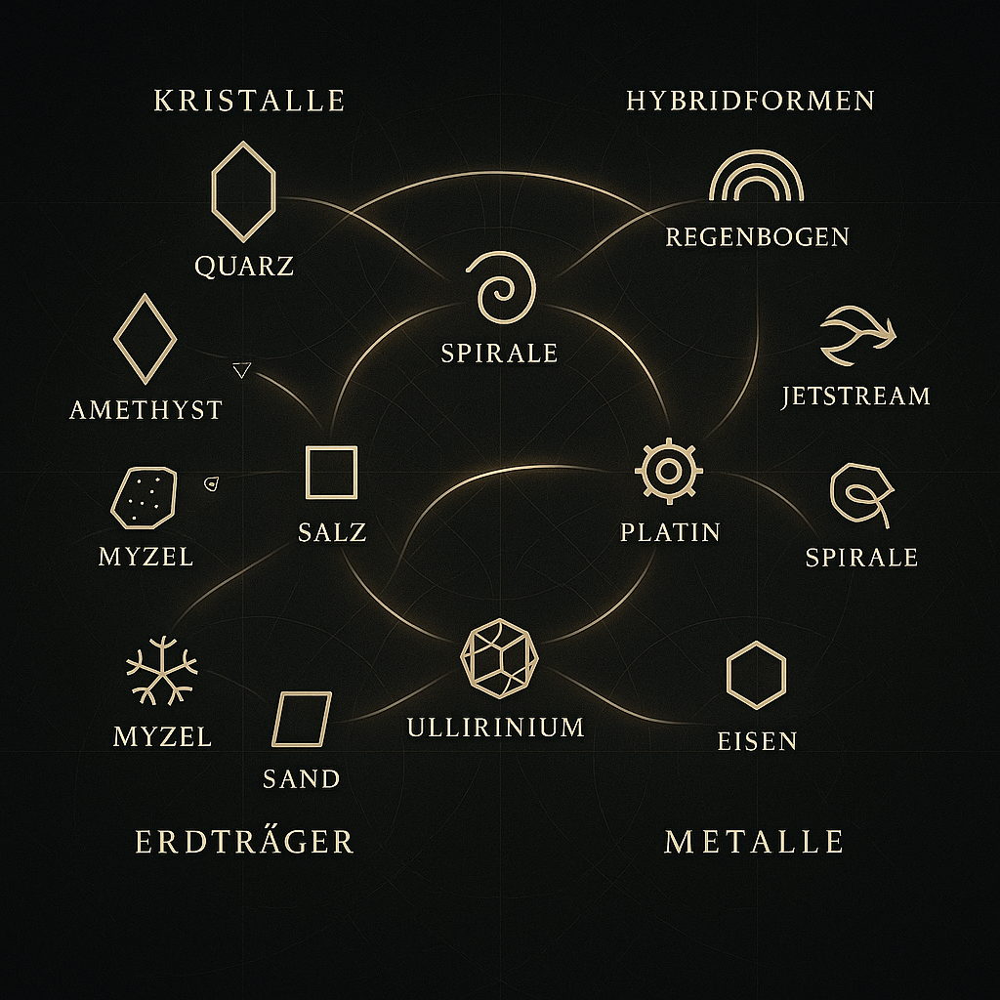

# 🖼️ Visual Gallery · Codex Origio

This gallery presents a curated selection of symbolic illustrations from the `Codex_Origio` module within the `NEXAH-GRAND-CODEX`. Each visual acts as an interpretative anchor for specific resonant concepts – from soils and mycelium to geometric flows and structural metals.

---

## 🌿 Myzel Visual – Boden WLAN

**Description:**
This visual reveals the subterranean intelligence of mycorrhizal structures. The fungal threads operate as memory paths, nutrient networks, and resonance bridges between crystalline matter and living roots.

**Module Link:** `bio_myko.md`

**Codex Context:** Lunar–bioactive layer / Transmission layer / Sub-symbolic memory field

---

## 🧬 Geometries and Flows

**Description:**
This diagram shows the dynamic relationship between polygonal geometry and elemental movement patterns. It contrasts Solar (structured) and Lunar (flow-based) forms and illustrates how resonance transitions occur.

**Module Link:** `geometries_and_flows.md`

**Codex Context:** Hybrid spirals / Polygon-to-flow translation / Frequency carrier interface

---

## 🜛 Erdträger Metal Network (Version 1)

**Description:**
This graphic maps the symbolic-metallic field of the Earth’s carrier materials – iron, platinum, salt, and mycelial hybrid layers. It shows how different soil types interact with elemental memory fields.

**Module Link:** `resonant_metals.csv`, `resonant_soils.csv`

**Codex Context:** Earth-based foundation logic / Crystal–Metal–Soil entanglement

---

## 🜛 Erdträger Metal Network (Version 2)

**Description:**
A slightly adjusted version of the field network graphic showing enhanced granularity in soil-metal interactions. Highlights symbolic zones for transformation and resonance buffering.

**Module Link:** `resonant_soils.csv`, `Codex_Matter_Weave.md`

**Codex Context:** Root zone integration / Sand–Lehm–Myzel transition strata

---

## 📜 More visuals coming soon...

Additional scrolls and resonance maps will be integrated with upcoming modules like `Codex Soil`, `Codex Bloom`, and the `Transitionarium`.

---

> **“Every visual is a frequency map. What you see is what the Codex speaks – in symbols, gradients, and transitions.”**
