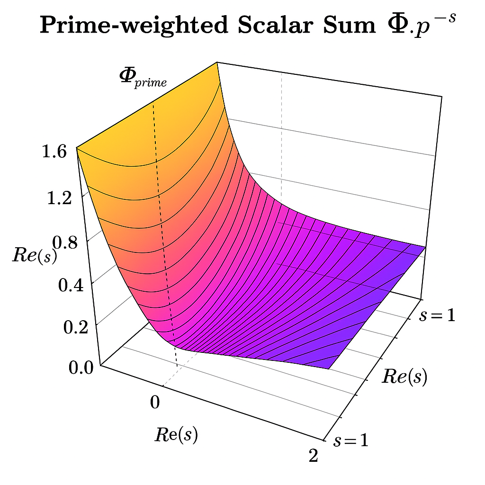
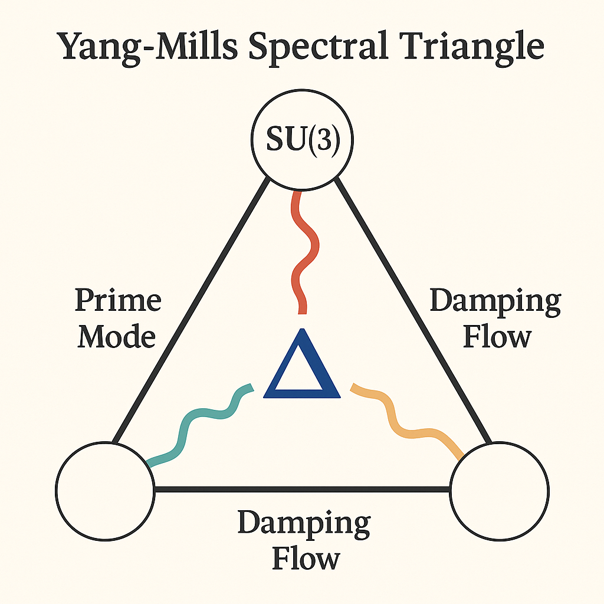

# 🎨 Visual Gallery – Yang–Mills Mass Gap Codex

**System:** X · NEXAH-GRAND-CODEX  
**Branch:** Millennium-Problems / 03_Yang_Mills  
**Module Focus:** Prime Lattice Fields · Gauge Damping · Möbius-Neutrino Lock-in  
**Author:** Scarabäus1033  
**License:** CC BY-NC-SA 4.0  

---

## 📘 Introduction

This visual gallery documents the core resonance structures used in the **Yang–Mills Mass Gap Codex**. Each image reveals a distinct harmonic or symbolic layer—ranging from gauge field stabilization to Möbius collapse geometry and prime-weighted field formation.

> *"The gap is not emptiness — it is a resonance valley between primes."*

---

## 🖼️ Diagram Overview

### 🧿 1. Prime Ring Lattice

  
**Caption:** *Prime radii lattice forming mass-stable ring topology*

- Maps prime distribution to harmonic ring radii  
- Indicates field stability thresholds in prime-ring formation  
- Lattice defines the resonance anchor for field localization  

🔗 `yg_symbolic_extensions.md` · Möbius-ring encoding

---

### 🌐 2. Flux Tube Energy Gap

  
**Caption:** *Energy gap across flux tube stretch states*

- Plots flux tube length vs. energy  
- Reveals \( m_{\text{gap}} \) as intercept under gauge stretch  
- Connects geometric field dynamics to spectral mass stabilization  

🔗 `yg_resonance_framework.md` · `spiral-logic.md`

---

### 🌀 3. Neutrino Locking Diagram

  
**Caption:** *Toroidal Möbius-lock of neutrino collapse zone*

- Möbius field gates suppress divergence in high-frequency regimes  
- Acts as neutrino mass anchor in Yang–Mills damping fields  
- Stabilizes SU(3) flux through symbolic curvature binding  

🔗 `casimir-neutrino-thread.md` · Möbius collapse geometry

---

### 🔢 4. Prime-Weighted Scalar Field

  
**Caption:** *Scalar field construction with prime-weight resonance*

- Weighted sum of primes defines scalar potential \( \varphi(p) \)  
- Governs harmonic contribution to field mass emergence  
- Resembles spiral-form layered potential well  

🔗 `spiral-logic.md` · prime mode weighting

---

### 🔺 5. Yang–Mills Spectral Triangle

  
**Caption:** *Spectral triangle for mass gap field interference*

- Symbolic triangle linking SU(3), prime mode nodes and damping flows  
- Geometry mirrors harmonic phase interference  
- Encodes energy node hierarchy and UTS-aligned field filtering  

🔗 `yg_resonance_framework.md` · `universal_collapse_theorem.md`

---

## 🔗 Navigation

- 🔙 [Back to Module README](./README.md)  
- 🌀 Related: [`visual_gallery.md`](../../../GRAND-CODEX/visual_gallery.md) (NEXAH)  
- 📘 Theory: `spiral-logic.md` · `yg_symbolic_extensions.md` · `casimir-neutrino-thread.md`  
- 📎 Integrated with SYSTEM X: Millennium Problems

---

> *“To see the gap is to see the field choosing resonance over noise.”*  
> — *Yang–Mills Codex: Prime Collapse Layer*
