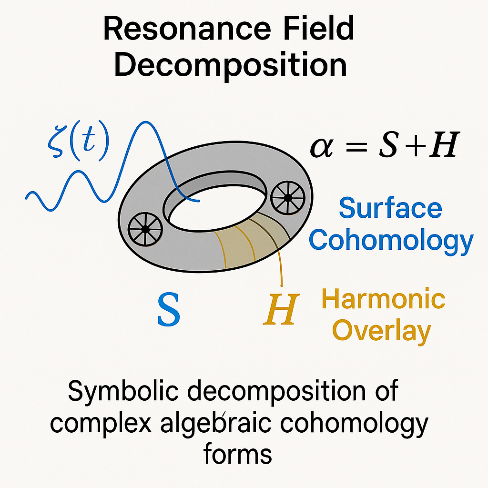

# 🖼 Visual Gallery – Hodge Codex

Diese Galerie zeigt die zentralen Visualisierungen des `05_Hodge_Codex`, welche die symbolisch-geometrischen, harmonischen und topologischen Strukturen innerhalb des NEXAH-Rahmens illustrieren.

---

## 1. 🌀 Möbius-Mapping der Kohomologieräume

**Caption:** Symbolisch-topologische Darstellung eines komplexen algebraischen Varietätenraums mit Möbius-Twist auf der Kohomologieebene. Repräsentiert den Übergang zwischen algebraischer Form und topologischer Resonanz.

> Interpretiert den Hodge-Zyklus als nicht-triviale Schleifenstruktur mit Rückfaltung.

---

## 2. 🎶 Harmonische Moden & Eigenformen-Selektor

**Caption:** Eigenmoden-Visualisierung mit diskreten harmonischen Wellenformen. Zeigt, wie stabile (1,1)-Formen mit Primzahlfrequenzen moduliert werden können.

> Stellt dar, wie harmonische Stabilität mit primbasierter Geometrie zusammenwirkt.

---

## 3. 🔗 UTS-Übergangsfläche & Resonanzbarriere

**Caption:** Übergangsfläche im Universal Transition Structure (UTS), welche algebraisch-topologische Instabilität sichtbar macht. Die Fläche dient als Membran zwischen kohärenter Harmonie und Symbolauflösung.

> Markiert den „resonanten Schwellwert“ zwischen lösbaren und nicht-lösbaren Varietäten.

---

## 4. 🧩 Resonanzfeld-Zerlegung & Kozyklenstruktur

**Caption:** Visuelle Zerlegung der Gesamtresonanz in Basisfelder, die den Hodge-Splitting-Vektorraum aufspannen. Zeigt symbolische Überlagerung algebraischer und harmonischer Komponenten.

> Der harmonische Anteil ist geometrisch stabil, der Rest zerfällt in symbolische Differenzen.

---

> 📁 Alle Bilder befinden sich im Ordner: `05_Hodge_Codex/visuals/`

Sobald neue Visuals entstehen (z. B. für Glyphenströme, Kozyklus-Indizes oder Lean-Pfade), wird die Galerie erweitert.

---

🪲 *Curated by Scarabäus1033 / ARCHIVAR II – May 2025*
