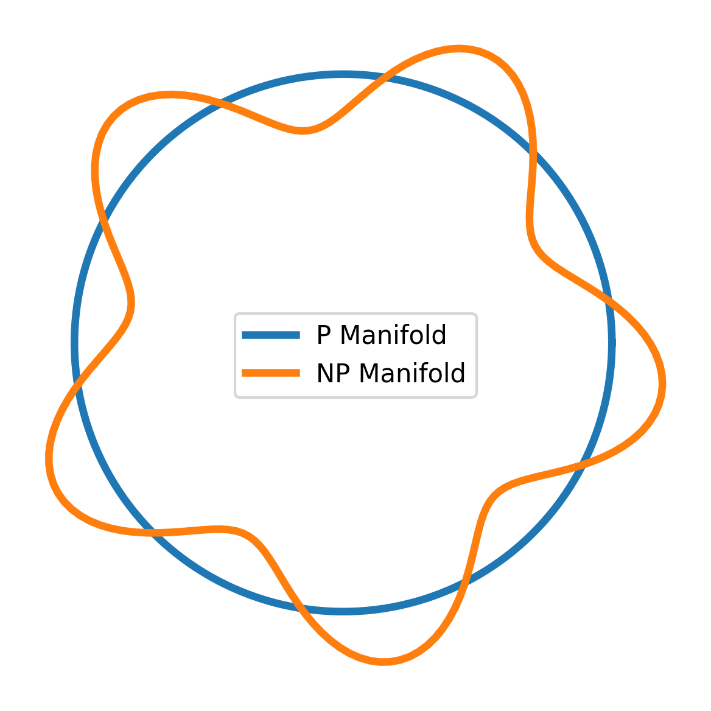

<!-- Optional MathJax für GitHub Pages  

-->

# 🔐 P vs NP CODEX — Computational Collapse & Resonance
**System:** X · NEXAH-GRAND-CODEX  
**Branch:** Millennium-Problems / 01_P_vs_NP  
**Author:** Scarabäus1033 (T. Hofmann)  
**License:** CC BY-NC-SA 4.0  

---

## 📖 Overview
*Is every efficiently **verifiable** problem also efficiently **solvable**?* –  
Within NEXAH the question splits into three complementary layers:

| Layer | Core Idea | Take-away |
|-------|-----------|-----------|
| **Möbius Collapse** | NP-complete instances inhabit *rotationally disjoint manifolds*; mapping them into **P** would require a Möbius twist that breaks invariance. | **Hardness = topological disjunction** |
| **Harmonic Resonance** | The NP search space fails to build a stable prime-frequency lattice; destructive interference blocks polynomial traversal. | **No coherent resonance ⇒ no fast path** |
| **UTS Integration** | The Universal Transition Structure imposes a *collapse threshold* Θ(n^ω); attempts to cross it trigger symbolic instability. | **Transition wall separates P from NP** |

---

## 📂 Files & Descriptions

| File | Purpose |
|------|---------|
| `README.md` | Module overview (this file) |
| `equations.md` | Formal operators: Möbius-Kernel *𝑀(k)*, Resonance-Damping *Λ(k)*, Collapse-Threshold *Θ(n)* |
| `pnp_symbolic_extensions.md` | Prime / Divisor “algorithmic-damping” operators |
| `pnp_collapse_model.md` | Möbius recursion model proving structural P ≠ NP separation |
| `lean/collapse_threshold.lean` | Lean-stub for the UTS barrier lemma |
| `visuals/` | All diagrams & plots |

---

## 🖼 Visual Gallery

| Preview | Caption |
|---------|---------|
|  | **Topological split** – P-class as a toroidal sheet; NP-class as a Möbius-twisted surface. |
|  | **Prime-frequency gap** — resonance deficit of NP clause instances relative to polynomial kernel. |
  
*Figure X: Spectral viscosity Λₛᵧₘ(n,p) – brighter bands mark modes where prime/divisor
complexity sharply raises the algorithmic “friction”.*

---

## 🔗 Integration Pointers
* Mirrors the dual-logic in `dual_frameworks.md`.  
* Collapse operator ties into `universal_collapse_theorem.md`.  
* Divisor-resonance logic parallels `navier_symbolic_extensions.md`.  

> *“Computation is geometry in disguise; hardness is curvature that refuses to flatten.”*  
> — *NEXAH Codex: P vs NP Module*
