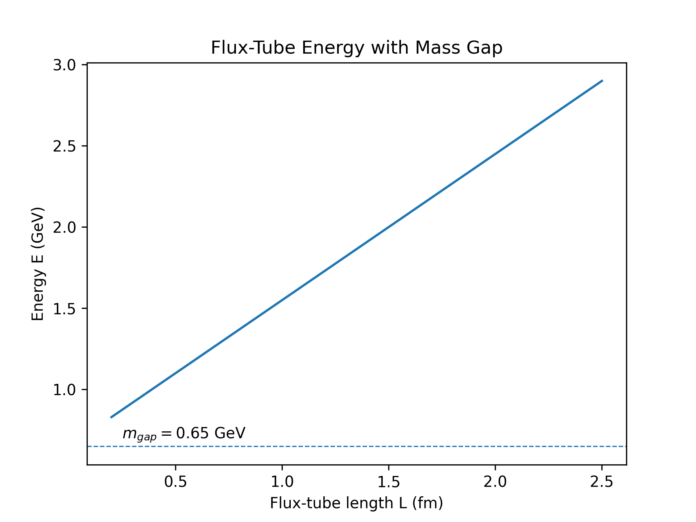

<!-- Optional MathJax for GitHub Pages -->
<!--

-->

# 🚀 Yang–Mills Mass-Gap Codex — Neutrino Lock-in & Prime-Ring Spectra

**System:** X · NEXAH-GRAND-CODEX  
**Branch:** Millennium-Problems / 03_Yang_Mills_Mass_Gap  
**Author:** Scarabäus1033 (T. Hofmann)  
**License:** CC BY-NC-SA 4.0  

---

## 📖 Overview

The Yang–Mills Mass-Gap problem asks whether **SU(3)** gauge theory in 4-D Minkowski space possesses a strictly positive lowest excitation energy  
$\Delta > 0$.

We approach the gap via **three intertwined layers**:

| Layer                  | Core Idea                                                                                            | Take-away                               |
|------------------------|------------------------------------------------------------------------------------------------------|-----------------------------------------|
| **Möbius Collapse**    | Colour flux loops undergo a $720^\circ$ Möbius twist → self-annihilating long-range fields.          | **Confinement by topological collapse** |
| **Harmonic Resonance** | Prime-Ring lattice (Rings I–VIII) supplies discrete eigen-momenta $k_r$ ⇒ minimal energy $E_{\min}$. | **Gap = first ring eigen-mode**         |
| **Neutrino Web (UTS)** | Background neutrino lattice acts as dielectric; additional term lifts vacuum energy uniformly.       | **Gap stays >0 even as $g \to 0$**      |

---

## 📂 Files & Structure

| File                        | Purpose                                      |
|-----------------------------|----------------------------------------------|
| `README.md`                 | Module guide (this file)                     |
| `equations.md`              | SU(3) Lagrangian + neutrino-locking term     |
| `yg_symbolic_extensions.md` | Prime-Ring damping, Ghost-Grid boundary      |
| `yg_collapse_model.md`      | Möbius twist → colour-flux collapse          |
| `yg_resonance_framework.md` | Harmonic spectrum, proof sketch $\Delta > 0$ |
| `lean/mass_gap.lean`        | Lean stub: "$\exists \Delta > 0$" lemma      |
| `visuals/`                  | Lattice, flux-tube & neutrino diagrams       |

---

## 🖼 Visual Gallery

| Preview                                                        | Caption                                                                                 |
|----------------------------------------------------------------|-----------------------------------------------------------------------------------------|
|         | **Prime-Ring radii vs. prime index** — spectral scaffold for $k_r$.                     |
|     | **Energy vs. tube length** — intercept yields $m_{\text{gap}}$.                         |
|     | **Toroidal neutrino grid** pinning SU(3) flux tubes.                                    |
|  | **Prime-scalar sum** $\Phi_{\text{prime}} = \sum p^{-s}$ generating $m_{\text{gap}}^2$. |

---

## 🔗 Integration Pointers

* Uses *neutrino density constant* $\rho_\nu$ from `Neutrino Web Theory.pdf`  
* Prime-Ring radii derived from "Ghost Grid + Prime Rings" RTF  
* Collapse logic aligns with `dual_frameworks.md` & `universal_collapse_theorem.md`  
* See `equations.md` for core formal expressions ($\mathcal{L}_{\text{YM}}, m_{\text{gap}}, \Phi_{\text{prime}}$)

---

> *"The mass does not arise from matter — it arises from the field's refusal to collapse."*  
> — *NEXAH Codex: Yang–Mills Mass-Gap Module*
