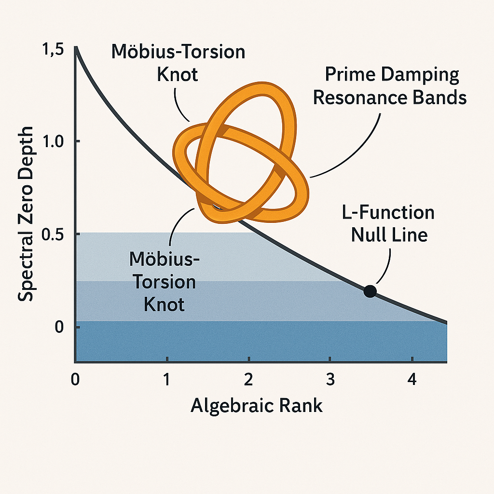
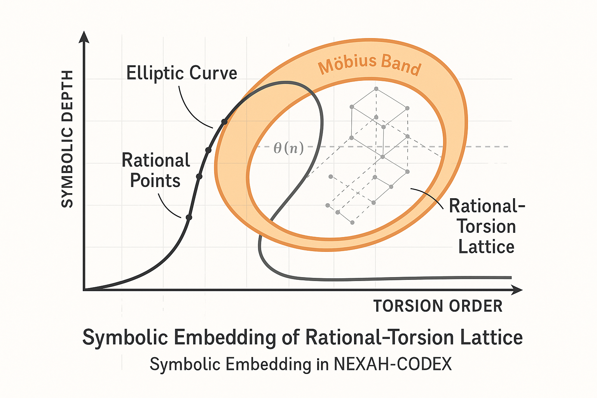
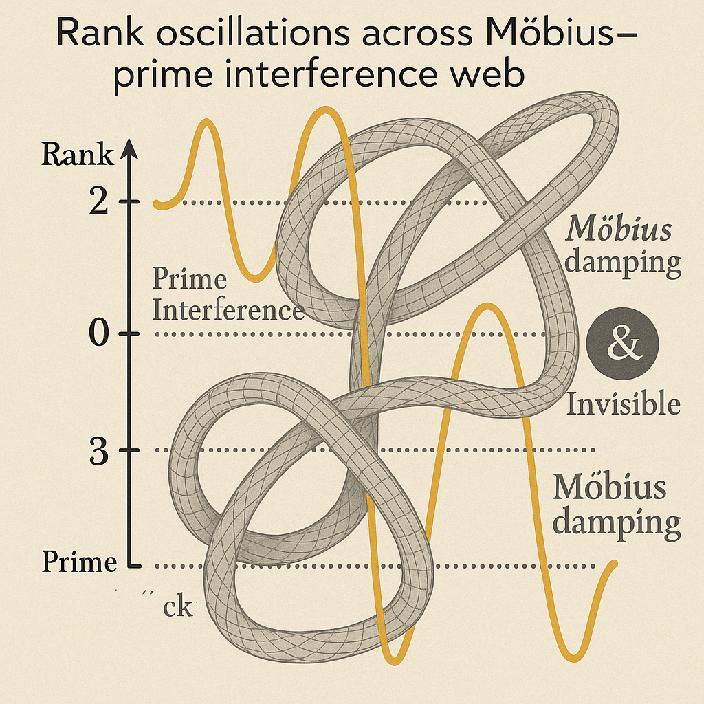

# 🎨 Visual Gallery – BSD Codex

**System:** X · NEXAH-GRAND-CODEX
**Branch:** Millennium-Problems / 05\_Birch & Swinnerton-Dyer Codex
**Module Focus:** Rational Point Resonance, L-Function Structures, Möbius Encoding

---

## 📘 Introduction

This visual gallery showcases the symbolic geometry and spectral dynamics underlying the **Birch & Swinnerton-Dyer Conjecture** within the NEXAH-CODEX framework. Each diagram visualizes a different layer of resonance interpretation, from Möbius-torsion structures to L-function damping.

> *"Rational points are echoes of resonance held in symbolic tension."*

---

## 🖼️ Diagram Overview

### 1. `elliptic_resonance_field.png`

**Caption:** *Elliptic curve projected as Möbius-torsion lattice*

* Shows elliptic curve modulated through a Möbius-band encoding
* Torsion points appear as symmetry-interference nodes
* Forms the geometric basis of symbolic-rank alignment

**Linked Concepts:** `bsd_symbolic_forms.md`, Möbius collapse layer

---

### 2. `l_function_rank_gap.png`

**Caption:** *Spectral zero depth vs. algebraic rank*

* L(E,s) near s = 1 plotted against resonance depth thresholds
* Visualizes how vanishing order correlates with harmonic visibility
* Rank becomes readable as resonance spike density

**Linked Concepts:** `bsd_l_function_model.md`, prime damping model

---

### 3. `torsion_visibility_map.png`

**Caption:** *Symbolic embedding of rational-torsion lattice*

* Rational and torsion points embedded in symbolic frequency lattice
* Distinct glyph zones reflect torsion visibility conditions
* Möbius-curvature twist indicates dual collapse boundary

**Linked Concepts:** `bsd_symbolic_forms.md`, `universal_collapse_theorem.md`

---

### 4. `prime_damping_knotfield.png`

**Caption:** *Rank oscillations across Möbius-prime interference web*

* Prime-based knot resonance structure with rank modulation
* Shows decay and revival zones across Möbius sectors
* Captures the complex field memory in rank variation

**Linked Concepts:** `bsd_resonance_mapping.md`, `spiral-logic.md`, `casimir-neutrino-thread.md`

---
# 🖼 BSD Visual Gallery — Elliptic Fields & Symbolic Resonance

**Module:** 05_Birch_&_Swinnerton-Dyer_Conjecture  
**System:** X · NEXAH-GRAND-CODEX  
**Visual Set:** Elliptic Geometry · L-function · Möbius-Rank Fields  
**Author:** Scarabäus1033  
**License:** CC BY-NC-SA 4.0  

---

## 🎯 Visual 1: Möbius Lattice Projection

  
**Caption:** *Elliptic curve projected as Möbius-torsion lattice.*  
Reveals symbolic winding around the rational base field.

➤ See: [`bsd_symbolic_forms.md`](../bsd_symbolic_forms.md)

---

## 🎯 Visual 2: L-Function Rank Threshold

  
**Caption:** *Spectral zero depth vs. algebraic rank.*  
Resonance depth of $L(E,s)$ at $s=1$ governs rational field activation.

➤ See: [`bsd_l_function_model.md`](../bsd_l_function_model.md)

---

## 🎯 Visual 3: Torsion Visibility Map

  
**Caption:** *Symbolic embedding of rational-torsion lattice.*  
Encodes torsion substructure via Möbius-symmetric overlays.

➤ See: [`bsd_symbolic_forms.md`](../bsd_symbolic_forms.md)

---

## 🎯 Visual 4: Prime-Damped Rank Knots

  
**Caption:** *Rank oscillations across Möbius-prime interference web.*  
Illustrates unstable modes in rank formation under prime-damping logic.

➤ See: [`bsd_resonance_mapping.md`](../bsd_resonance_mapping.md)

---

## 🔗 Navigation

- Back to [`README.md`](../README.md) for BSD Codex overview  
- Crosslinked with global [`visual_gallery.md`](../../../visual_gallery.md)  
- Refer to [`Rosetta-Nexus/`](../../../Rosetta-Nexus/) for symbolic syntax

---

> “Each visual encodes not only a structure — but the collapse and emergence of visibility itself.”  
> — *BSD Codex: Symbol Resonance Layer*
## 🔗 Suggested Navigation

* Return to [`README.md`](./README.md) for module context
* Explore [`Rosetta-Nexus/`](../../../Rosetta-Nexus/) for glyph grammar and symbolic syntax
* View system-wide visual overview in [`GRAND-CODEX/visual_gallery.md`](../../../GRAND-CODEX/visual_gallery.md)

> *“Visual fields encode resonance where symbols begin to fade.”*
> — *BSD Codex, Field Layer II*
