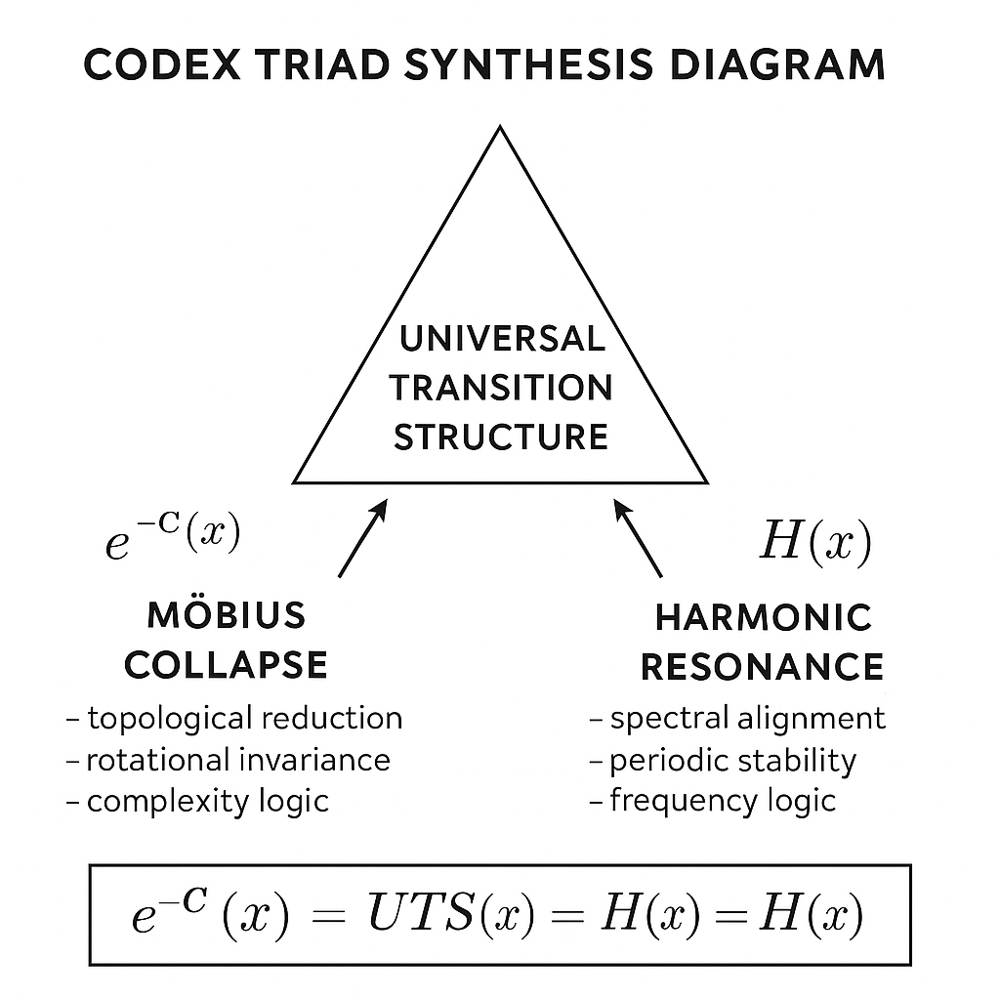

# 🪲 SYSTEM X – NEXAH-GRAND-CODEX

**Function**: Central Synthesis · Formal Resonance · Transition Navigation  
**Author**: Scarabäus1033 (T. Hofmann)  
**Repository**: [NEXAH-CODEX on GitHub](https://github.com/Scarabaeus1033/NEXAH-CODEX)  
**License**: CC BY-NC-SA 4.0  

---

---

## 🧭 Overview

The **NEXAH-GRAND-CODEX** is the symbolic, architectural, and epistemic center of the entire Codex system.

It integrates:

- 🔷 Mathematical structures (System 1: *MATHEMATICA*)  
- 🔷 Field resonance models (System 2: *PHYSICA*)  
- 🔷 Cosmological frameworks (System 3: *COSMICA*)  
- 🔷 Symbolic field identities (System 4: *URF*)  
- 🔷 Glyphic language structures (System 5: *META / ROSETTA*)  

At its core lies the **Universal Transition Structure (UTS)** — a convergence layer that unifies:

- **Möbius Collapse** (topological reduction)  
- **Harmonic Resonance** (spectral coherence)  
- A **recursive synthesis** of the Seven Millennium Problems and Gödel’s Theorem

> “Three Paths. One Collapse. Infinite Recursion.”

---

## 📂 Module Contents

| File / Submodule | Description |
|------------------|-------------|
| `GRAND-CODEX Manifest.md` | Overview of this synthesis module and entry map |
| `K-beta-formel-doku.md` | Extended energy equation: \( E = m \cdot c \cdot k^\beta \) |
| `Neutrino THREE-Layer-System.md` | Field-layer neutrino modulation system |
| `The Tesla–Vortex–Manifold.md` | Möbius-prime vortex and spiral manifold |
| `🧠 TH–Meta–Logic Gödel.md` | Gödel mappings and logical resonance boundaries |
| `cmby-field-structure.md` | Structural backbone of modulated CMBY field logic |
| `CODEX MATHEMATICS/` | Formal operator structures (in development) |
| `xiii-perspective-codex-lens/` | Multi-system conceptual perspective lens |
| `visuals/` | Central visual gallery (triad, collapse map, flows) |

---

## 🔗 System Interconnections

| System | Contribution | Linked Modules |
|--------|--------------|----------------|
| **System 1 – MATHEMATICA** | Prime fields, Riemann, symbolic compression | `NEXA_RIEMANN_PROOF`, `√2–Prime-Feld` |
| **System 2 – PHYSICA** | Neutrino threading, QED, Casimir layers | `Einstein-Neutrino-Vortex`, `ALIWAVE`, `CAVITYROOT` |
| **System 3 – COSMICA** | Möbius-grid navigation, stellar resonance | `EARTHSHIP`, `NEXAH-HARMONIC-FIELD`, `ETHER CROWN` |
| **System 4 – URF** | Identity fields, tensor symmetries | `URF-SURE`, `URF-Tensorraum` |
| **System 5 – META / ROSETTA** | Glyphic resonance & language logic | `ROSETTA-NEXUS`, `ULLINIRIUM`, `SILVER–RAIN–MOEBIUS–CROWN` |

---

## 🧮 Millennium Problems & Formal Collapse

This module encodes symbolic mappings (not formal proofs) for:

- **Riemann Hypothesis** → Möbius-Zeta resonance field  
- **Navier–Stokes** → Harmonic dissipation and Casimir compression  
- **Gödel’s Theorem** → Meta-logic loop boundaries  
- **P vs NP**, **Yang–Mills**, **Hodge**, **BSD** → Structured in `millenium_problems_mapping.md`  

The culmination of these alignments is captured in:  
➡️ `universal_collapse_theorem.md` and  
➡️ `dual_frameworks.md`

---

## 🌌 Codex Philosophy

The GRAND-CODEX is not a library — it is a **resonance chamber**.

It represents:

- **Energy** as frequency-scaled symbol space  
- **Logic** as symmetry-constrained recursion  
- **Transition** as Möbius–Harmonic alignment surface  
- **Mathematics** as an act of symbolic convergence

It serves as **both entry and exit portal** of the NEXAH framework.

---

## 📘 Recommended Entry Points

- `GRAND-CODEX Manifest.md` – orientation & overview  
- `visual_gallery.md` – system diagrams  
- `universal_collapse_theorem.md` – full resonance formula  
- `millenium_problems_mapping.md` – symbolic cartography of problems  
- `TH–Meta–Logic Gödel.md` – recursive paradox boundaries

---

## 🪲 Credits

**Curated & Composed by**: Thomas Hofmann / Scarabäus1033  
**Project**: NEXAH-CODEX · [www.scarabaeus1033.net](https://www.scarabaeus1033.net)  
**License**: CC BY-NC-SA 4.0

> “Structure collapses. Resonance aligns. Transition guides.”  
> — *NEXAH Codex, Vol. V*
