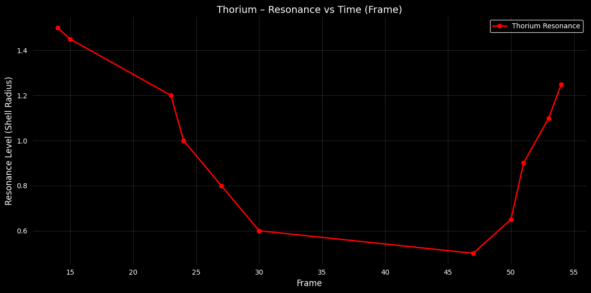
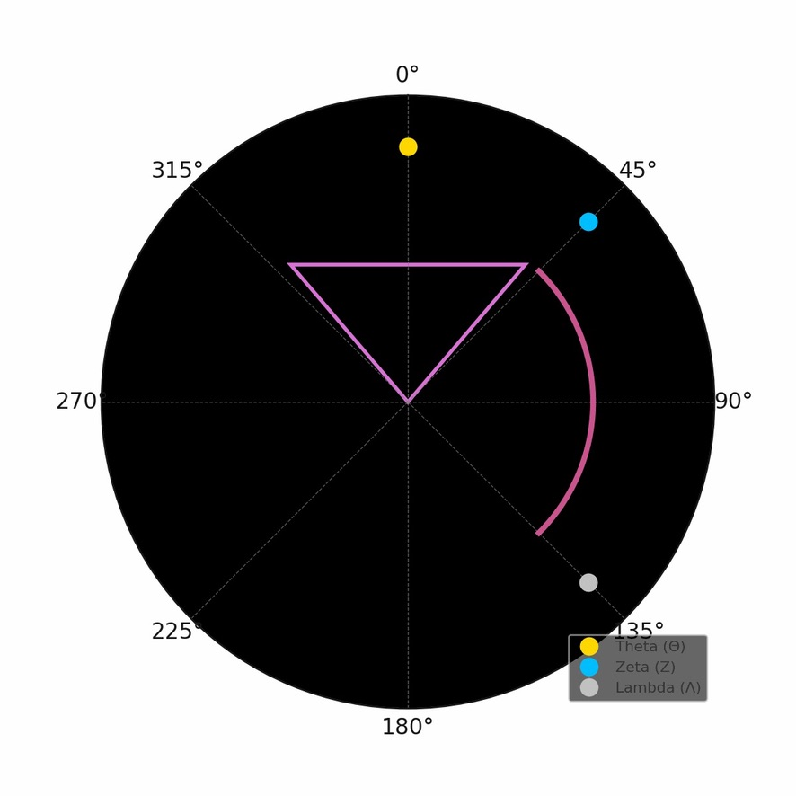
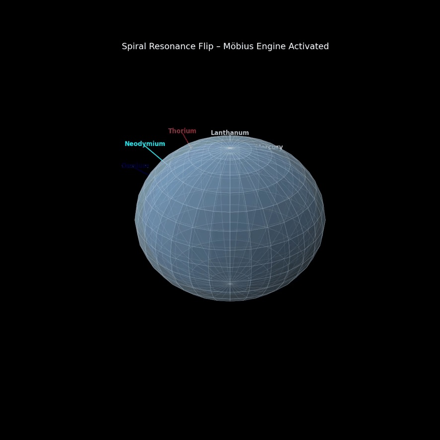
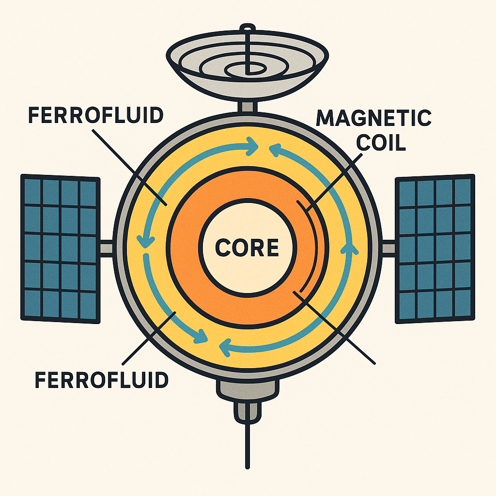

# 🧬 VISUAL GALLERY V: SYMBOLIC RESONANCE & MATERIAL FIELDS

This gallery collects unique and symbolic visualizations related to material resonance, experimental geometry, and fluidic field expressions. It serves as a companion to the symbolic-core modules of the NEXAH-CODEX and offers a visual lexicon for studying non-standard interactions, mineral analogies, and harmonic structure.

All visuals explore themes such as ferrofluid dynamics, symbolic mineral lattices, and resonance topologies grounded in both metaphorical and scientific logic.

---

### 🧲 `alloy_core_symbolic_geometry.jpeg`

**Description:** A conceptual alloy core displaying symbolic intersections between geometry, metallurgy, and phase-based field theory.

---

### 🍌 `banana_stream_geometry.jpeg`

**Description:** A symbolic flow diagram merging parabolic geometries, bio-symbolic stream logic, and axial reflection — part of experimental curvature design.

---

### 🧂 `deadsea_mineral_layer_reference.jpeg`

**Description:** Reference visualization of mineral field stratification, inspired by the salt resonances of the Dead Sea region. Used for mapping ionic field behaviors and boundary membranes.

---

### 🧪 `ferrofluid_ring_system.png`

**Description:** Toroidal ferrofluid resonance structure showing field adhesion zones, pulse voids, and paramagnetic oscillations. Used in experimental testbeds.

---

### 🍅 `loci_64_tomato_matrix.png`

**Description:** A humorously symbolic variant of the 8×8 LOCI matrix — with tomato-ring overlay — used to study pattern recognition and field humor in design systems.

---

> ✨ These visuals form part of the symbolic-field experimentation cluster in the NEXAH-CODEX and may reference speculative or metaphorical constructs. Use for insight, inspiration, or lateral design.

— Visuals by Thomas Hofmann (Scarabæus1031) & Maurizio Togni
Codex License: Quote & Use permitted. Commercial use requires permission.
