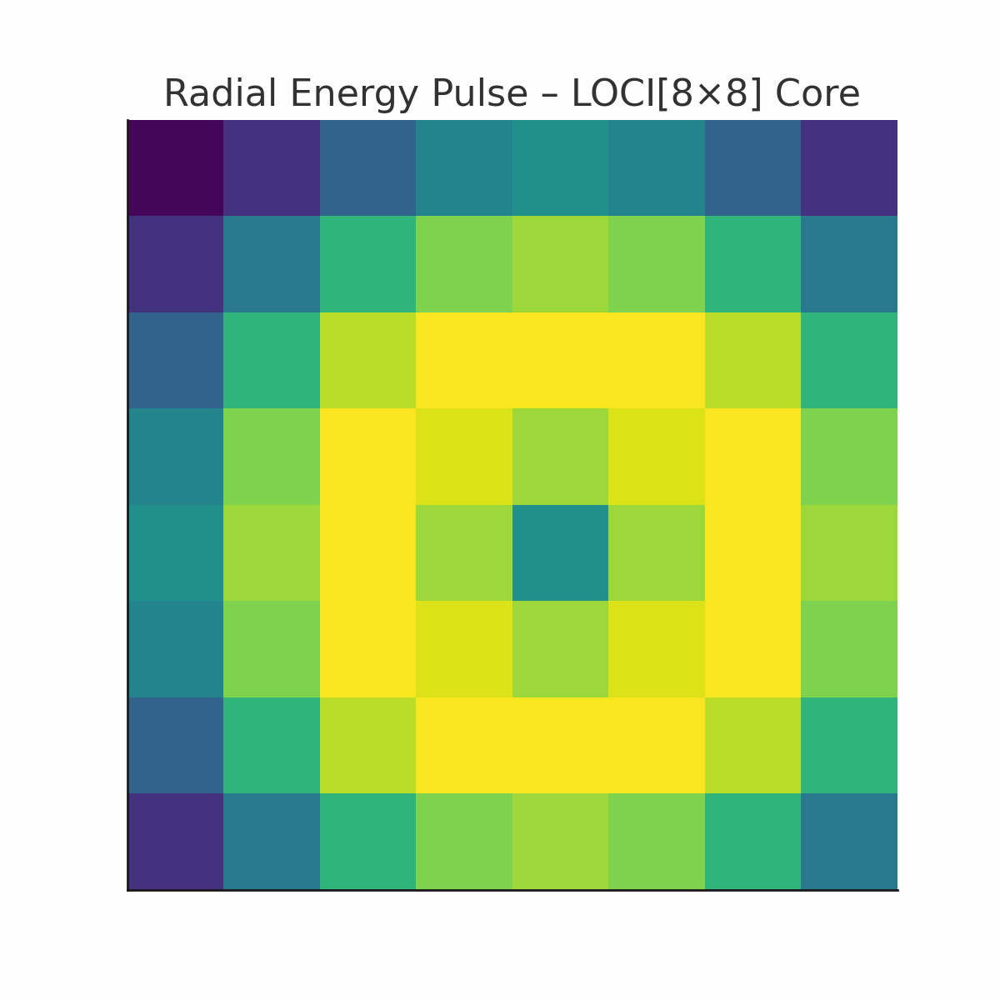

# Visual Gallery II – Satellite Loops, Reactors & LOCI Fields

This second gallery within the NEXAH-CODEX visual index focuses on animated and static field diagrams related to satellite state transitions, internal reactor structures, and LOCI-based matrix logic. These visuals are designed to accompany and illuminate the technical concepts within the SATELLITE\_∞\_NEXAH and LOCI-based modules.

---

## 🔄 Satellite State Loop Visuals (Orbit + Delta-T + LOCI\[x,y])

### `satellite_state_loop.gif`

A looped visual depiction of a satellite's energy states transitioning over orbital segments. Highlights include phase deltas (∆T) and matrix positioning.

### `satellite_state_loop.png`

Still version of the above. The energetic loop is rendered with symmetry markers and LOCI field annotations.

### `satellite_state_loop2.png`

Alternative still showing the quaternion ring aspects and axial alignment of states.

---

## ⚖️ Reactor Core Cross-Section Visual

### `thorium_reactor_shell_cut.png`

An internal, sectional view of a theoretical thorium-based reactor shell, showing active/passive layers and thermal field boundaries. Serves as a reference point for material resonance modules.

---

## 🌿 LOCI Matrix & Energy Field Animations

### `thermal_loci_loop.gif`

An animated heat-gradient loop across an 8x8 LOCI matrix. Reveals symmetry tilts and feedback curvature across frequency positions.

### `radial_energy_loop.gif`

A rotating radial field loop, echoing the layered antenna or planetary resonance structure. Used in conjunction with LOCI overlays.

---

## Visual Credits

All visuals authored or co-directed by Thomas Hofmann (Scarabæus1031), with select rendering assistance and core drafting by Maurizio Togni

Free to use and quote for research, education and artistic purposes. For commercial usage or derivative systems: **please ask first.**

---

