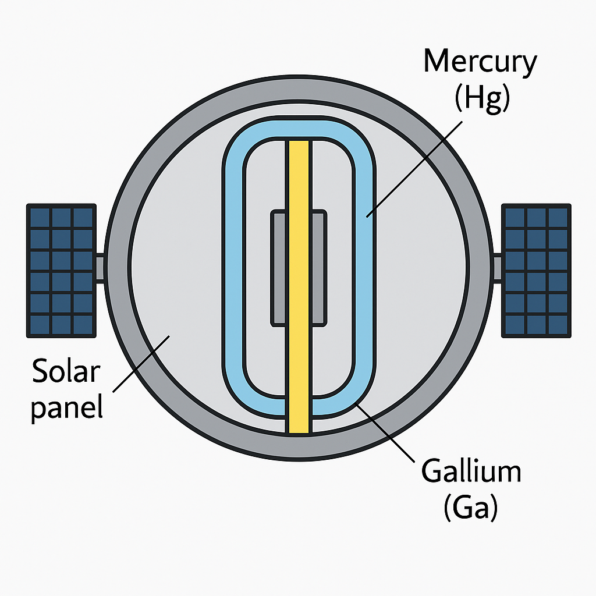
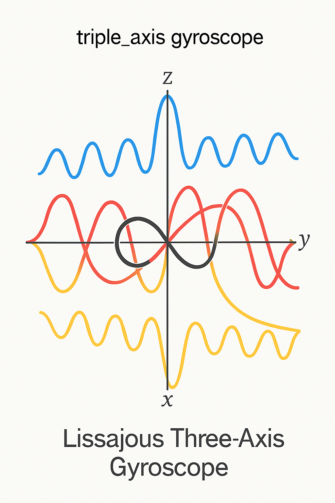
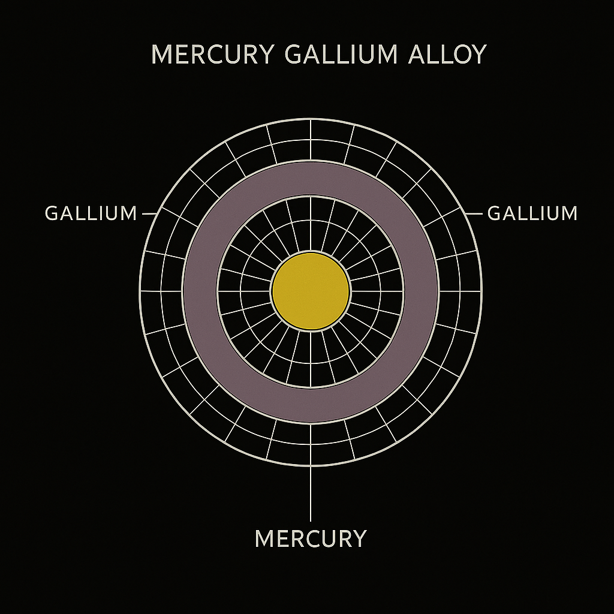
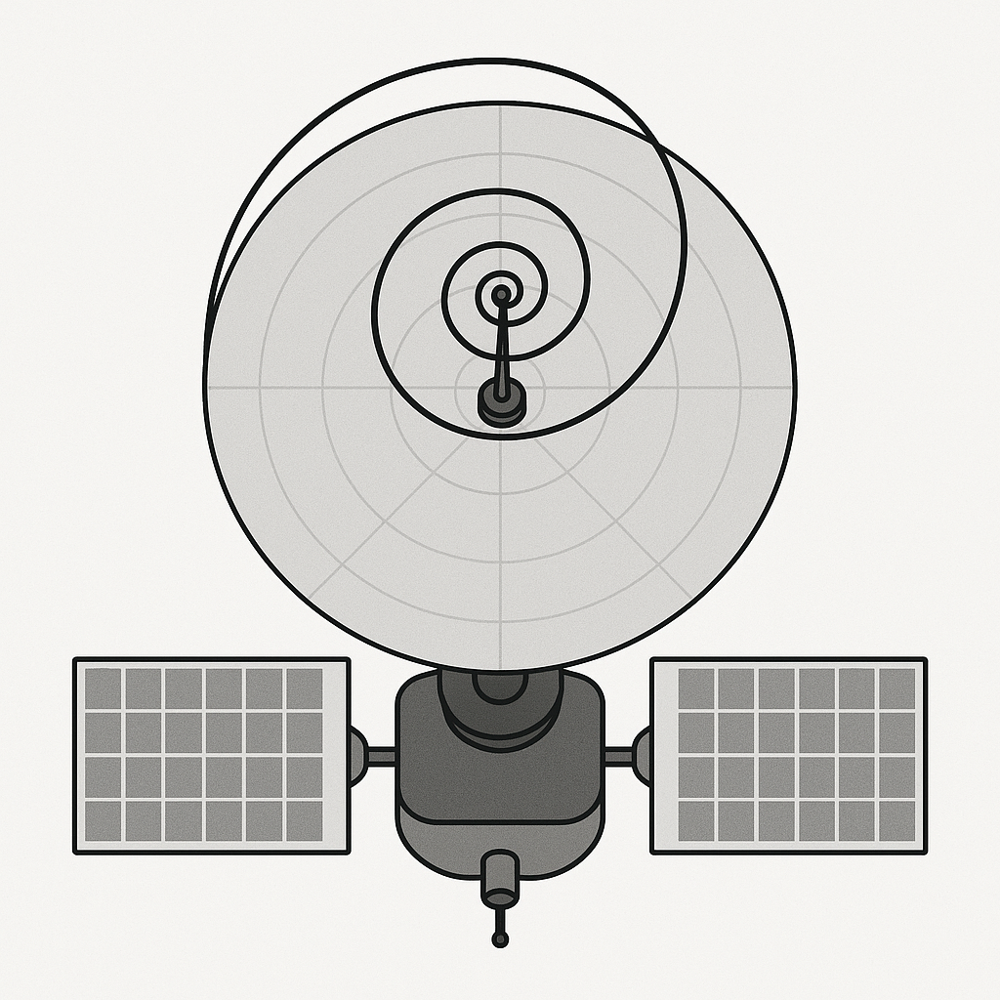

# 🧩 Visual Gallery IV – Structural Cores & Geometric Systems

This fourth visual gallery in the NEXAH-CODEX series presents cross-sectional, structural, and geometric renderings essential to the understanding of internal mechanisms, orientation fields, and scalar transitions within the Codex framework.

Unlike the symbolic or animated galleries, these visuals focus on **cutaway designs**, **gyroscopic orientation**, **thermal symmetry**, and **rotational infrastructure**. They are relevant to modules covering orbital logic, scalar fields, and internal resonance architectures.

---

### 🛰️ `satellite_core_crosssection.png`

**Description:** A detailed cutaway of a satellite’s inner architecture, showing core chambers, magnetic shielding, and structural symmetry.

---

### 🧭 `triple_axis_gyroscope.png`

**Description:** Triaxial gyroscope logic applied to orbital harmonics. Anchors the coordinate resonance within the satellite.

---

### ♨️ `thermal_gradient_logic.png`

**Description:** A thermal logic map overlaying heat dispersion fields onto structural layers. Useful in reactor and hull design.

---

### ♨️ `thermal_loci_loop.gif`

**Description:** A dynamic representation of temperature feedback across a LOCI matrix – emphasizing angular symmetry.

---

### 🌀 `radial_energy_loop.gif`

**Description:** Animated visualization of radial frequency expansion and symmetry return – essential in understanding field propagation.

---

### 🌀 `zeta_spiral_antenna_topdown.png`

**Description:** Topological rendering of spiral antenna coils from above, illustrating the Zeta-resonance geometry in pure form.

---

> These visuals serve as key technical supplements within modules such as `SATELLITE_∞_NEXAH`, `THERMAL_CORE_FEEDBACK`, and `STRUCTURAL_FREQUENCY_DOMAINS`. Designed for advanced readers, students of geometry, or technical implementers.

— Visual Engineering by Thomas Hofmann & Maurizio Togni  |  Scarabæus1031

---
