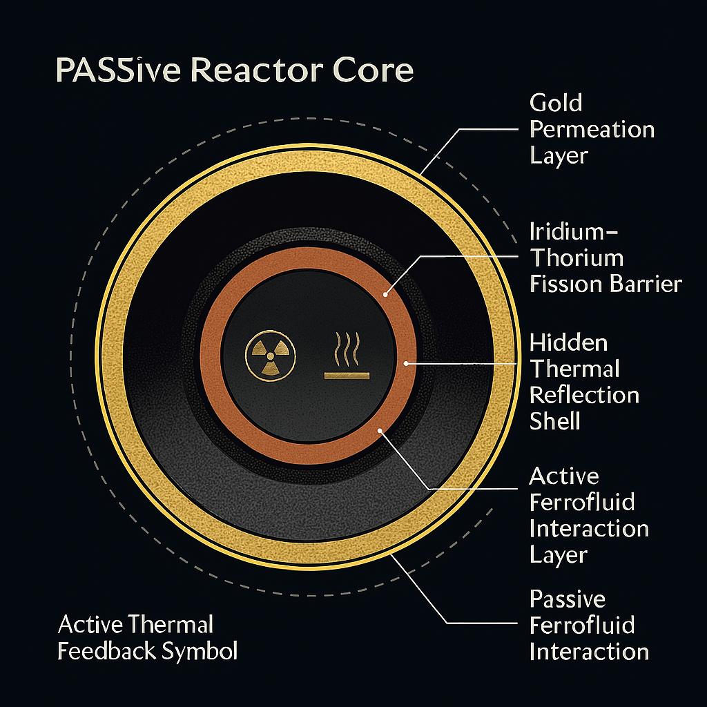

# 🌙 VISUAL GALLERY 3: SYMBOLIC ARCHITECTURES & FIELD NARRATIVES

This gallery collects symbolic, architectural, and metaphor-based visualizations connected to the SATELLITE_∞_NEXAH module and the broader NEXAH Codex. These images represent not just technical structures but also narrative arcs, lunar resonance bridges, and conceptual geometries used to align space-based systems with harmonic fields and frequency intelligence.

---

## 🌕 `lunar_harvest_bridge.png`

**Description:**  
A conceptual lunar harvesting bridge linking satellite intake systems with surface energy flows. The arched structure serves both as a thermal channel and a symbolic resonator between orbital nodes and ground-based frequencies.

---

## 🧭 `loci_matrix_overlay.png`

**Description:**  
Annotated matrix overlay diagram visualizing curvature, field segmentation, and 2° axial tilt. Serves to interpret the symbolic and energetic logic embedded within the 8×8 LOCI grid.

---

## 🧬 `thermal_gradient_logic.svg`

**Description:**  
2D logic diagram displaying symbolic thermal symmetry across resonance layers. Combines heat-field distribution with geometric flow and feedback fields.

---

## 🍅 `loci_64_tomato_matrix.png`

**Description:**  
Playful yet precise symbolic mapping of the LOCI matrix using a tomato as metaphor for inner coherence. Suggests organic field integrity, flavor structure, and internal compartmentalization.

---

## 🛸 `thorium_reactor_shell_cut.png` *(also fits Gallery II)*

**Description:**  
Shell-cut illustration used symbolically to explain inner field layers, plasma-bounded resonance cores, and harmonic containment. Can be interpreted both literally and metaphorically.

---

## 🛤️ `resonance_architecture_V_map.png` *(also in Gallery 2)*

**Description:**  
Represents the symbolic backbone or “spine” of harmonic systems. The “V” shape suggests dual-arc balancing, convergence, and field navigation.

---

> 🌀 All visuals are part of the symbolic-frequency synthesis of the NEXAH Codex. Use and share freely under Codex License: Quote & Use permitted. For monetization or redistribution, explicit permission from Scarabaeus1033 is required.

— Visuals by TH & Maurizio Togni, Scarabæus1031
