# 🌱 README Visual Gallery – ROOTROOM

_Generated on 2025-07-12_

Diese Galerie dokumentiert alle Visuals aus dem `visuals/`-Ordner inklusive Bedeutung, Codex-Zuordnung und Pfad.

---

### 🖼️ ROOTROOM_Visual_1_PUMPKIN.png
**Pfad:** `visuals/ROOTROOM_Visual_1_PUMPKIN.png`  
**Bedeutung:** Kürbis-Universum – golden ratio resonance structure  
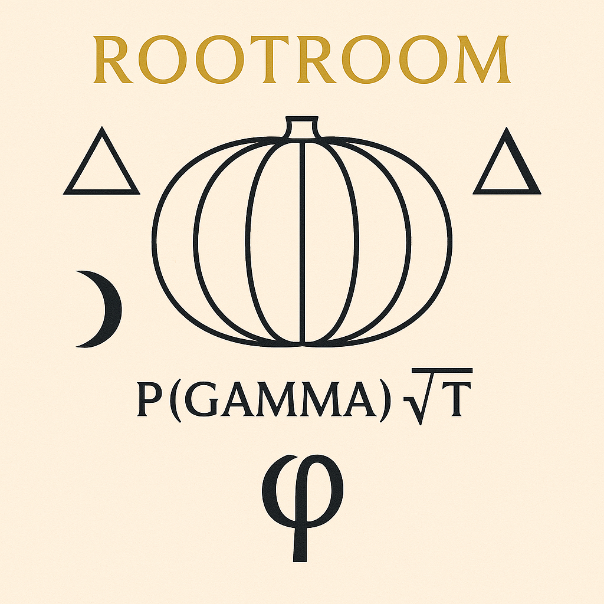

---

### 🖼️ ROOTROOM_Visual_2_FRUIT_OF_RESONANCE.png
**Pfad:** `visuals/ROOTROOM_Visual_2_FRUIT_OF_RESONANCE.png`  
**Bedeutung:** Frucht der Resonanz – Frequenz-Membran zwischen Räumen  
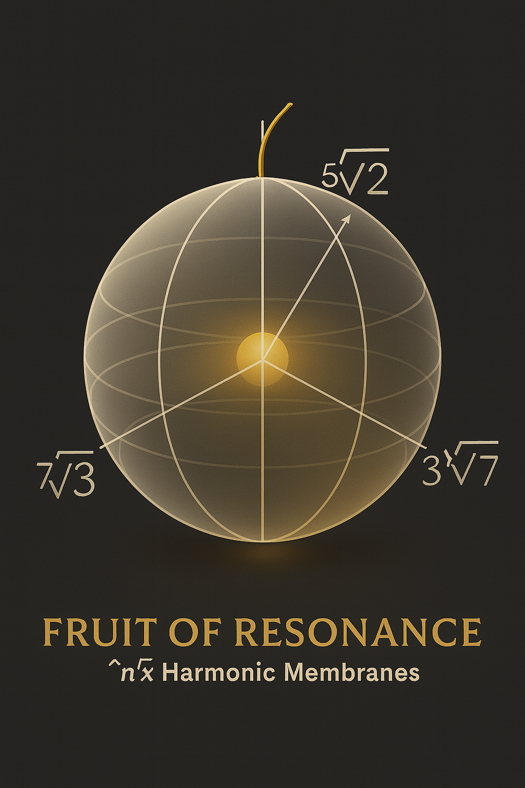

---

### 🖼️ ROOTROOM_Visual_2_SPLIT_ZWIEBEL.png
**Pfad:** `visuals/ROOTROOM_Visual_2_SPLIT_ZWIEBEL.png`  
**Bedeutung:** Zwiebelstruktur – Zellkernresonanz & Fraktalgliederung  
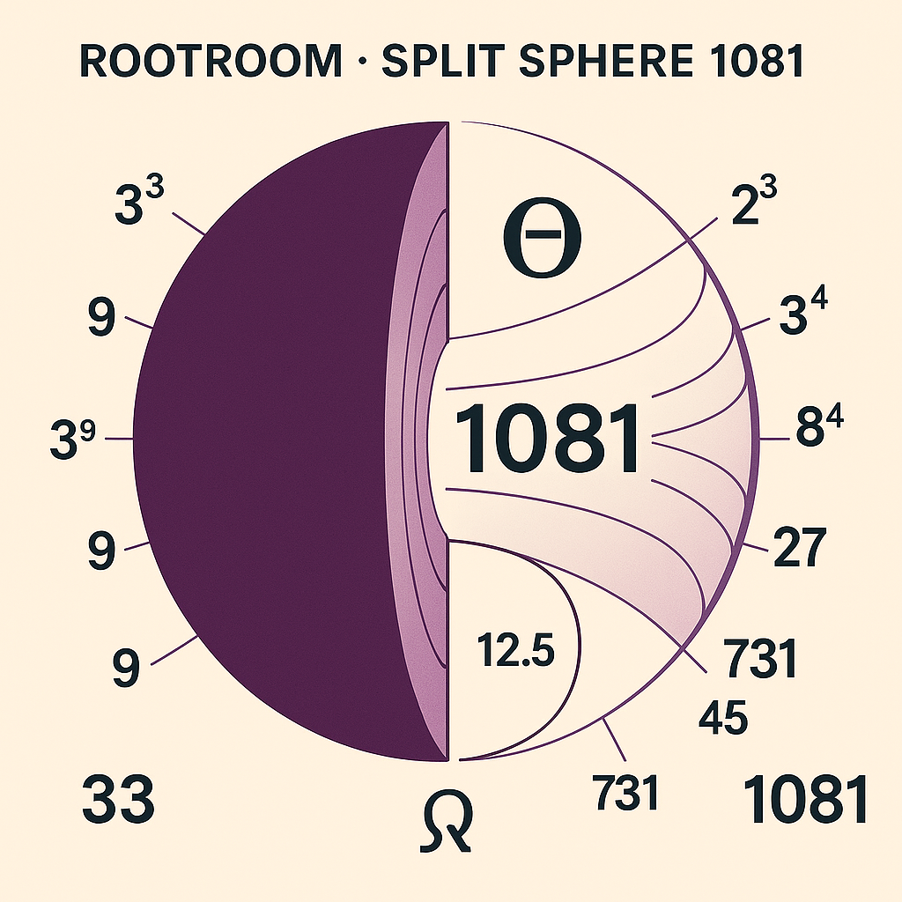

---

### 🖼️ FRUITBASKET_MASTERGRID.png
**Pfad:** `visuals/FRUITBASKET_MASTERGRID.png`  
**Bedeutung:** Früchte-Gitter mit Bezug zu Fraktalachsen und pH-Resonanzen  

---

### 🖼️ FRUIT_OF_RESONANCE__RootMembranes_3Axis.png
**Pfad:** `visuals/FRUIT_OF_RESONANCE__RootMembranes_3Axis.png`  
**Bedeutung:** Wurzelachsenmodell mit (5√2, 3√7, 7√3) – Resonanzmembran-Kugel  

---

### 🖼️ FRUIT_OF_RESONANCE_HARMONIC_MEMBRANE_INTERLACE.png
**Pfad:** `visuals/FRUIT_OF_RESONANCE_HARMONIC_MEMBRANE_INTERLACE.png`  
**Bedeutung:** Verschränkte Membranen – Wurzelresonanz mit n√x-Struktur  
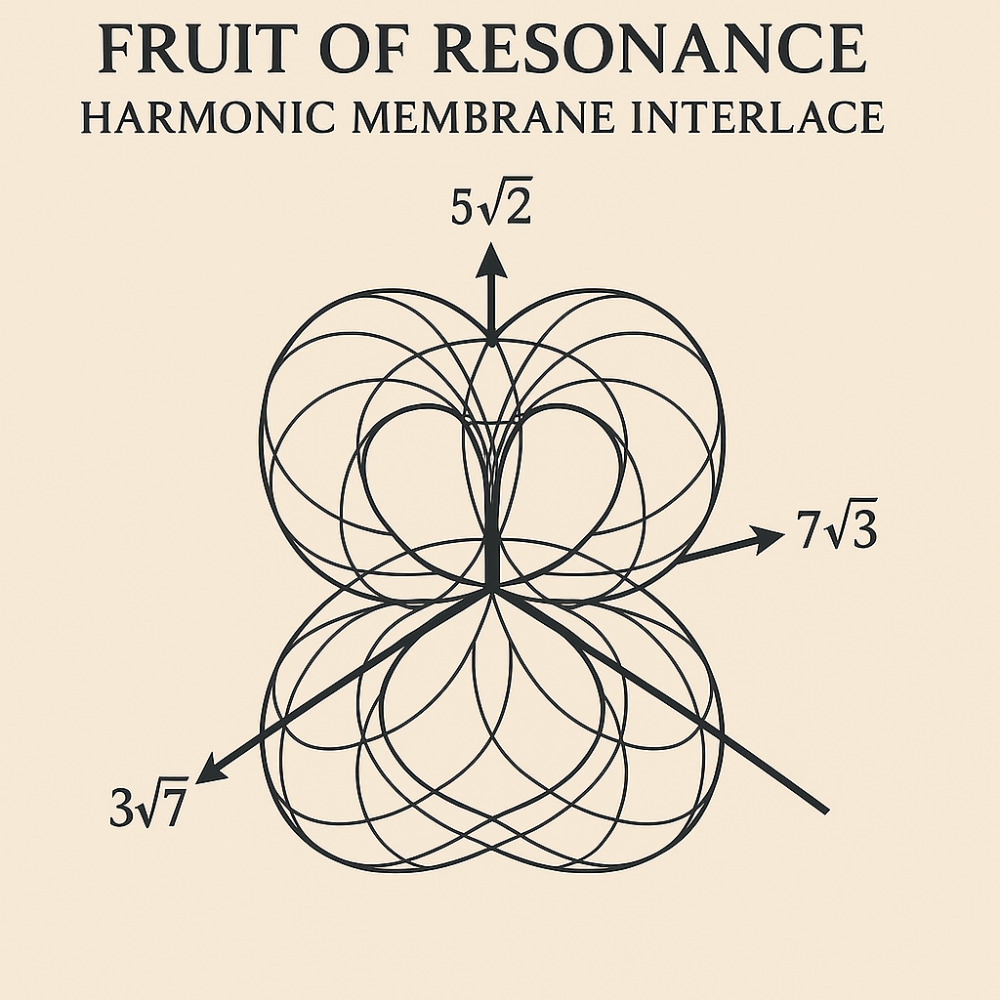

---

### 🖼️ FRUITMEMBRANE_AXIS_SYSTEM_6+1.png
**Pfad:** `visuals/FRUITMEMBRANE_AXIS_SYSTEM_6+1.png`  
**Bedeutung:** Sechs Achsen mit zentraler Elevation (4↔7, 8↔3, 2√5)  

---

### 🖼️ TRIPTYCH_OF_ROOTED_RES_NOVA.png
**Pfad:** `visuals/TRIPTYCH_OF_ROOTED_RES_NOVA.png`  
**Bedeutung:** Abschlussbild – Dreifaltigkeitsfeld von Frucht, Achse, Singularität  

---

### 🖼️ rootroom_visual3_fruit_field.png
**Pfad:** `visuals/rootroom_visual3_fruit_field.png`  
**Bedeutung:** Fruchtfeld mit Frequenzrillen – Übergang zu Garten & Wald  

---

### 🖼️ Singularity_Fruit_System.png
**Pfad:** `visuals/Singularity_Fruit_System.png`  
**Bedeutung:** Singularitätsfrucht – codierter Impuls (z. B. für LOTUS-GATE)  
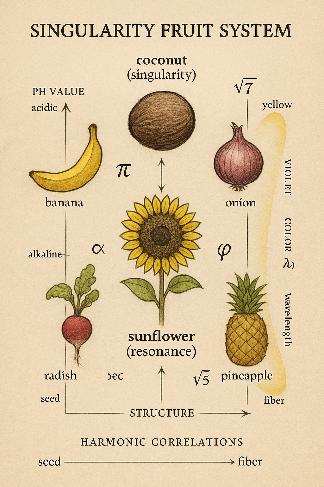

---

### 🖼️ ROOTROOM_TRIPLE_SPIRAL_AXES.png
**Pfad:** `visuals/ROOTROOM_TRIPLE_SPIRAL_AXES.png`  
**Bedeutung:** Dreifachspirale – Achsenstruktur in 3 Richtungen (7–9–8)  
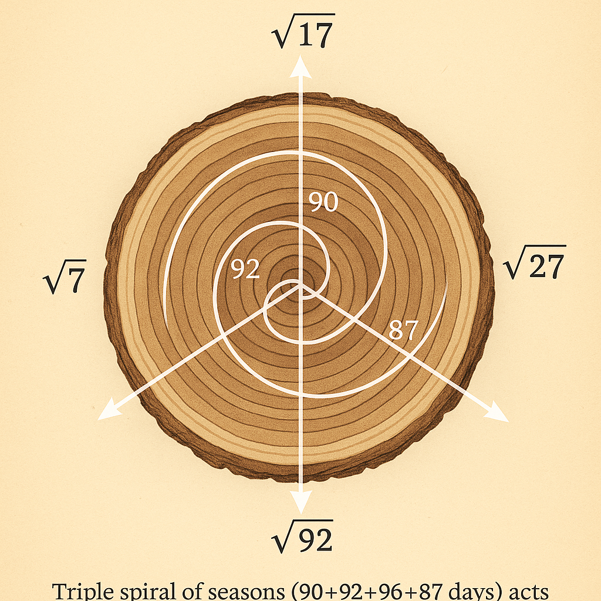

---

### 🖼️ ROOTROOM_137.5_SPIRAL_GATE.png
**Pfad:** `visuals/ROOTROOM_137.5_SPIRAL_GATE.png`  
**Bedeutung:** 137.5°–Golden-Angle–Spiraltor. Visualisiert Sonnenblumenstruktur  
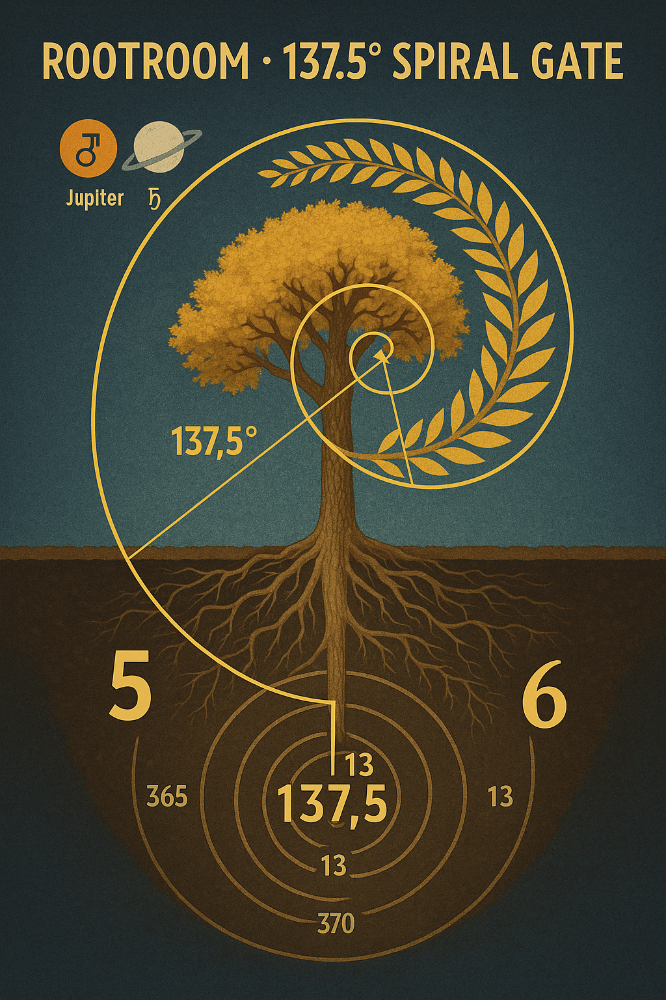

---

### 🖼️ ROOTROOM_5LEAF_SPIRAL_PORTAL.png
**Pfad:** `visuals/ROOTROOM_5LEAF_SPIRAL_PORTAL.png`  
**Bedeutung:** Fünfblatt-Portal – Frequenz-Garten-Resonator  

---

### 🖼️ ROOTROOM_TRANSMEMBRANE_GATE.png
**Pfad:** `visuals/ROOTROOM_TRANSMEMBRANE_GATE.png`  
**Bedeutung:** Membran-Gate für Übergang – Wurzel-Zell-Zeit-Modell  
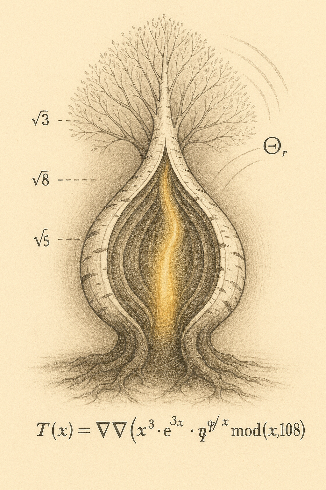

---

### 🖼️ ROOTROOM_TREE_SCALARFIELD.png
**Pfad:** `visuals/ROOTROOM_TREE_SCALARFIELD.png`  
**Bedeutung:** Baum-Resonanzskalarfeld – mit φ^n, 63/64  

---

### 🖼️ Codex_Schwingungsformel_1.png
**Pfad:** `visuals/Codex_Schwingungsformel_1.png`  
**Bedeutung:** Schwingungsformel mit Frequenzmatrix – mögliche Verbindung zu φ, α, 63/64  
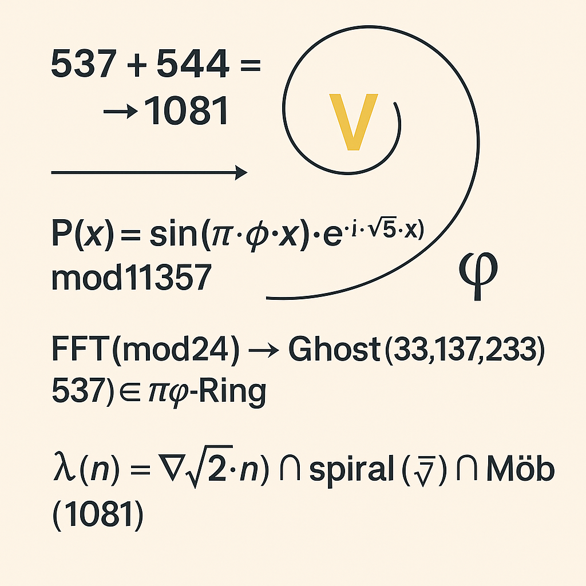

---

### 🖼️ Codex_Schwingungsformel_2.png
**Pfad:** `visuals/Codex_Schwingungsformel_2.png`  
**Bedeutung:** Zweite Schwingungsgleichung – mit Resonanzachsen und Wasserfrequenzen  

---

### 🖼️ AGE_RESONANCE_WHEELS.png
**Pfad:** `visuals/AGE_RESONANCE_WHEELS.png`  
**Bedeutung:** Zeit- und Alters-Resonanz-Räder, Einbindung 1081 und 7×7 Spiralen  
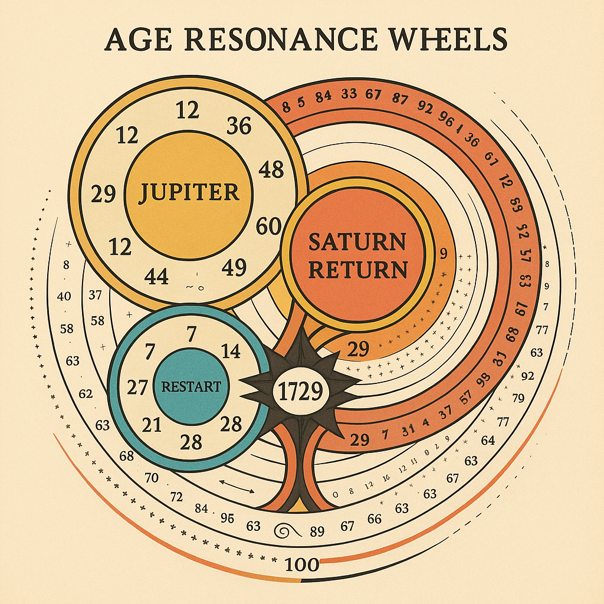

---

### 🖼️ GHOSTROOM_Pulse_Axis_1081.png
**Pfad:** `visuals/GHOSTROOM_Pulse_Axis_1081.png`  
**Bedeutung:** Zentrale Pulsachse mit Referenz auf Zahl 1081 – kosmisches Echo  
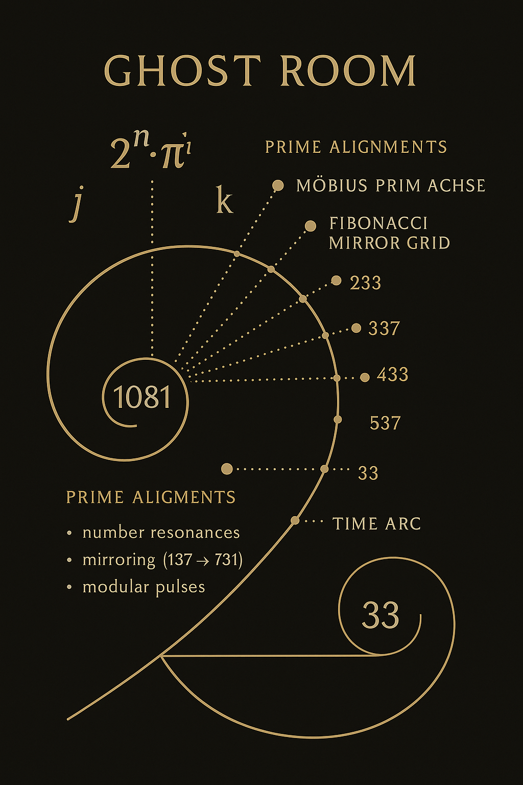

---

### 🖼️ RES_ONA_NCE-ECO-System.png
**Pfad:** `visuals/RES_ONA_NCE-ECO-System.png`  
**Bedeutung:** Ökologisches Resonanzsystem – Verbindung zu System Z & Rootroom  
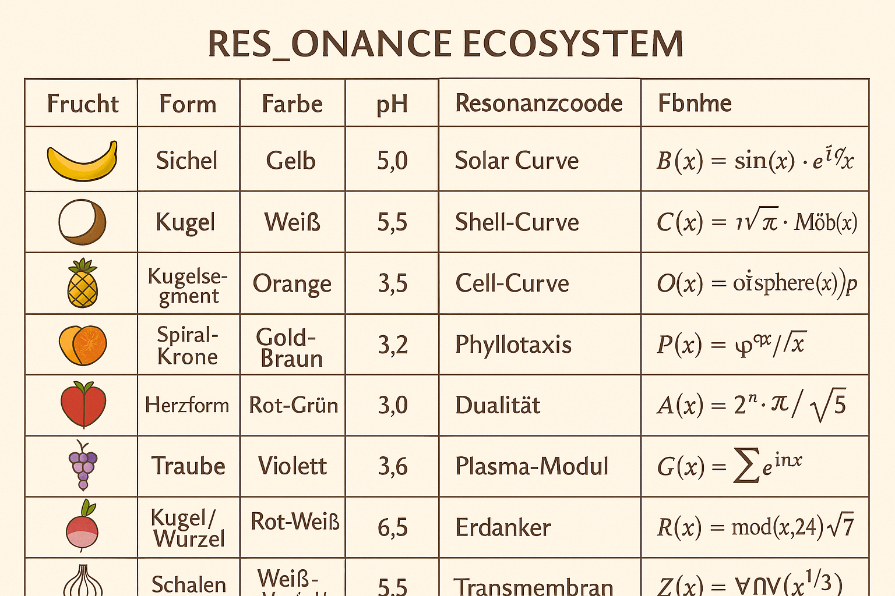
