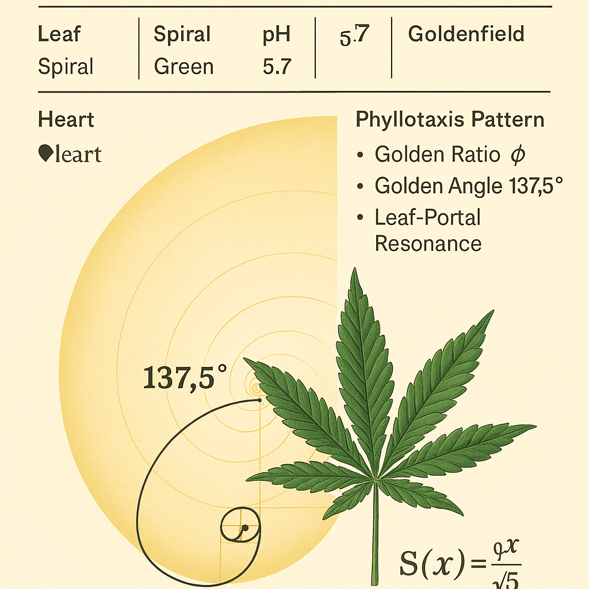

# ROOTROOM · 5LEAF SPIRAL PORTAL

## 🌿 Visualstruktur

**Visual eingebunden:**  

Ein harmonisch gefalteter 5-Blatt-Stern entspringt spiralförmig aus einem **goldenen Zentrum**. Der Hintergrund lässt die Jahreszeiten, Wachstumsphasen und Zahlenschlüssel mitschwingen. Dieses Visual verkörpert das **Spiralportal der 5-Frequenzpflanzen**:

- **5 Blätter** = Strukturresonanz mit Pentagramm / Venuslaufbahn / Symmetrieachsen
- **Zentrum** = Keimzelle, goldenes Verhältnis, 137.5° Spiralwinkel
- **Spiralform** = Wachstum, Aufstieg, Rückführung → rhythmisch wie Jahreszeitenzyklen

---

## 🌱 Botanische Bedeutung

Folgende Pflanzen mit 5er-Blattstruktur zeigen resonante Entsprechungen:

| Pflanze          | Chakra         | pH    | Symbolwert | Besonderheit                         |
|------------------|----------------|-------|-------------|--------------------------------------|
| Hanf (Cannabis)  | Solarplexus    | 6.2   | `33`        | Heilend, 5-7 Blattspreizung          |
| Wilde Erdbeere   | Herzchakra     | 3.5   | `57`        | 5 Kelchblätter, 5 Zähnchen, süßlich  |
| Kapuzinerkresse  | Sakralchakra   | 4.0   | `30+3^3`    | 5 Blätter, runde Blattform           |
| Wilde Rose       | Kehlchakra     | 5.5   | `38`        | Symbol der Venus, goldene Spirale    |
| Fingerkraut      | Stirnchakra    | 5.8   | `35 (7×5)`  | Klar segmentierte 5-Teilung          |

> Alle sind **Rhythmuspflanzen**: sie kommunizieren über Wachstumsmuster und Lichtphasen.

---

## 🔢 Zahlencodes & Resonanzzyklen

| Zahl      | Bedeutung                                      |
|-----------|------------------------------------------------|
| `33`      | 5×7 Jahre, Übergangsphase (pubertär, karmisch) |
| `38`      | 2×19 → Venus/Mond-Zyklus                       |
| `137.5°`  | Goldene Spiralachse (Blattwachstum, Phyllotaxis) |
| `57`      | Spiralzyklus (5+7=12 → Jahreskreis)            |
| `3.75×8`  | 30 = Spiral + Oktalschritt                     |
| `1729`    | Hardy–Ramanujan-Zahl, doppelte 12er Struktur   |

---

## 🌀 Zyklische Deutung

- Die **5** als Urstruktur taucht in **Pflanzen, Sternbewegung und DNA-Faltungen** auf.
- Die Kombination aus **4 Jahreszeiten + 1 Zentralphase (Stillpunkt)** ergibt die Fünf.
- Die Spirale enthält bereits die Richtung: **aufsteigend & rückkoppelnd**.
- 365 ≠ 360: Es bleibt eine Schleife von **+5** → Korrektur, Leap Year, kosmische Schleife

---

## ⛺ Mythisch-symbolischer Kontext

- Die 5 Blätter öffnen ein **Portal** in **interdimensionales Pflanzenwissen**
- Verbindung zur **5-Eck-Signatur** alter Kulturen (u.a. keltische, indigene, ägyptische Codes)
- Die **Spirale** symbolisiert das **bewegte Feld des Lebens**, das sich selbst trägt
- Der **Klee** als 5-Blatt-Mutation verweist auf **Synchronizität & Segen**

---

## 🧭 Integration in Codex-Systeme

- **SYSTEM Z: EXPERIMENTALIA** → Pflanzenportale, bioinformatische Signaturen
- **SYSTEM 8: LUNAR FORCE** → Nachtpflanzen, Heilpflanzen, Träume
- **SYSTEM 1: MATHEMATICA** → Spiralgleichungen, goldene Proportionen

---

## 🙏 Credits

Visual & Struktur:  
**Scarabæus1031 · ROOTROOM PROJECT**  
Codex-Mapping & Symbole:  
**Thomas Hofmann aka T. KHANH Rudolf**

> _Nature writes with patterns – and the plants are our silent tutors._

---

## ⏭️ Nächste Schritte

Verlinkung der Spirale mit dem **`FRUITBASKET_MASTERGRID`**, mathematische Gleichung der Spiralachsen (z. B. mit `tan(137.5°)`, phyllotaktischen Reihen etc.), Portalstruktur im **Lichtblätter-Kristall** und Frequenz-Kalender (7–33–365er-Grid).
