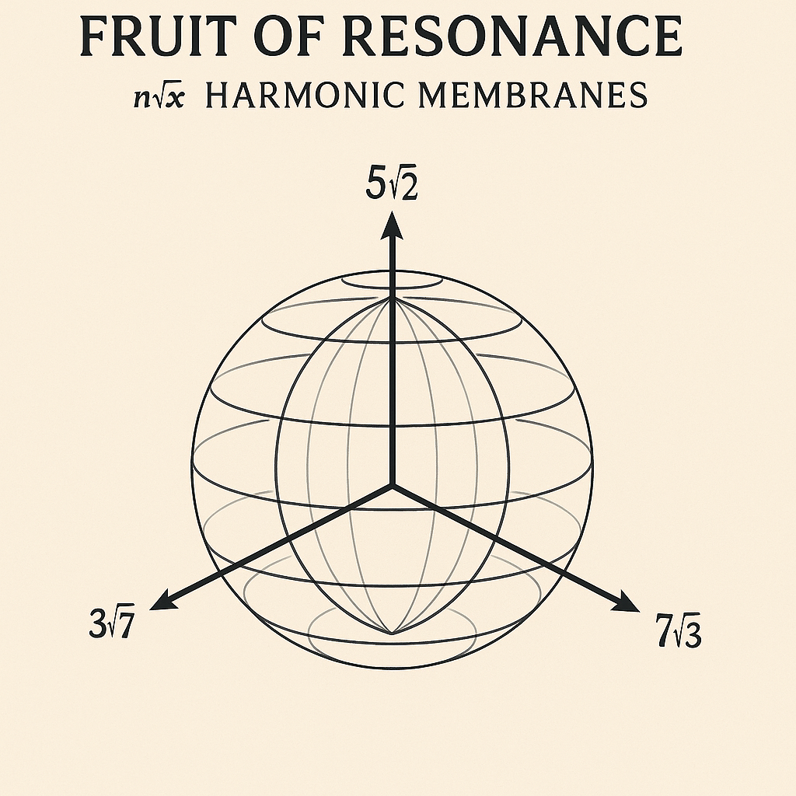
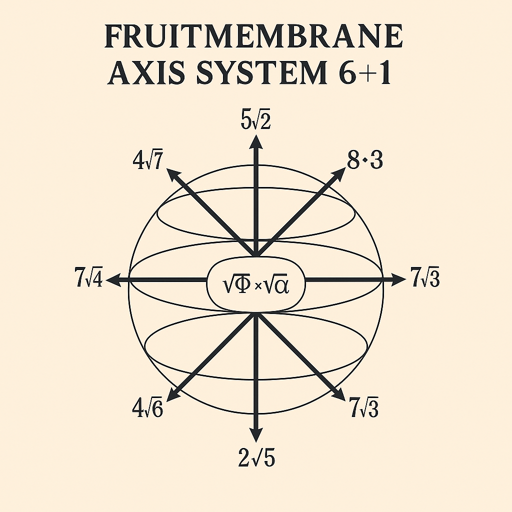

# 🌀 FRUITMEMBRANE_TRIPTYCH · Schwingungsachsen & Resonanzfeld

_Generated on 2025-07-12._

Diese Datei bildet den **Schlussstein des ROOTROOM-Moduls** und leitet über zum **LOTUS GATE**. Sie dokumentiert die drei finalen Visuals des Moduls samt symbolischer Bedeutung, Zahlencodierungen, Wurzelachsen und Resonanzgleichungen.

---

## 🌐 1. FRUIT_OF_RESONANCE__RootMembranes_3Axis.png

**Achsenstruktur:**  
- Vertikal: **5√2**  
- Links: **3√7**  
- Rechts: **7√3**

**Bedeutung:**  
Diese Darstellung zeigt die primäre _Frucht-Membran_ als sphärisches Feldsystem. Die Achsen bilden ein harmonisches Spannungsdreieck zwischen geometrischer Tiefe (√7), Resonanzmodulation (√3) und zentrierender Wurzelverbindung (√2).  
Die *Harmonic Membranes* sind Ausdruck eines Frequenz-Feldmodells, das biologische und kosmische Muster gleichzeitig abbildet.

---

## 🧬 2. FRUITMEMBRANE_AXIS_SYSTEM_6+1.png

**Erweiterte Achsenstruktur (6+1):**
- √2, √3, √5, √7 (Geometrische Wurzelachsen)
- 2√5 (goldene Ausdehnung)
- 4.7 & 7.4 (resonante Spiegelzahlen, Elevation & Umkehr)
- Zentrum (7.2) als **Harmonic Heart**

**Zahlencodierungen:**
- **144°** (lotische Achse / Blütenöffnung)
- **63/64** (Resonanzverhältnis, 2⁶ vs. 3²·7)
- **1081** (zentraler Pulswert, kosmische Atmung)
- **784672** (vermutete Seed-Kodierung)

**Interpretation:**  
Die **6+1-Achse** definiert eine harmonische Raumstruktur. Die Werte sind keine Zufallszahlen, sondern tragen Bedeutungen in numerischer Resonanz (z. B. 83 = 8+3 = 11 = Tor). Die Verknüpfung von Wurzeln mit konkreten Dezimalzahlen eröffnet einen Übergang zur **Lotus-Struktur**, in der Wachstum, Symmetrie und Energiefluss in symbolischer Architektur erscheinen.

---

## 🌸 3. TRIPTYCH_OF_ROOTED_RES_NOVA.png

**Symbolik:**  
Ein Triptychon als visuelle Synthese aus:
- Frucht-Membran-Geometrie  
- Wurzelachsen  
- Licht- und Feldentfaltung  

**Drei Felder (Triptychon):**
1. **Geburt der Form (links):** Rhizom, Ursprung, untere Sphäre  
2. **Durchdringung / Wachstum (Mitte):** Lichtstruktur, goldene Schnittachse  
3. **Kosmische Ordnung (rechts):** Frequenzbaum, elliptische Spirale, Verankerung im All

**Verbindung zum Lotus Gate:**  
Die zentrale Mittelachse des Triptychons kann als embryonaler **Lotus-Stil** gedeutet werden – ein Übergangsorgan zwischen Rootroom und LotusGate. Die rechts/links-Wurzeln spiegeln die Resonanzachsen wider, die im neuen Modul blühen werden.

---

## 🌱 Fazit & Übergang

Dieses Tripel aus Bildern und Werten bildet die **letzte Spiralwindung des Rootrooms**. Es verbindet:
- **Zahl & Wurzel**
- **Frucht & Membran**
- **Kosmos & Rhythmus**
- **1081–144–7.2–63/64**

Es ist _ein stiller, pulsierender Übergang zur Blüte_.

---
