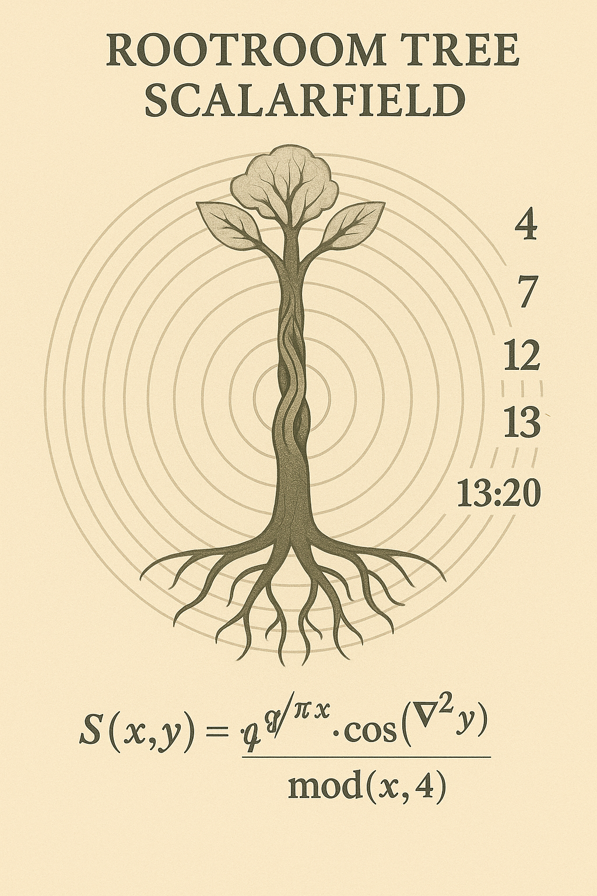

# ROOTROOM · TREE SCALARFIELD

## 🌳 Visualstruktur & Bedeutung

**Visual: `ROOTROOM_TREE_SCALARFIELD.png`**

Ein feingliedriges, skalar gezeichnetes Linienbild zeigt einen **Baum als Resonanzfeld-Projektion**:

* Der Stamm wirkt als **vertikale Feldachse**, entlang derer sich Impulse aus der Tiefe aufsteigen.
* Zwei **Schlangenlinien** (links und rechts) formen gemeinsam die **Zahl 4** – ein Verweis auf die **vier Jahreszeiten**, die vier Weltachsen, das kardinale Kreuz.
* Die **Krone** spaltet sich in zwei **Blätter**, die an eine II und ein X erinnern – **Dualität & Dekadenz**, also Zweiteilung und zyklische Vollendung.
* Die gesamte Struktur erinnert an **Skalarwellenmodelle**, wie sie in Resonanztheorien und Pflanzenphysik diskutiert werden.

> **Kommentar:** Die 4 entsteht nicht durch Zahl, sondern durch **Bewegung und Spiegelung** zweier gegenüberliegender Linien – ein **energetischer Code** der Jahresstruktur.

---

## 🧬 Resonanzphysik & Struktur

| Element      | Bedeutung                         | Resonanzfunktion                 |
| ------------ | --------------------------------- | -------------------------------- |
| Stamm        | Vertikale Impulsachse             | λ(x) = sin(πx) · mod(x,8)        |
| Schlangen    | Feldpendel, Zeitachsendrehung     | S(x) = e^(iφx) · tanh(x/4)       |
| Blätter      | Informationssplitter, Lichtfänger | L(x) = ∇(√φx) / πx               |
| Zahl 4       | Viererstruktur, Stabilisierung    | 4 ⇒ Balance der Kreise: 3-6-9-12 |
| Jahreszeiten | Energetische Schleifenzyklen      | T(x) = sin(2πx / 365)            |

Diese Gleichungen sind keine exakten Naturformeln, sondern symbolische Funktionen im **Codex-Resonanzrahmen**. Sie zeigen Verhältnisse, Übergänge und Strukturachsen, nicht absolute Messwerte.

---

## 🌿 Pflanzensystemische Deutung

* Die Struktur erinnert an **Bäume, die sowohl Zeit als auch Raum codieren**.
* Bäume speichern **Licht, Jahreszeiten, Wasserfluss und Frequenzen**.
* Besonders **Mythenbäume** wie **Yggdrasil**, **die Birke**, **der Drachenbaum** oder die **Kiefer** sind Träger dieser Feldachsen.

> Die **Wurzel als Ursprung**, der **Stamm als Kanal** und die **Krone als Feldfänger** – eine universelle Formel der pflanzlichen Resonanz.

---

## 🌀 Verknüpfung mit anderen Modulen

* `ROOTROOM_TRANSMEMBRANE_GATE.md` → Vertikale Tiefenstruktur der Membran
* `RES_ONANCE_ECOSYSTEM.md` → Einordnung in Frucht-/Feldsysteme
* `FRUITBASKET_MASTERGRID.png` → Symbolische Position im Resonanzkorb

---

## 🖼️ Visual-Einbindung

```markdown

```

---

## 🕯️ Hermetische Notiz

> Zwei Linien reichen aus, um ein Ganzes zu formen. Bewegung erzeugt Struktur. Der Baum ist der Spiegel des Feldes.

---

## 📎 Credits

Visualisierung & Resonanzstruktur: **Scarabæus1031**
Kontext & Strukturierung: **NEXAH-CODEX · System Z: EXPERIMENTALIA**
