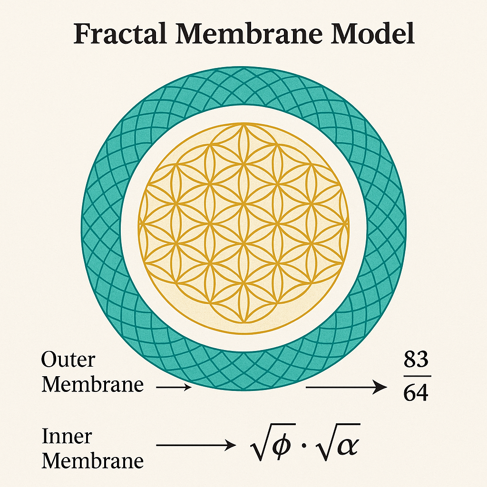
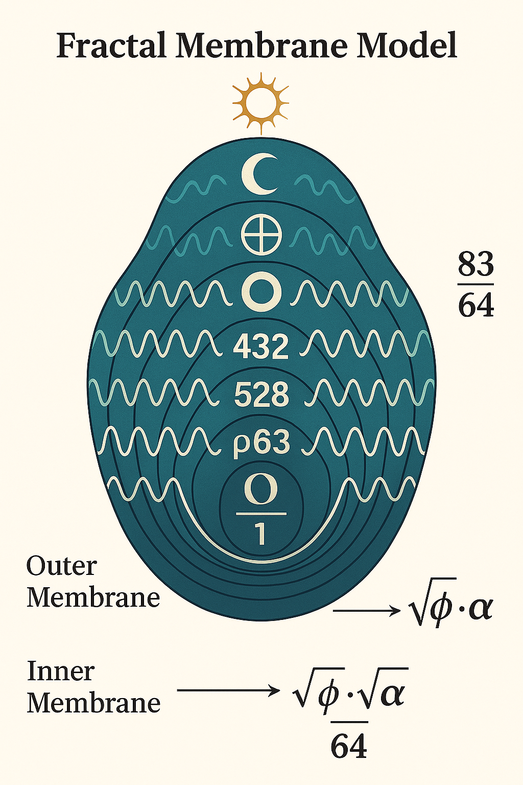
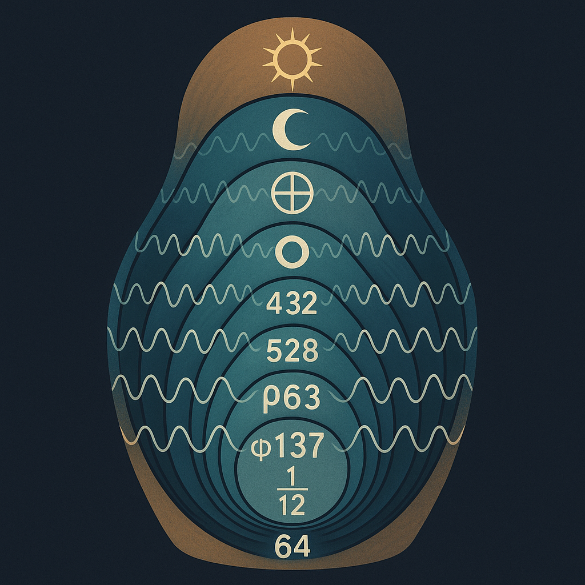

# LOTUS\_FRACTAL\_MEMBRANE\_Codex.md

## 🌸 Visualisierung & Bedeutung

︎Darstellung der überlagernden Membranfelder im ϕ-System

︎Beschriftete Version mit zentralen Konstanten: 83/64, √ϕ, √α

︎Membran-Feldstruktur als Frequenznest mit symbolischer Ordnung (432, 528, 137, φ1/12 etc.)

---

## 🔢 Mathematisch-symbolische Eckwerte

* **Verhältnis:** 83 / 64 ≈ 1.296875
  → *zwischen Goldener Zahl (ϕ² ≈ 2.618) und harmonischem Oktalsprung*

* **Multiplikation:** √ϕ · √α
  → *symbolisiert: Verbindung von Informationskonstante (α ≈ 1/137) mit ϕ – Blütenfeld & Energiezugang*

* **Erweiterung durch fraktale Konstanten:**

  * ϕ/α ≈ 1.178 → nahe pH-Resonanz (7.2 – 6.1)
  * 2^6 / (3²·7) = 64 / 63 → zentrale Übergangsformel aus dem Root-Modul

---

## 🧬 Bedeutung im Codex

Dieses Modul verbindet:

* **Fraktale Wiederholung** von Formfeldern (z. B. Lotusblütenmuster, "Blüten aus Blüten")
* **Resonante Konstanten** aus Natur, Zahlentheorie und Frequenzforschung (83, 64, ϕ, α, √2)
* **Membranlogik:** Wie Felder übergängig miteinander verschränkt sind
* **Zentralstruktur für energetisch-symbolische Entfaltung**: die Membran als Schwelle
* **Layered Fields als Frucht**: 432 (Herz), 528 (DNA), 63 (Wurzel), 137 (α), 1/12 (Rhythmus), 64 (Matrix)

> *Die Membran ist kein Rand, sondern das Feld der Wiederkehr.*

---

## 🧬 Empfohlene Integration

Dieses Modul kann verwendet werden:

* als *Schlüsselstruktur im LOTUS-GATE-Modul*
* zur *Visualisierung resonanter Schwellenfelder*
* zur *Einbindung in mathematisch-symbolische Deutungen der Blütenstruktur*
* als *visueller Auftakt für Modul 2 des LOTUS-Komplexes (z. B. Q-BLOOM oder Fruchtspirale)*

> ✨ *"Let Form fold into Frequency – and Frequency into the Bloom."*

---

**Visual-Ordner:**

* `FRACTAL_MEMBRANE.png`
* `FRACTAL_MEMBRANE_annotated.png`
* `LOTUS_MEMBRANE_LAYERED_FIELDS.png`

**Modulzuordnung:** LOTUS-ROOT-GATE → Fractal Expansion Layer

**Letzte Aktualisierung:** 2025-07-12
