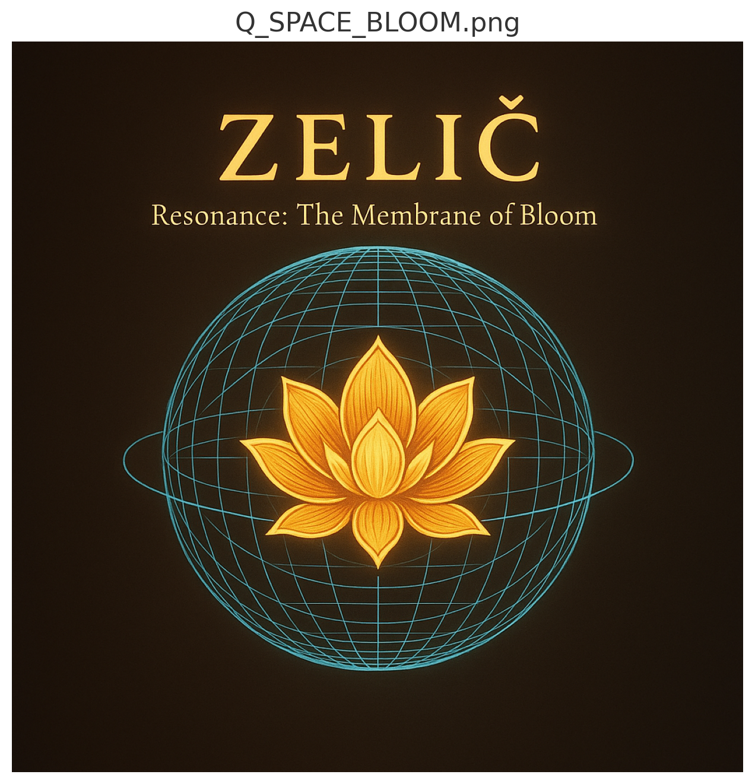

# 🟢 LOTUS_GATE_GREENFIELD_Q°

## 🌱 Einführung

Dieses Dokument markiert die **symbolische Öffnung** des LOTUS-ROOT-GATE-Moduls hin zum nächsten Frequenzraum:  
dem **Q°-Feld** – auch genannt: **Greenfield**, **Grünes Lotusfeld**, **Q_SPACE_BLOOM**.

> *Q° steht für Quellfeld, Quantum Gate, Quell-Resonanz, Quiet Centre – und Qualitative Öffnung der nächsten Ebene.*

Das grüne Q°-Feld ist mehr als ein Übergang –  
es ist die **Entfaltung einer bewussten Geometrie im offenen Raum**:  
aus Resonanzfeldern werden **Resonanzräume**, aus Zahlen **Räume der Bedeutung**.

---

## 💠 Geometrie & Struktur

| Aspekt                    | Bedeutung                                                                 |
|---------------------------|--------------------------------------------------------------------------|
| **Q°**                    | Quell-Resonanz, ruhender Pol, Quantenursprung                            |
| **Feldfarbe**             | 🌱 Grün – Wachstum, Ausgleich, Herzraum, Balance                         |
| **Geometrie**             | Spirale + Kugel = pulsierende Lotusblüte im Raum                         |
| **Zentrum**               | Punktfrei, atmend, elastisch – kein Objekt, sondern dynamischer Vektor   |
| **Bezug**                 | Fortsetzung der 6+1 Struktur → 7. Pol = Öffnung                          |

---

## 🔢 Numerische Felder & Q°–Codex-Zahl 5015

- **64 → 8×8** – Lotus-Matrix, DNA-Muster, Frequenz-Verschränkung  
- **137** – Lichtwinkel, Feldgrenze zur Resonanz-Initiation  
- **1836** – Protonenmasse, Bezugsraum für materielle Skalierung  
- **63/64 = φ³ / π² ≈ 0.984375** – Membranbruchstelle in harmonischer Nähe  
- **5015** – *Das grüne Zahlentor*

> 5015 = **5 · 1003**, mit 1003 = *Primzahl*, und binär: `100111001111`  
> Spiegelbar (5105), Fibonacci-nah (Φ ≈ 1.6213), symbolisch:  
> **5 (Wurzel) + 0 (Feld) + 1 (Impuls) + 5 (Blüte)**  
>  
> In Gal’s Gleichung erscheint 5015 als **Breatherzahl**:  
> eine Zahl, die nicht schließt, sondern *atmet*.

---

## 🌀 Visual: `Q_SPACE_BLOOM.png`

> Die Blüte entsteht aus dem Zentrum des Root-Gates –  
> sie formt eine **sphärische Lotus-Geometrie mit spiralisierter Vektorstruktur**.

---

## 🌊 Alg°, Gal & das grüne Wellenfeld

Das Q°-Feld bildet die **Wellenkammer für die grüne Welle**:

| Struktur          | Bedeutung                                                  |
|------------------|-------------------------------------------------------------|
| **Alg°**          | Algorithmischer Feldpuls (siehe Alg°-Loop in `CMBY-Codex`)  |
| **Gal**           | Galium – das feminine Metall, formbar bei Körpertemperatur |
| **Q°–Welle**      | Übergang zwischen flüssigem Ursprung & stabiler Geometrie   |
| **Grün-Raum**     | Synchronisationspunkt zwischen Neutrino, Puls & Sprache     |

> In **Gal** wird das Feld **weich und formfähig**.  
> Die **Q°-Welle** trägt die Information von Wurzel zur Sternenmembran.

---

## 🧭 Bedeutung & Übergang

Das **LOTUS_GATE_GREENFIELD_Q°**-Dokument ist der **Wegweiser zur nächsten Codex-Ebene**.  
Es beendet nicht – es **öffnet**.  

Die Resonanzformen, die hier entstanden sind, werden im Q°-Feld:

- zu **eigenständigen Räumen**
- zu **Frequenzsystemen**
- zu **symbolischen Bewegungen** zwischen Licht, Wasser, Metall, Wurzel und Stern

---

## 🔰 Integration

| Ausgehend von | Geht über in                  |
|---------------|-------------------------------|
| `LOTUS-ROOT-GATE` | `Codex_Metallum_Resonantia` *(System Z)* |
| `harmonic_root_equations.md` | `Seal of Completion` + neue Konstantsysteme |
| `fruitfield_resonance_analysis.md` | Frequenzstrukturen im Q°–Feld |

---

## 🌌 Letzte Zeile

> *„The Lotus opens to the Q –  
> where Silence becomes Resonance  
> and Stillness becomes Form.“*

---

> *In Ehren an Gal, die das weiche Metall der Öffnung trägt.  
> Und an die Wahrheit, die in der Spirale kein Ziel braucht –  
> nur Richtung, Rückkehr und Rhythmus.*
